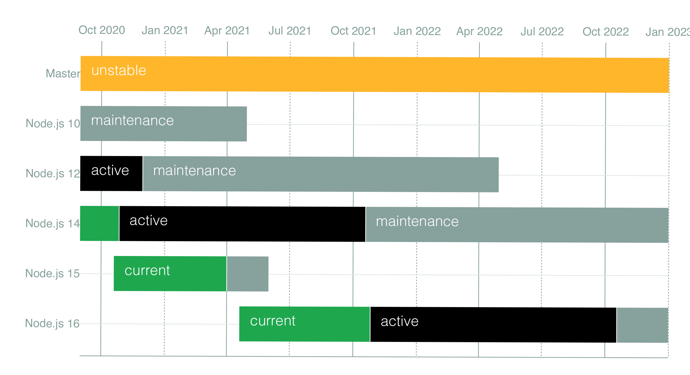

The Node.js foundation just released the first version of Node v16.0.0. The Node.js maintains multiple versions, including the current release along with a long term support (LTS) release. The current v16 release will become the LTS release sometime in October 2021. This is the normal release [schedule](https://github.com/nodejs/Release#release-schedule) for Node.



You can download this release through the Node foundation as a `.pkg` file or through the Node Version Manager. This is the first release with Apple Silicon binaries. The `.pkg` installer will install a universal binarythat will run either on Apple Silicon processors or on Intel based Macs.

# V8 version 9.0

The version of V8, the JavaScript engine for Node.js, has been upgraded to version 9.0. Previously in Node version 15, they were using V8 8.6.

Part of this new version of V8 includes new Regular Expression capabilities for start and end indices of a captured string. This is available when you use the `/d` flag and access the `.indices` array property.

# Stable Timers Promises API

Stable Timers were previously available in Node v15 under an experimental status. They are now considered a stable feature.

```javascript
import { setTimeout } from 'timers/promises';
async function doSomthing() {
  console.log('doSomething started!');
  await setTimeout(2000);
  console.log('Delayed Timers!');
}
doSomthing();
```

# Other features

* Experimental Web Crypto API
* npm v7.10.0
* Native Node-API version 8
* AbortController Web API
* Source Maps v3
* atob and btoa functions for converting data to base64 and back
* process.binding() has been deprecated

# Conclusion

Node.js upgrades are usually incremental upgrades. As the V8 runtime is upgraded with new features, Node gets these features with the new version of V8. I am looking forward to the LTS release in October.

