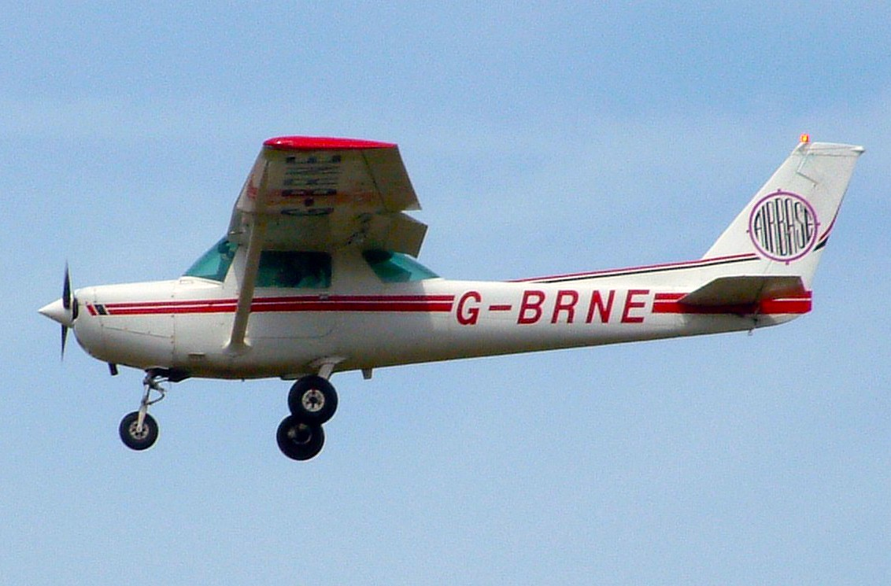
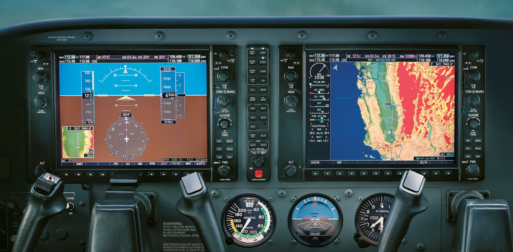

#### Coffee Breaks is what one of my flight instructors referred to my breaks of a couple months or a couple of years from flying.

I recently started flying again after a 20 year absence from the cockpit. A recent experience I had with the Transportation Security Administration encouraged me that there might be a better way to travel.

When I was a child I became fascinated with airplanes, helicopters and anything else that might fly. I was fortunate enough to have a parent who was also a pilot, so I was able to learn some basics prior to actually learning how to fly an actual aircraft. So when it became time to decide on my education, I decided I wanted to become a professional pilot. There are a number colleges where students can learn how to fly, but I wanted one to go to one that focused on aviation and aerospace. The university I wound up attending was [Embry-Riddle](https://erau.edu) in Daytona Beach, Fl.

After graduating I had a degree and a commercial pilot's license. At that time there were two tracks a student with my degree could take as a pilot. One where you could get a Multi-engine rating, and one where you could become a Certified Flight Instructor. I chose to get my Multi-engine rating because that was the quickest and least expensive way to complete my training.

After graduating I was broke and looking for work, so I chose to get a job doing what I had been doing in college, and save my money and train to become a flight instructor. I did eventually go on and become a CFI. At the time I had a day job working in IT, but either in the mornings before work, or on the weekends I would fly and instruct.

Life has a funny way of finding different vectors in life you take on your career. With my day job I eventually became a Software Engineer, and I have been extremely content in that profession. Along the way I let my CFI certificate expire, and stopped flying altogether in the 90s.

In my current job I travel fairly frequently. Over the last year I traveled to the San Francisco Bay area three different times, as well as many other locations across North America. Like many of the people probably reading this post, I enjoy all the same indignities as you trying to get from point A to point B. It was on one of my recent trips that I decided to get back into the cockpit after a 20 year absence.

A lot of people think that a pilot’s license has an expiration date, but in fact it does not. Once you receive an airman’s certification, it is good forever. But in order to fly legally, there are a number of things a pilot must do to stay current. These include proof of sound health and recurrency training.

Unless you are a sport pilot, you have to have what is called an aviation medical exam (AME). There are doctors that are certified to give airmen medical exams by the FAA. They can give three different types of medical certificates that have different classes. The FAA recently added a new type of medical called a basic aero that can be used by private and recreational pilots. Basic aero medicals can be performed by any licensed doctor.

I decided to get a 1st class medical last month, which is the highest class medical a pilot can receive. One of the things I noticed from my most recent medical exam is that the FAA has relaxed this exam. They used to be pretty strenuous, but you will find that TSA is more thorough now on their inspections than the flight surgeon. The reasoning is that flying an airplane is not that different from driving a car. I don’t know if I agree, but this did used to scare a lot of people away from learning how to fly.

Every 24 months, a pilot has to do recurrency training if they want to fly legally. This requires that the pilot find an instructor and they get at least an hour of ground and an hour of flight instruction. Pilots do not have to do this training if they have completed another rating in the proceeding 24 months.

> British registered Cessna 152 two person trainer

## Some Observations on 20 Years of Changes

I was worried that all of the regulations would have changed since I was flying in the 90s, but to my surprise not much has changed. There are some new regulations in our post 9/11 world, but they are what you would expect. One of the big regulatory changes was the establishment of the “Special Awareness Training for the Washington, DC Metropolitan Area”. There is special training that pilots must undergo if they plan on flying into a 60 nautical mile radius of the DC metro area. There is even a [course](https://www.faasafety.gov/gslac/ALC/courseLanding.aspx?cID=405) you can take online by the FAA on how to fly within this area.

The other thing that has not changed is the aircraft I was flying 20 years ago are the same ones I am flying today. In fact it is very common to find Cessna and Piper aircraft from the 60s, 70s and 80s on the ramp today. What has changed a lot is the Avionics. These are the radios and instruments that pilots use to navigate aircraft around in flight.

> A Garmin G1000 EFIS display

When I was flying in the 90s, we had one airplane on the flightline that had a GPS receiver. That receiver did not have a graphical display, and it could only tell you if you were on or off course.

One of the most significant changes in avionics has been the introduction of ADS-B. Automatic Dependent Surveillance-Broadcast (ADS-B) allows aircraft to broadcast their positions to ground stations. In turn the ground stations send traffic and weather information back out to the aircraft. This is an amazing tool we did not have when I started flying, and helps pilots avoid other aircraft and bad weather.

## Resources and Inspirations

One of the things we did not have when I began and ended my early career as a pilot was the internet. We did have the internet in the 90s, but there were not a lot of resources online for pilots. You generally had to find an aviation bookstore to find current copies of the [FAR](https://www.faa.gov/regulations_policies/faa_regulations/)/[AIM](https://www.faa.gov/air_traffic/publications/media/aim.pdf) or charts used in flying. A lot of these are online now. [FAA.gov](https://www.faa.gov) has most of the publications that pilots require in PDF form.

There are also great weather resources for pilots online as well. We used to have to call a Flight Service Station (FSS) to get weather and file flight plans. Today the government has contracted Lockheed-Martin to offer these same service through a website called [1800wxbrief.com](1800wxbrief.com).

## iPad

> Two pilots looking at airport diagrams on their iPads

The days of carrying around 40 lbs of charts are gone. Nowadays pilots are using some sort of “electronic flight bag”, or an iPad. As someone who earns their living writing iOS software, this is one of my favorite changes for the better.

The folks at [ForeFlight](https://www.foreflight.com/) have an amazing product. I remember when they launched, they were just an aviation weather app. Now you can do flight planning, view approach plates, get up to date weather and even file flight plans all in ForeFlight on your iPad.

## YouTube Channels

There are a ton of YouTube channels from pilots showing everything from instruction to just showing GoPro footage taken from their flights. It is important to remember that these videos should not be considered a substitute for real instruction, but it helped me remember things from my training.

My favorite channel right now is FlightChops from Canadian pilot Steve Thorne. Steve is a professional filmmaker and a private pilot. He does a really good job of showing context in the things he is learning, and he consults with and uses real flight instructors in his videos.

    <iframe width="700" height="393" src="https://www.youtube.com/embed/71RL8EdvUkI" frameborder="0" allow="accelerometer; autoplay; encrypted-media; gyroscope; picture-in-picture" allowfullscreen></iframe>

YouTube user Steveo1Kinevo is a professional pilot based in South Florida. He makes great videos of his flights and experiences as a commercial pilot.

<iframe width="700" height="393" src="https://www.youtube.com/embed/5XCCJVv-MFQ" frameborder="0" allow="accelerometer; autoplay; encrypted-media; gyroscope; picture-in-picture" allowfullscreen></iframe>

Friendly Skies Films is another great YouTube channel by Nicholas Cyganski. Nicholas makes great videos about his experiences as a licensed pilot. He also goes into great detail explaining different aviation subjects. One of my favorite videos he did was how the news media never gets anything right when it comes to aviation.

<iframe width="700" height="393" src="https://www.youtube.com/embed/NDOBN0r3ydA" frameborder="0" allow="accelerometer; autoplay; encrypted-media; gyroscope; picture-in-picture" allowfullscreen></iframe>

Another YouTube user I enjoy quite a bit is Matt Guthmiller. Matt set a world record when he was 19 to be the youngest pilot ever to fly around the world. Matt makes great videos of him flying the same plane he flew around the world, making regular general aviation flights. Check out this video he made of flying to the Bahamas.

<iframe width="700" height="393" src="https://www.youtube.com/embed/tiUTcgQ978Y" frameborder="0" allow="accelerometer; autoplay; encrypted-media; gyroscope; picture-in-picture" allowfullscreen></iframe>

There are also two ground instruction companies online that produce great short videos on short subjects on learning how to fly. One of these companies is MzeroA.com. Jason Schappert is a CFII and owner of MzeroA.com. Check out him demoing how to do slow light.

<iframe width="700" height="393" src="https://www.youtube.com/embed/t8wEhhWQlSg" frameborder="0" allow="accelerometer; autoplay; encrypted-media; gyroscope; picture-in-picture" allowfullscreen></iframe>

Another one of these companies is FLY8MA. They have some great videos online demonstrating different things a pilot needs to know when flying an airplane. Check out this video from Jon Kotwicki doing an introductory flight lesson.

<iframe width="700" height="393" src="https://www.youtube.com/embed/G1v7KYjjtCI" frameborder="0" allow="accelerometer; autoplay; encrypted-media; gyroscope; picture-in-picture" allowfullscreen></iframe>

I would not use these videos as a substitute for training, but they are good refreshers on things you might have leaned in the past. I would still consult a CFI or CFII in person before attempting to do anything in these videos.

## Bucket List

There are a number of things I was never able to accomplish as a pilot that I would like to do now that I am flying again. I have never flown to the Bahamas. I hope to do that this year.

I am also planning on getting my seaplane rating. I plan on writing about my aviation experiences with these blog posts to help other pilots like myself who have taken long coffee breaks from flying.
