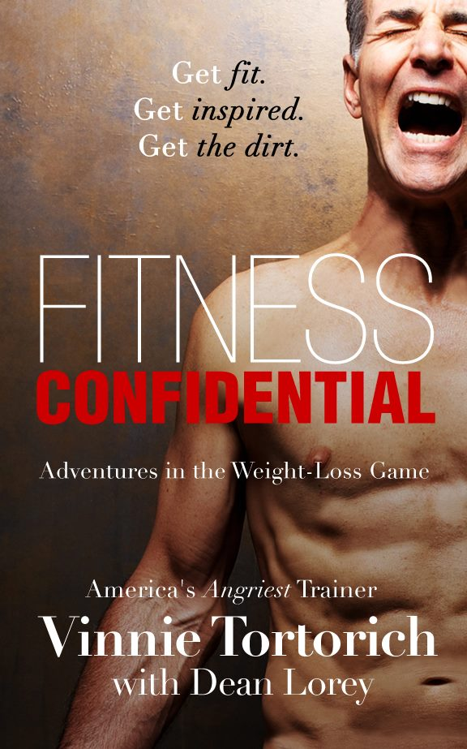

### I was asked to write about how I lost my excess weight, and what I have learned about nutrition

"You know you have gained 10 pounds from last year?" No one likes hearing that question from their doctor. On top of being 10 pounds heavier, my A1C was in a pre-diabetic range and I had high 
blood pressure that was making my Doctor prescribe a second blood pressure medication. I was about to turn 48 and my health was headed in the wrong direction.

I tried to look at what I had been doing up until that point as far my lifestyle goes. 

* I don't smoke
* I exercise vigorously about everyday
* I was eating what I thought was a healthy diet
* I avoid stress

At this point I weighed 240 pounds at 6'3". I thought that I was maybe 10-20 pounds overweight. Then I looked at my BMI. You can argue over how accurate of a scale that is, but at my height, 
I should not weigh more than 200 pounds. I was determined to get my weight below 200 pounds by the end of the year. I weighed about 200 pounds when I graduated from High School, 
and I wanted to see if I could get back down to that weight.

The next thing I did was buy a scale and read a book called ["Fitness Confidential"](https://www.amazon.com/FITNESS-CONFIDENTIAL-Adventures-Weight-Loss-Game-ebook/dp/B00DONI7AK).

> Fitness Confidential by Vinnie Tortorich

If you are not familiar with Vinnie Tortorich, he is kind of like the fitness trainer to the stars, and he is a regular guest on the [Adam Carolla Show](https://adamcarolla.com/blogs/podcast-archive).
I had heard him on Carolla's podcast before talking about diet and fitness, so I decided to read his book. In the book he says that your should exercise, but it is one of the least effective ways 
to lose weight. I was wary of this because in the past I had used exercise to lose weight. At one point I weighed close to 300 pounds I managed to lose a lot of that weight by exercising, 
but I never got to where I wanted to with the exercise. And I was sometimes exercising twice a day. Now I was starting to gain weight again.

Then I started reading his book, and looking for things I could change in my diet to help me loose weight. 
Vinnie summarized what I needed to do with my lifestyle in one sentence; "You got to cut out Sugars and Grains".

## Cutting Out Sugars and Grains

Vinnie has even trademarked a slogan called "NSNG" for No Sugar, No Grains. 
The other thing he details in the book are some of the specifics about food and drinks that can be problematic if you are trying to loose weight. 
One of the stupid things I was doing was drinking a glass of Gatorade after working out. Real athletes don't drink Gatorade. 
I was also drinking a lot of diet drinks like Diet Coke. I figured that since there were no calories it would be Ok for me to drink Diet Coke or other diet drinks. 
It turns out that drinking diet drinks tricks your body into producing more insulin, and works against you when you are trying to lose weight. 
So I started drinking the one drink every human should be drinking, WATER!

Giving up the drinks was the hardest part. The food was easier than I thought. I just had to avoid foods that had sugars and grains. Some of that is obvious, like candy bars and cookies. 
Other foods can be tricky to spot. So many of the foods we eat now have added sugar. An easy way to tell if food has added sugar is if it has "Low Fat" label. Generally when foods have fat removed, 
food companies will replace the fat with sugar. Malcolm Gladwell chronicled this in a talk he gave titled "Choice, happiness and spaghetti sauce".

<iframe width="560" height="315" src="https://www.youtube.com/embed/iIiAAhUeR6Y" frameborder="0" allow="accelerometer; autoplay; encrypted-media; gyroscope; picture-in-picture" allowfullscreen></iframe> 

What about grains? What exactly is a grain? What kinds of foods have grains? This was a little trickier. Obviously bread has grains. So does rice and pasta. I was eating a lot of rice and pasta.
This was probably one of the harder things to cut out of my diet, but I did it anyways.

## Aren't You Eating More Fat?

One of things Vinnie Tortorich has said that I think is a good analogy is the worst part of fat is the name "Fat". There are three Macro-nutrients: Carbohydrates, Protein and Fat.
Sugars and Grains are carbohydrates, and you have to substitute those kinds of carbs with other kinds of foods. I did increase the amount of fat I was consuming,
 but it turns out that there are healthy fats that you can eat.
 
There are three mains types of fats: saturated fats, mono-unsaturated fats and poly-unsaturated fats. I grew up believing that if you ate saturated fat, you would have a heart attack and die. 
It turns out that heart disease is a little more complex than that advice. Policy makers and organizations like the American Heart Association has slowly been moving away from these types 
of recommendations. I attend to post more on on the policies and science at a later time. 

The fats that are really bad for you, you have probably heard of before: trans-fats. 
We really don't have to worry to much about trans-fats anymore because they have been banned. I made fun of Michael Bloomberg when he did this as the Mayor of New York city, 
but he was right about trans-fats. Trans-fats where actually introduced into our food supply by *experts* who thought they were healthier than saturated fats.

## I Stoped Counting Calories

One of the reasons diets don't work, especially with calorie restriction, is because people can't maintain a low calorie lifestyle for extended periods of time. I am going to save the science behind this
for another post. They key is to eat the right kinds of food, and to eat to satiety. This worked for me, and I realize some people overeat. My experience was that I did not want to overeat if I ate until I was full.

I started all of this in July of 2017. The first week I lost five pounds I continued to lose weight each week, but not at the rate I did the first week. I mentioned I bought a scale. 
There are a number of scales that connect to Wi-Fi, and will sync to the cloud. I bought the Fitbit scale which ties into their app. This made it a lot easier for me to track my progress.

## Shooting Past My Goal

My original goal was to get below 200 pounds before 2018. I wound up reaching 195 pounds by November of that year. Needless to say I was extremely pleased with the results, 
and more importantly I enjoyed the change I had made to my lifestyle. So I decided to see if I could get down to 190 pounds. I eventually did, and then to 185, 180, 175 and 170. 
This past August I got down to 167 pounds. That was a little lower than I wanted to go, so I average around 175 pounds now.

I think this is a healthy weight for me, and I intend on maintaining the weight I am at now. I mentioned the BMI scale before, but for someone my height it recommends somewhere 
between 155 and 199 pounds. I don't know how accurate this is, but this seems to work for my body type.

## Mistakes I Made

The first mistake I made was not talking to my doctor about loosing weight. If I had this all to do over, I would have consulted my doctor so they could monitor changes to my blood pressure 
as I lost the weight. I would have also asked for tests to see if my blood work looked ok. In my case I was not getting enough water. 

This type of lifestyle change is commonly referred to as LCHF, or low carb, high fat. I think it should be called low carb, heathy fat. 
There are a lot of resources for people that are trying to cook and eat with this lifestyle. One of the websites I have been going to is [dietdoctor.com](https://dietdoctor.com). 
Vinnie Tortorich also has a great [podcast](https://vinnietortorich.com/category/podcast/) where he talks about diet and exercise. One of his co-hosts is [Anna Vocinno](https://annavocino.com/), and she wrote a cookbook called [Eat Happy](https://www.amazon.com/gp/product/B01ICGQMDC/ref=as_li_tl?ie=UTF8&tag=annavocino-20&camp=1789&creative=9325&linkCode=as2&creativeASIN=B01ICGQMDC&linkId=d8ab451b8d7fdca35c6eeeda425b17d7). 
It has some excellent recipes on how to cook and make NSNG meals.

There are also some excellent Facebook groups for people who are doing LCHF. Vinnie's fans have one called [Vinnie Tortorich's No Sugar No Grains](https://www.facebook.com/groups/434957346580399/). 
There is another one I like a lot called [Fat Head](https://www.facebook.com/groups/57440891958/). This is for fans of Tom Naughton who made a very funny documentary called "[Fat Head](https://www.youtube.com/watch?v=evcNPfZlrZs)".

## Are you Doing Keto or Intermittent Fasting?

Short answer is no. I am not doing keto. Keto is short for Ketosis. Ketosis is a state you body goes into when you body feeds off of ketone bodies instead of glucose, 
usually around a minimum of 0.5 mmol/L of beta-hydroxybutyrate (BHB). I certainly don't have a problem with anyone who is in Ketosis, it is actually a natural state. 
Ketosis by its nature is LCHF. 

Intermittent Fasting (IF) has also become a popular method, especially when used in combination with LCHF. 
There are different was of doing IF. I try to restrict my eating to about eight hours a day. There are some people that fast for a day or two. Some people fast for even longer periods of time.
I do not know enough about it to make any recommendations, but Dr. Jason Fung has a [book](https://www.amazon.com/Complete-Guide-Fasting-Intermittent-Alternate-Day-ebook/dp/B01MF8SC2X) and runs a medical practice specializing in IF.

## What About My Health?

Most of the problems I was having have gone away. I lost the weight, and when I did I lost my hypertension. It turns out that I was really suffering from metabolic syndrome. 
Metabolic syndrome is a term that refers to a cluster of diseases like obesity, hypertension, pre-diabetes or type II diabetes and fatty liver disease.

Most of my other markers have improved as well. I was worried about my cholesterol, particularly my LDL numbers. I actually lowered my LDL number significantly. 
My overall heart health has improved as well.

I plan on writing more about nutrition on this blog in the future, as well as some of the myths I have discovered about weight loss and healthy living. 
I also want to thank Vinnie Tortorich for helping me blow past my weight loss goals. 
 