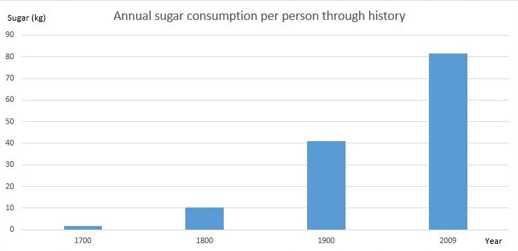

I decided to make a list of my favorite food and nutrition myths. We get a lot of mixed messages from the media about what is good for you to eat, and what is bad. 
One week we will hear a study hat says that food is good for you, and the next week we hear that food a will give you cancer.

Most of the studies that are cited in the news are based on epidemiology. Epidemiology in nutrition is based on surveys that people fill out about what they are eating, 
or have eaten over a period of time. Epidemiology is really good at identifying risk factors, but at the end of the day they show an association and not causation. 
You will see questions on those surveys like "How many cups of Ribs did you eat in the last six months?" 

> *Surveys are not Science!!!*

Here is my list of food and nutrition myths.

## 1. Salt causes High Blood Pressure

As someone who has suffered through hypertension, I am super sensitive to anything that might raise my blood pressure. Most of the science that says that salt causes high blood pressure comes from a Scientist named Jeremiah Stamler. He even came up with a diet that is given to hypertensive patients called the DASH diet, or [Dietary Approaches to Stop Hypertension](https://www.mayoclinic.org/healthy-lifestyle/nutrition-and-healthy-eating/in-depth/dash-diet/art-20048456). The DASH Diet recommends that you eat no more than 2,300 mg of sodium a day. I am surprised we have not all dissolved by now. Your body actually needs sodium, probably a lot more than 2300 mg.

There is no proof that salt has any kind of lasting affect on blood pressure. A more recent study [BU](https://www.medicalnewstoday.com/articles/317099.php) could not find example of anyone who had high blood pressure due to sodium. In fact they found that low sodium produced nearly the same risk as a high sodium diet. 

## 2. Eat Egg White Omelettes, don't eat the Yolk

Egg white omelettes became popular because the yolks contain cholesterol. The egg whites also have [less calories and fat](https://www.popsugar.com/fitness/Egg-Whites-vs-Whole-Eggs-7291034). Unfortunately, the yolks also contain Vitamins B12, D and Iron. The egg whites also have more Omega 6 fatty acids, where the yolks have Omega 3 fatty acids. So eating just the egg whites is pro-inflammatory. Inflammation is bad because it can cause weakening of the arteries, and eventually arteriosclerosis. 

## 3. Saturated Fat is bad for you

Saturated Fat started being maligned in the 1950s because research done my Ancel Keys, a physiologist from the University of Minnesota. He believed at the time that eating fat would give you heart disease. He even produced a study called the `The Seven Countries` study. There were actually 22 countries that kept the kind of data that he used in his report, but he excluded the countries that did not prove his theory. 

Healthy fats are an essential part of ones diet. The worst part about fat is the name, Fat. People think that if you eat fat, you will get fat. I am sure if you ate enough of it you would get fatter, but getting fat is really a hormonal response due to insulin secretion. Your body produces insulin as a way to lower blood sugar. Anything that is not used up as energy gets stored as long chain triglycerides into your fat cells.

There are fats that are bad for you. Trans-fats, which come from hydrogenated vegetable oil, have been shown to lower HDL, increase LDL, and more importantly [increase inflammation](https://www.healthline.com/nutrition/why-trans-fats-are-bad).

Nina Teicholz goes into great detail about the studies, how experts made recommendations for women without ever doing any studies on women in her book, [The Big Fat Surprise](https://www.amazon.com/Big-Fat-Surprise-Butter-Healthy/dp/1451624425).

## 4. Don't Eat Red Meat because it is bad for you

Red meat is actually one of the healthiest foods you can eat. Ruminants in general are very high in the nutrients and micro-nutrients we need to live. Red meat also contains Vitamin B12 and Heme Iron.

There was a [study](https://www.who.int/features/qa/cancer-red-meat/en/) that came out of the World Health Organization a couple of years ago that said that red meat and processed meat increases the chances of getting cancer. There were a lot of flaws in the study. Many of the officials at the WHO who conducted the study were vegetarians or vegans. The study was actually produced from an meta analysis from multiple reports based on epidemiology. They never published their data.

In the end they said that there was a 1.17 times greater chance in those who got colorectal cancer from eating fresh or processed meat. You are not even supposed to consider any statistical numbers under 2 because there are too many possible confounders. As and example, smokers are 35 times more likely to get cancer than non-smokers.

<iframe width="1160" height="652" src="https://www.youtube.com/embed/1rz-8H_i1wA" frameborder="0" allow="accelerometer; autoplay; encrypted-media; gyroscope; picture-in-picture" allowfullscreen></iframe>

## 5. It is Ok to Eat Sugar, it is Just Empty Calories

Sugar is just empty calories, right? WRONG!!!

The two sugars that are commonly found in our foods, sucrose and high fructose corn syrup. Sucrose is 50% fructose and 50% glucose. High fructose corn syrup is 55% fructose and 45% glucose. They are both equally bad for you. Many of our foods and drinks have replaced sucrose with high fructose corn sugar, mainly because it is cheaper to produce.

Science journalist Gary Taubes wrote an excellent book called [The Case Against Sugar](https://www.amazon.com/Case-Against-Sugar-Gary-Taubes/dp/0307701646). Sugar intake around the world has gone up dramatically around the world over the last 100 years. You certainly make the case based on epidemiology that sugar is also causing heart disease, obesity, diabetes, hypertension and a host of other diseases.

Check out this video by Dr. Robert Lustig who treats children with adult onset diabetes.

<iframe width="1160" height="652"  src="https://www.youtube.com/embed/dBnniua6-oM" frameborder="0" allow="accelerometer; autoplay; encrypted-media; gyroscope; picture-in-picture" allowfullscreen></iframe>

## 6. An Apple a Day Will Keep the Doctor Away

Apples contain lots of fructose. They also contain fibre, which makes them easier to process than if we just drank apple juice. The fructose has to be processed in your liver. The fiber in an apple helps, but the overall effects of fructose can be harmful. Apples and most fruit are essentially confection on a tree.

Check out this presentation from Dr. Gary Fettke on why fruit may not be as good for you as you think.

<iframe width="1160" height="652" src="https://www.youtube.com/embed/L6LL92Zs5L0" frameborder="0" allow="accelerometer; autoplay; encrypted-media; gyroscope; picture-in-picture" allowfullscreen></iframe>

## 7. Breakfast is the Most Important Meal of the Day

The name Breakfast actually comes from two words, `break` and `fast`, meaning you are breaking the fast you started from before you went to sleep. The saying `Breakfast is the Most Important Meal of the Day` actually comes from cereal marketing from the 1800s.

The line “Breakfast is the most important meal of the day” was invented in the 1800s by Seventh Day Adventists James Caleb Jackson and John Harvey Kellogg to help them sell their  breakfast cereal. 

## 8. Grains are Heart Healthy

There is nothing heart healthy about grains. Grains actually get converted into long chain triglycerides in our liver, and are pro-inflammatory. Wheat and white flour are treated by your liver in a similar way as eating sugar. Eating a slice of bread is like eating seven tea spoons of sugar.

Dr. William Davis chronicled this in his book [Wheat Belly](https://www.amazon.com/Wheat-Belly-Lose-Weight-Health/dp/1609614798). 

## 9. Eat Many Small Meals a Day Instead of Three Large if you are Trying to Lose Weight

Eating six small meals a day is much worse for than eating three meals a day. Every time you eat, especially food with carbohydrates or protein, your pancreas has to produce more insulin to process your blood sugar. Spiking your [blood sugar](https://journals.plos.org/plosone/article?id=10.1371/journal.pone.0038632) six times day is not going to help you lose weight. 

## 10. Use Margarine over Butter

Margarine is made from vegetable oil, and is actually gray until it is died with food coloring. People started eating Margarine when Butter was maligned because of saturated fat. Margarine contains trans-fats. It is also causes inflammation and should be avoided.

Current forms of Margarine contain polyunsaturated fats, and contain food additives like emulsifiers. It is a highly processed food. There is great [article](https://www.healthline.com/nutrition/butter-vs-margarine#what-are-butter-and-margarine) on margarine at healthline.
