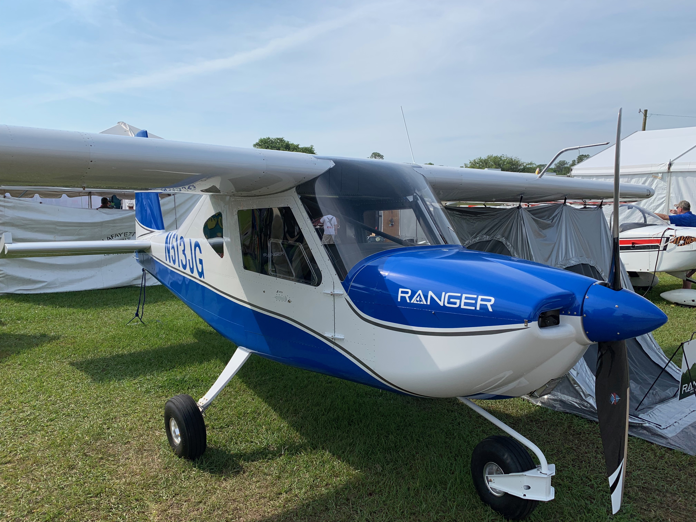
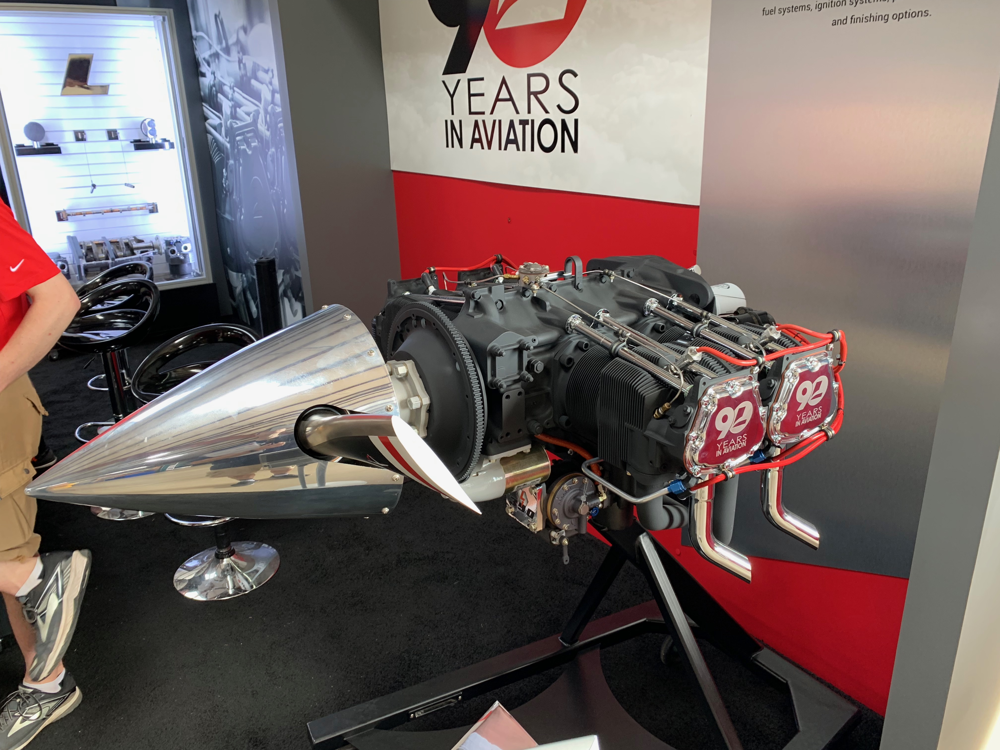
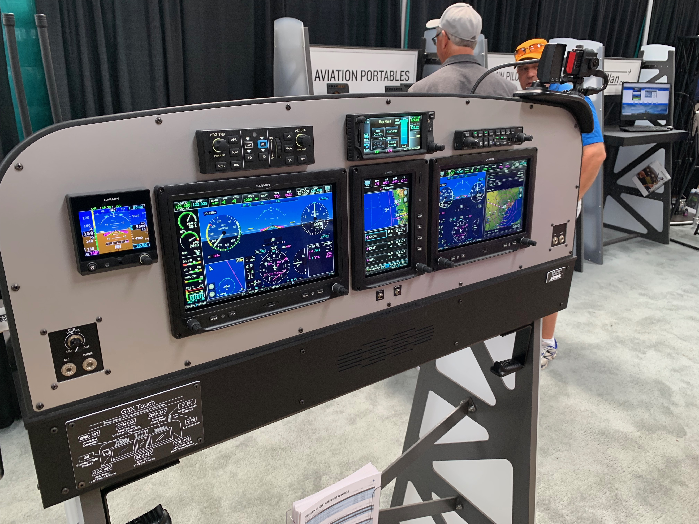
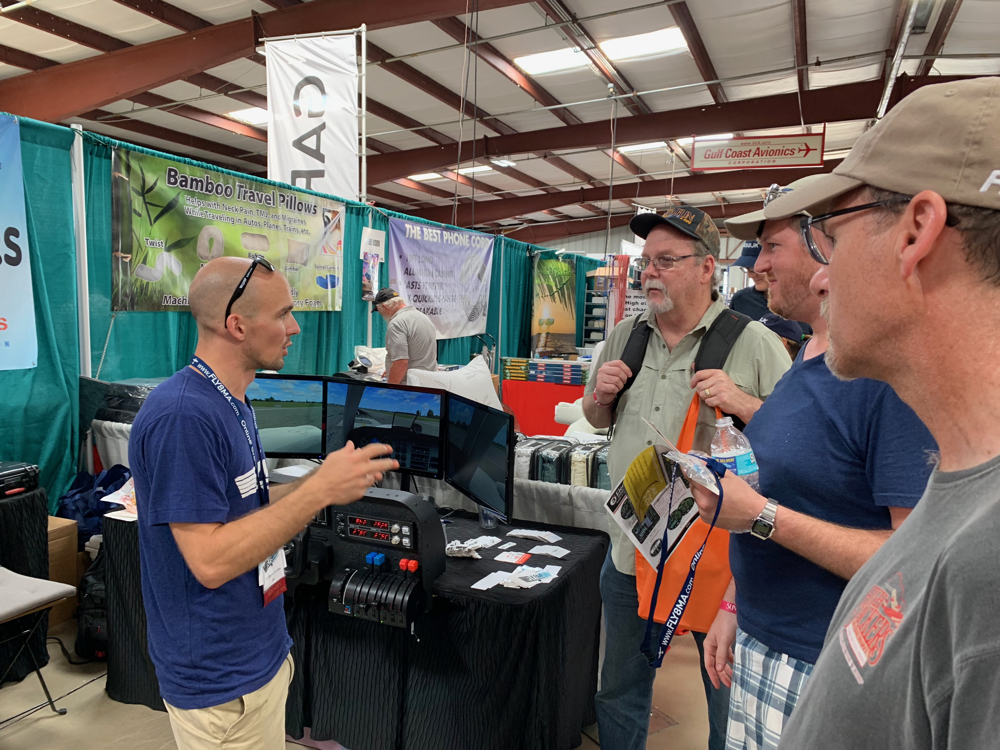
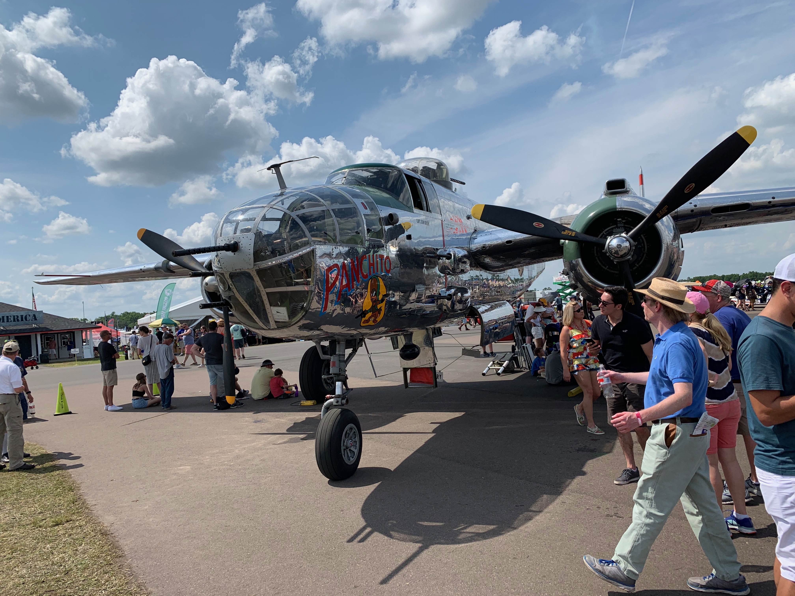
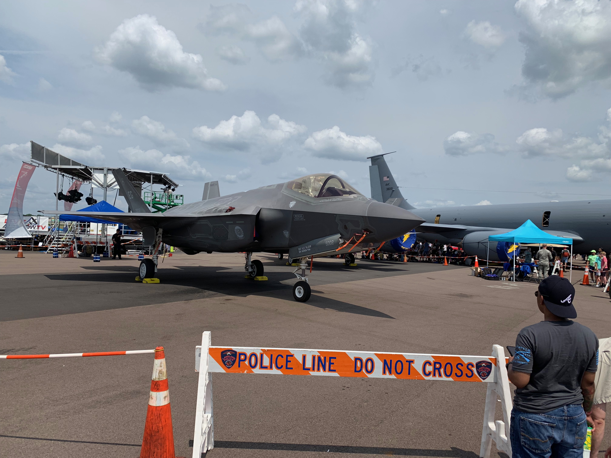
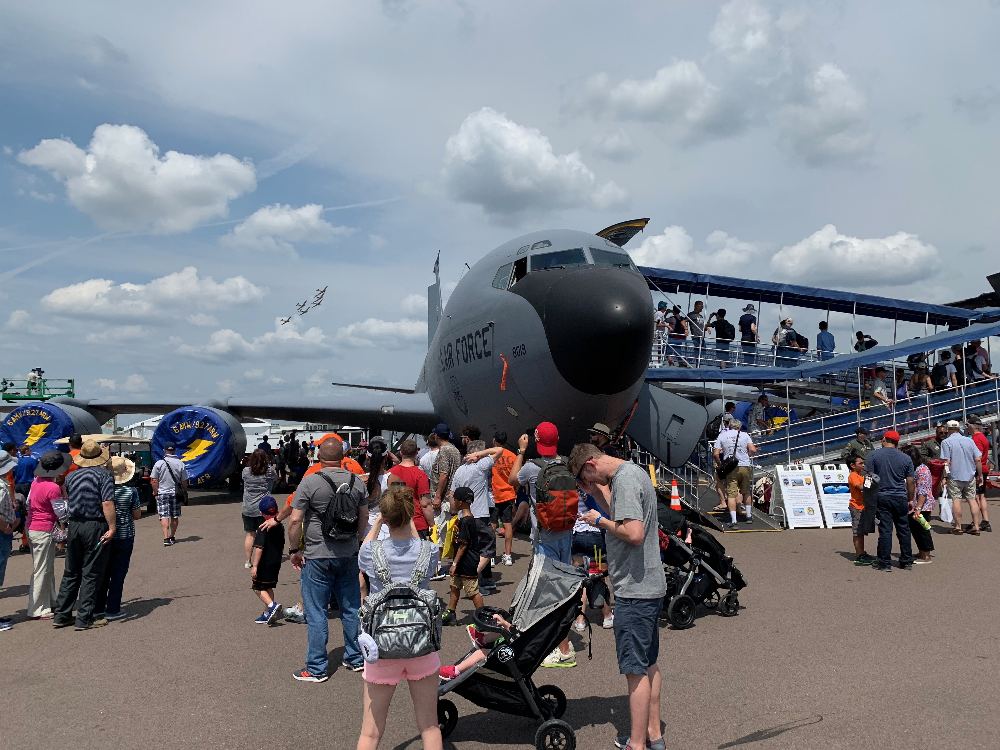
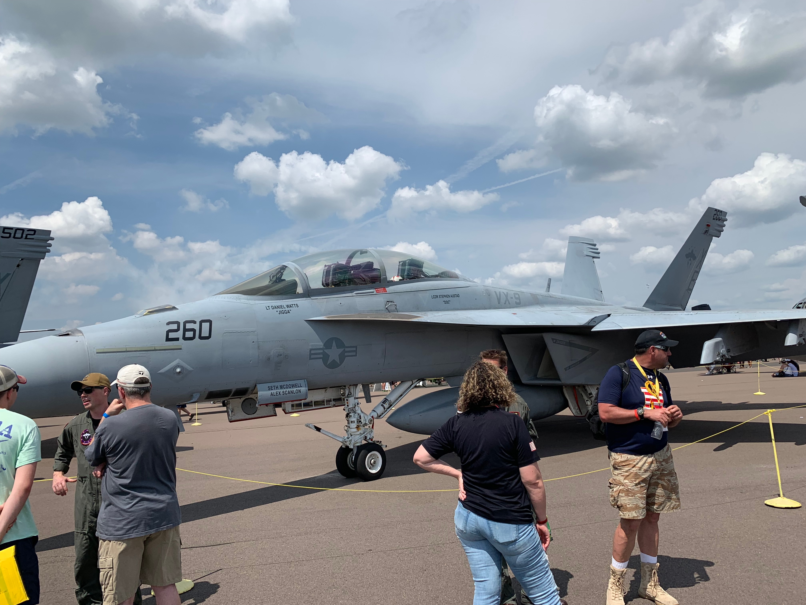
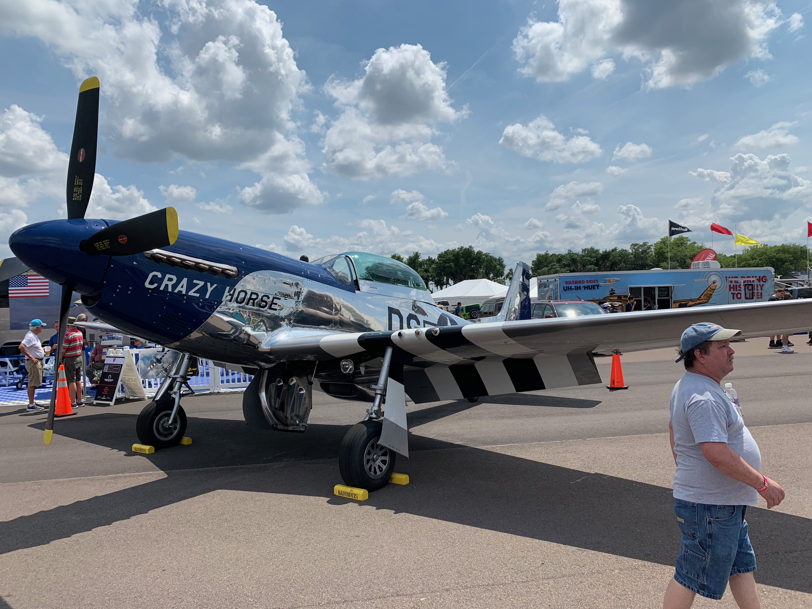
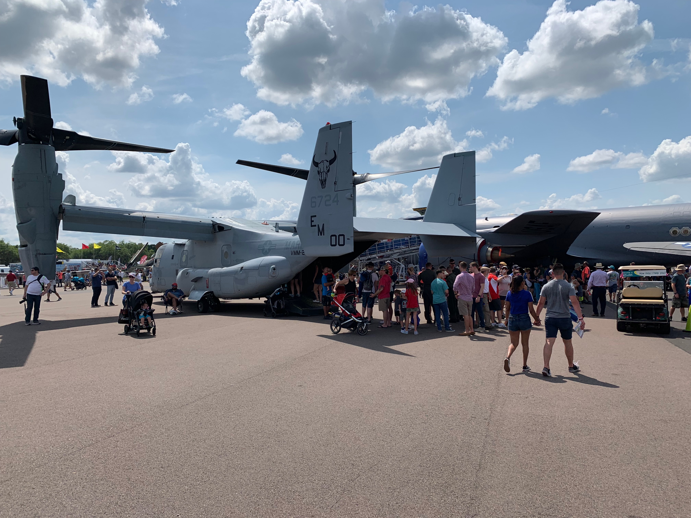

## Highlights from my 2019 trip to Sun-n-Fun 2019

I went down to Lakeland again this year to visit the [Sun-n-Fun aviation airshow and expo](https://www.flysnf.org/). One of the neatest things about Sun-n-fun is that it is not just 
an Airshow and general aviation fly-in, it is also a place where many of the venders that serve the aviation industry can come and show off their products and services. This was my second time visiting Sun-N-Fun. I wanted to highlight some of the aircraft and vendors I saw while I was at the show.

## Piper

Piper Aircraft was there showing off a new trainer they are marketing to smaller flight schools. The aircraft is called the Piper Pilot 100 and the 100i. These trainers are based on the Piper PA-28 model, but have been streamlined for pilot training. They include Garmin PFD and MFD display and avionics, a single seat in the back, and a Continental IO-370 fuel injected engine rated at 180 BHP.

I joked with the Saleswoman that they should have called them the Piper Cadets because Piper made an aircraft very similar to that in the late 1980s called the Piper Cadet. These new pipers are being priced at $259,000 and $285,000 for the VFR and IFR versions.

## Vashon Ranger

[Vashon](https://vashonaircraft.com/index.php) recently started manufacturing a new LSA (light sport aircraft) out of Washington state. The Ranger is priced at right around $100,000, making it one of the lowest cost aircraft manufactured today.

Vashon was started by entrepreneur John Torode. John is also known for starting [Dynon Avionics](http://www.dynonavionics.com/home.php), and the Rangers come equipped with the latest in Dynon PFD and MFDs.

The Ranger is clearly being targeted not just as an airplane that can be used to train pilots to become sport pilots, but also be used as a recreational plane for going on a camping trip or fishing.

## Textron, Cessna and Beechcraft

Textron had a large place in the show with many of their piston powered aircraft. They had a Baron, Bonanza, Skylane and a Caravan all on display.

The one thing that disappointed me is that they did not have a Skyhawk on display, or an airplane aimed the smaller flight school market like Pipe did this year.

## Lycoming

[Lycoming](https://www.lycoming.com/) had a booth in one of the hangers. Lycoming engines can be found in many GA piston powered aircraft. Most of the Cessna, Mooney and Pipers I have flown have had Lycoming 0-320 or I0-360 engines. The aircraft I am a partner in now has a Lycoming engine.

I spoke to one of the salespeople about the direction they are taking the company. He told me that Lycoming is bringing in more of their manufacturing in-house to their factory in Pennsylvania. 

## Continental

[Continental](http://www.continentalmotors.aero/) seemed to have a good presence this year at Sun-n-Fun. They were showing off one of the piston engines they have that can run on Jet-A fuel, which is less expensive than 100LL avgas. They think this will do well in many parts of the world where they may use diesel fuel instead of Jet-A.

The new Piper Pilot 100 uses a Continental IO-370 engine. I also found out they can make parts for Lycoming engines.

## Avionics and more Avionics

So many of the exhibitors are avionics manufacturers like [Garmin](https://buy.garmin.com/en-US/US/in-the-air/cInTheAir-p0.html), [Bendix King](https://www.bendixking.com/), [Dynon](http://www.dynonavionics.com/home.php), [Avidyne](https://www.avidyne.com/) and [Aspen](https://aspenavionics.com/) where in the hangers.

I went by the Bendix King booth, and they where showing of a PFD running at 4k. Most of the Avionics displays do not have that high of a resolution. So many of the aircraft I have flown used Bendix King communication and navigation radios, it was nice to see Bendix King doing something innovative.

There seems to be a lot of competition in the space, hopefully we will see the prices come down even more.

### ADS-B

Many of the Avionics manufacturers were showing their ADS-B options. ADS-B out is going to become a legal requirement in GA aircraft starting in January 1st, 2020. One of the neater solutions I saw was a replacement running light that doubles as an ADS-B out transmitter. The solution called [skyBeacon](https://uavionix.com/products/skybeacon/) can be mounted in about 10 minutes and costs about $1849.

## Youtubers

I have managed to meet a lot of the pilots creating content on Youtube around aviation at Sun-n-Fun. You might have watched some them like [FlightChops](https://www.youtube.com/user/FlightChops), [Matt Guthmiller](https://www.youtube.com/channel/UC_YMUUbonlfzhah0HW4xGGg) and [Steveo1Kinevo](https://www.youtube.com/channel/UCT4l4ov0PGeZ7Hrk_1i-5Ug).

Jon Kotwicki from Fly8MA

A bunch of them got together and had their own booth in one of the hangers. Some of these Youtubers where [Niko's Wings](https://www.youtube.com/user/nikolaki70), [Corporate Pilot Life](https://www.youtube.com/channel/UCtAq7j6lUtIpVU06_Sq1FHw), [Baron Pilot](https://www.youtube.com/channel/UCc2ONz1evD4R114CfqyJLYg) and [Jon Kotwicki](https://twitter.com/fly8ma?lang=en) from [Fly8MA](https://fly8ma.com/).

## Vintage and Current Military Exhibits 

The Blue Angels Navy flight demonstration team came and put on quite a show along with so many other acrobatic pilots. On top of the airshow there was a ramp where guests could go and view many of the current, WWII and Vietnam era military aircraft on display. 

Check out some of these pictures from the ramp:

B-25 Bomber

F-35 Lightning

KC-135 Stratotanker 

F-18 Hornet

P-51 Mustang

V22 Osprey

If you are lucky enough to live near where there is an airshow, or can travel to one, they are a lot of fun. I hope everyone gets the chance to visit an airshow at least once in their life. 