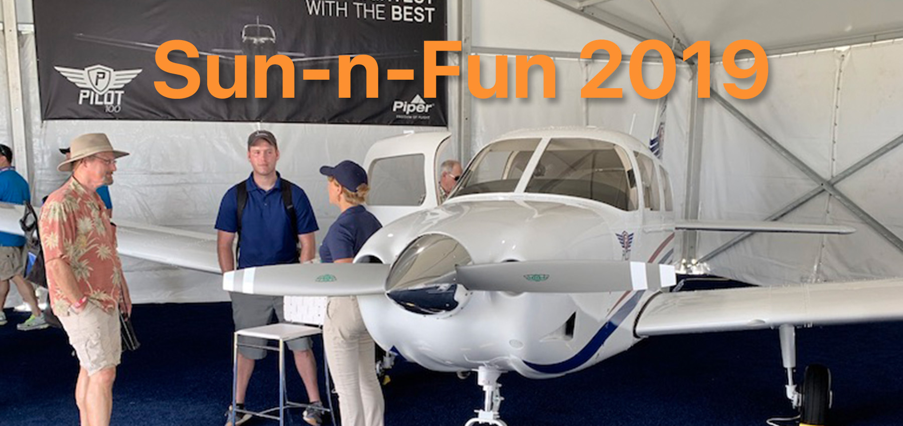

I saw this [headline](https://www.aopa.org/news-and-media/all-news/2019/november/13/mooney-factory-closed) a couple of days ago that Mooney's factory has shut down. If you try to call the plant in Kerrville, TX, you are greeted with an automated message saying that the employees have been furloughed. Not only is this not good for Mooney, it is not good for General Aviation as a whole.

The Mooney M20 is probably my favorite aircraft that I have flown as a pilot. The Mooneys are known for being efficient sleek airplanes that can travel at 200 MPH. I did my complex commercial and instrument training in M20J models. I absolutely loved every minute I spent in that airplane.
   
A couple of years ago Mooney was purchased by a Chinese company with plans to build a new trainer. This airplane would have been called the M10. Mooney had shut down right after the financial crisis of 2008, and did not manufacture any new aircraft for five years. If you go to the [Wikipedia page](https://en.wikipedia.org/wiki/Mooney_International_Corporation) for Mooney International you can see they have had a long history and have changed ownership multiple times through the history of the company.

Mooney had started producing Acclaim Ultras again, but had not been producing them in great numbers. According to [AvWeb](https://www.avweb.com/aviation-news/mooney-shut-down-employees-furloughed/) Mooney only produced 14 aircraft in 2018 and four this year. The price tag of $850,000 might have something to do with the low sales numbers.

Why do general aviation cost so much money? Well there are a couple of different reasons for that, but one of the biggest ones is `Product Liability Insurance`. This problem was supposed to be solved in 1994 with the [General Aviation Revitalization Act](https://en.wikipedia.org/wiki/General_Aviation_Revitalization_Act).

Post WWII, there was a renaissance in General Aviation manufacturing. With many pilots returning from the war, they bought aircraft for their own personal use. Companies like Mooney, Cessna, Piper and Beechcraft produced aircraft for this market of pilots. They reached a zenith in production around the 1970s. Over 18,000 GA aircraft were built in 1978. That was the peak of manufacturing. 

It has been on the decline ever since. 1982 was the first year Cessna did not make a profit. Lawsuits soon caused all manufacturers to cease production or seriously curb their production. Cessna declared they would no longer manufacture piston single or twin engine aircraft until the Federal government fixed the product liability problem.

After GARA passed in 1994 Cessna began manufacturing piston singles again, but ceased making the two seat 152. The price tag also increased significantly with a new 172 costing hundreds of thousands of dollars. So while production resumed, there was still a heavy burden placed on the price by the liability insurance.

In the late 1980s you could purchase a Piper PA-28 called the Piper Cadet for $45,000. Piper just announced a streamlined version of that plane for the training market called the Piper Pilot 100. This version of the PA-28 now costs $259,000. A new Beechcraft Bonanza costs over $1 million. A Cirrus SR20 unit cost is around $454,900. A brand new Cessna 172 will cost you $398,000. Even if you factor in inflation the cost of aircraft has increased far greater than the rate of inflation.

This of course has driven up the cost of the used aircraft market. I currently co-own a Cessna 177RG with three other pilots. It is currently valued more that than what it originally sold for in 1976. While this has increased the value of the existing fleet, the average age is also increasing. The average age of a general aviation aircraft is now [50 years old](https://generalaviationnews.com/2019/05/27/aging-pilots-aging-airplanes/).

When people ask me why I bought such an old airplane, my response is it is not that old compared to the average. I have flown in aircraft that are older than I am on many occasions. Plus it is what I can afford.

The health of the General Aviation Industry is important for many reasons, but the main reason is we need aircraft to help train the next generation of pilots. 