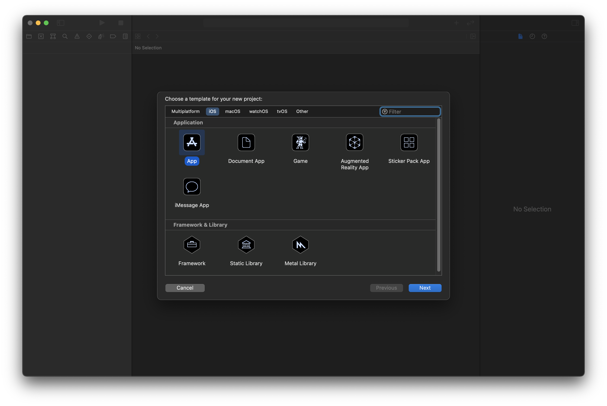
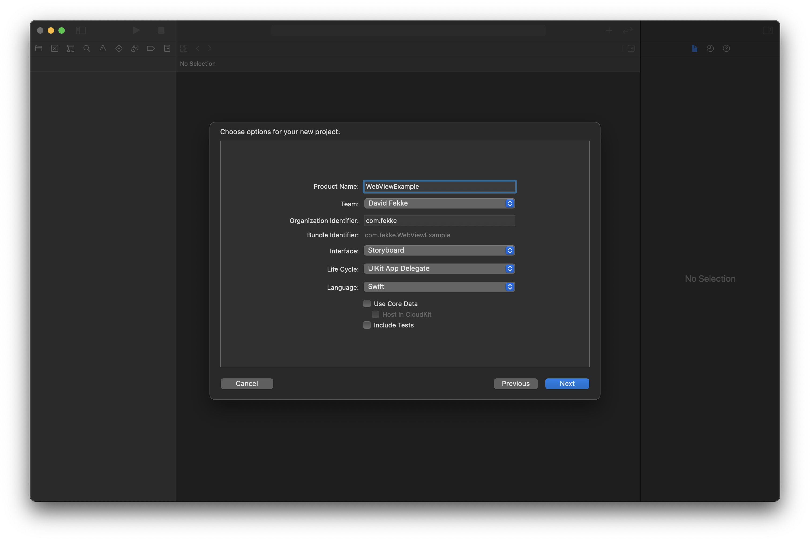
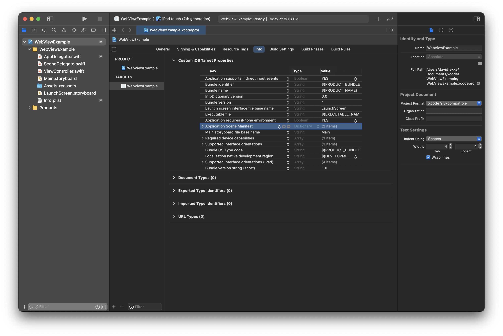
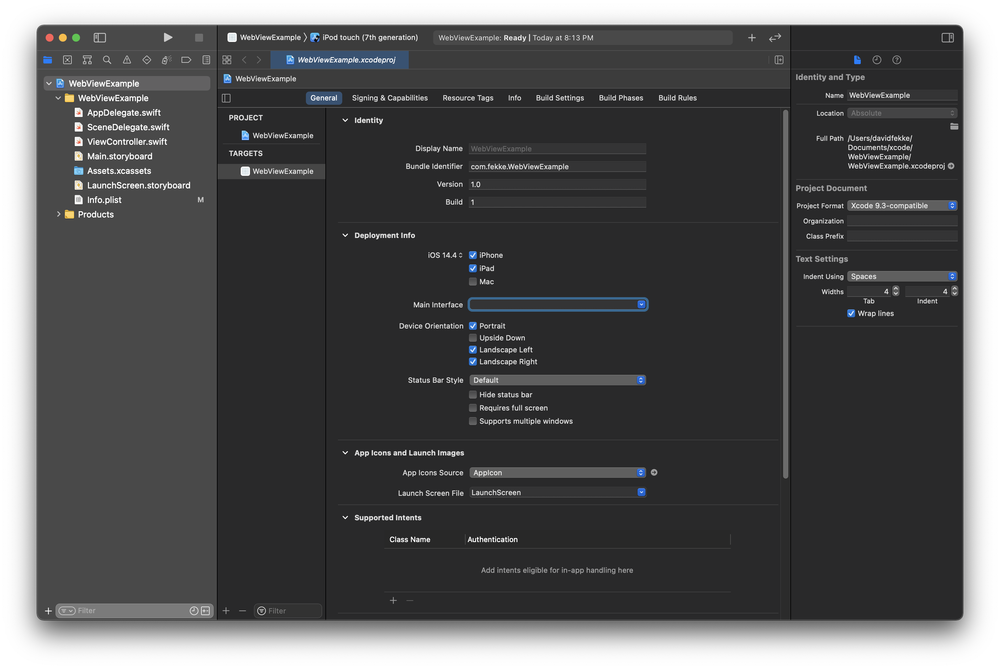
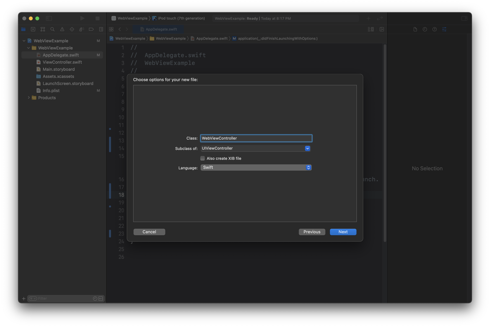
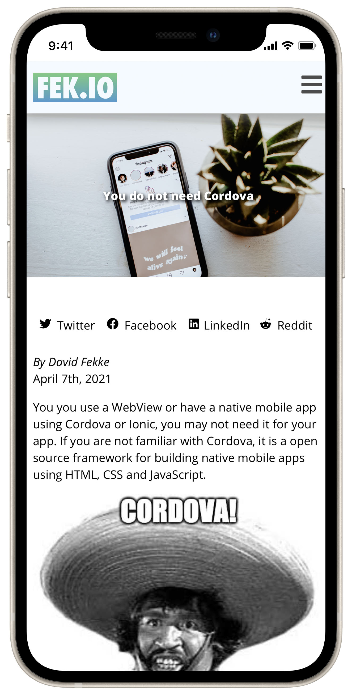

<div style="text-align: center">
<iframe width="700" height="393" src="https://youtube.com/embed/VaWiLYJpioQ" frameborder="0" allow="accelerometer; autoplay; encrypted-media; gyroscope; picture-in-picture" allowfullscreen></iframe>
</div>

Cordova is a very popular framework for creating mobile applications that are based on web technologies. It allows developers to create apps that are based on HTML, CSS and JavaScript. There are a number of different software development kits that are based on Cordova. These include Ionic and PhoneGap.

Some Cordova apps just use local content in the app, while some point to a remote endpoint. Either way the same thing can be accomplished fairly simply in a native mobile app using the native WebView components. Both iOS and Android have native components that can be used for displaying Web content. For this post I will show how to do this with Swift on iOS using the WKWebView.

# iOS WebViews

There are actually three different types of WebView in iOS. Lets look at the differences between these different WebViews.

### UIWebView

iOS actually has three different WebViews you can use, but one of these is deprecated. The original framework for displaying web content was the 'UIWebView'. This WebView was slow, and not optimized like the browser built into Safari. 

Apple has deprecated the 'UIWebView', and it will no longer accept new apps with any references to the 'UIWebView', so don't plan on using this WebView.

### WKWebView

Apple introduced the 'WKWebView' in iOS 8, and has made substantial improvements every year. This is the one you should plan on using if you want to use it as a replacement for Cordova, Ionic or Phonegap.

### SFWebView

The 'SFWebView' is the Safari WebView. Think of this as a mini browser you can embed in your app. It has many of the same features you would find in a web browser. If you are mainly trying to display HTML content, and do not need an address bar or back button, you can use the 'WKWebView'.

# How to create a WebView app for iOS

Let's build an app in Xcode that simply displays a web page. We will write this application in Swift using a UIKit based app. The first thing you will need to do is create a new project in Xcode.



On the next screen we want to make sure we set the interface to Storyboard, the life cycle to 'UIKit App Delegate' and the language to 'Swift'.



In this new Xcode project we will want to delete the scene manifest from the 'info.plist' We can do this by making sure we have the project selected in the Project Navigator on the left hand side of Xcode. 



You will see a series of tabs in the main window. Select the tab that says 'info'. This displays all of the 'info.plist' keys. We want to select the key for the scene manifest, and delete it from the list of keys.

After deleting the scene manifests we want to remove the storyboard reference from the 'Main interface'. Select the 'General' tab, and you should see the 'Main interface'. It should have 'Main.storyboard' currently selected.  



Delete the 'Main.storyboard' from the 'Main interface' field so it is empty.

# WebViewDelegate

We are now going to create a new ViewController class called 'WebViewController.swift'. You can do this in Xcode by going to the File menu, selecting New -> File. Make sure to choose the Cocoa Touch Class. On the next screen name the class 'WebViewController', subclass the 'UIViewController' and choose 'Swift' for the language.



We are going to add the WKWebView to this class as a property. In order to do this we will need to import in the WebKit framework. We will also set up view constraints in the code so we do not have to use the storyboard. The final 'WebViewController' class should look like this next example.

```swift
//
//  WebViewController.swift
//  WebViewExample
//
//  Created by David Fekke on 4/7/21.
//
import UIKit
import WebKit

class ViewController: UIViewController {

    private var webView: WKWebView?
    
    private var urlString: String?
    
    init(url: String) {
        super.init(nibName: nil, bundle: nil)
        urlString = url
    }
    
    required init?(coder: NSCoder) {
        fatalError("init(coder:) has not been implemented")
    }
    
    override func loadView() {
        webView = WKWebView()
        webView?.translatesAutoresizingMaskIntoConstraints = false
        view = webView
        
        webView?.topAnchor.constraint(equalTo: view.topAnchor).isActive = true
        webView?.leadingAnchor.constraint(equalTo: view.leadingAnchor).isActive = true
        webView?.trailingAnchor.constraint(equalTo: view.trailingAnchor).isActive = true
        webView?.bottomAnchor.constraint(equalTo: view.bottomAnchor).isActive = true
    }
    
    override func viewDidLoad() {
        super.viewDidLoad()
        if let testedUrl = urlString,
           let url = URL(string: testedUrl) {
                let req = URLRequest(url: url)
                webView?.load(req)
        }
    }

}
```

In this class we have created an init constructor that overrides the default constructor for the nibName and bundle. This new constructor takes a string parameter called 'url'. This will set the urlString property on this class, which will in turn be used in the 'viewDidLoad' function to load as request in the webView.

# AppDelegate

The last thing we need to do to get this to work is to modify the 'AppDelegate' class to use the 'WebViewController' as the 'rootViewController'. Delete the 'UI Session Scene' lifecycle functions, and then modify the 'AppDelegate' class to look like the following example.

```swift
//  AppDelegate.swift
//  WebViewExample
//
//  Created by David Fekke on 4/7/21.
//
import UIKit

@main
class AppDelegate: UIResponder, UIApplicationDelegate {

    var window: UIWindow?
    
    func application(_ application: UIApplication, didFinishLaunchingWithOptions launchOptions: [UIApplication.LaunchOptionsKey: Any]?) -> Bool {
        self.window = UIWindow(frame: UIScreen.main.bounds)
        
        self.window?.rootViewController = WebViewController(url: "https://fek.io")
        self.window?.makeKeyAndVisible()
        
        // Override point for customization after application launch.
        return true
    }

}
```

In the 'AppDelegate' class we have added a property for the 'window'. In the application didFinishLaunchingWithOptions function we the window property to a new UIWindow set to the bounds of the screen. We then set the rootViewController to the 'WebViewController' passing in the URL we want to use in the contructor. The last thing we have to do is call the 'makeKeyAndVisible()' function on the 'window'.

Now we are ready to run our app. When you run this, it should look like the following app.



# Summary

As you can see from the example in this post, it is very easy to create a native mobile app that uses the native WebView on iOS. In a future post I will demonstrate how to do this on Android using Kotlin.