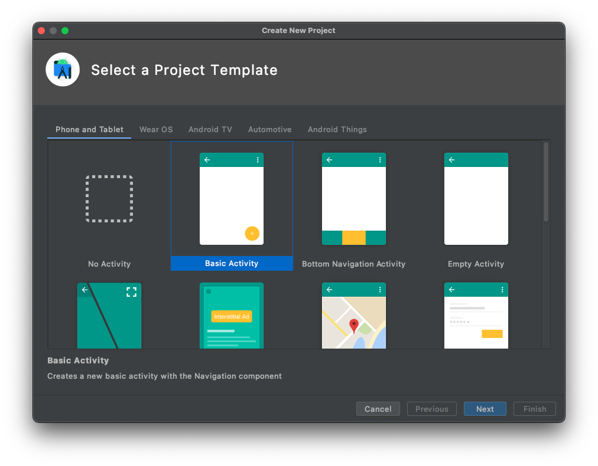
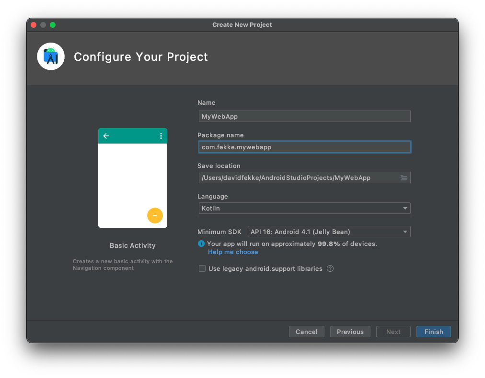

<div style="text-align: center">
<iframe width="700" height="393" src="https://youtube.com/embed/-EaJb2Jjeac" frameborder="0" allow="accelerometer; autoplay; encrypted-media; gyroscope; picture-in-picture" allowfullscreen></iframe>
</div>

I wrote a [post](/blog/you-do-not-need-cordova) yesterday on how to use a WebView on iOS without using Cordova. I got a couple of requests to show how to do this on Android using Kotlin and the WebView widget. Like on iOS, this is a very easy task to accomplish on Android.

The first thing we are going to do is create a new Android project using Android Studio. Select 'File' -> 'New' -> 'New Project' from the menu. Android Studio will display a wizard giving you a choice of which Project Template to base your app from.



We will select the 'Basic Activity'. Then click on the 'Next' button. The next screen asks you what you want to name the app and the Package name.



Pick a name for your application, package, and choose 'Kotlin' for the language. Then click on the 'Finish' button, and Android Studio will create the template for the application.

# Adding the WebView

In your project expand the 'res' folder , then the 'layout' folder in your 'app'. Open the content_mail.xml layout. You will see the white and green preview screens side by side. Click on the white preview to select it, then delete the fragment. 

In the palette on the upper left hand side, select 'Widgets', then click and drag the 'WebView' widget into the center of the view. Once you have dropped it into place, we will need to fix the constraints. We can do this by clicking on the 'Infer Constraints' button at the top of the view window. It looks like a magic wand. Once this has been done, the semi-circles at the top, bottom, left and right of the view will turn blue.

In the 'Attributes of the view we are going to rename the id from 'webView' to 'myWebView'.

# Changing the activity

Now that we have added the WebView widget the view, we change the code in the main activity to load an external website into the WebView. Open the 'MainActivity' class and delete the following code from the 'onCreate' function.

```kotlin
findViewById<FloatingActionButton>(R.id.fab).setOnClickListener { view ->
    Snackbar.make(view, "Replace with your own action", Snackbar.LENGTH_LONG)
            .setAction("Action", null).show()
}
```

Now we can add our code for loading the a website into the WebView. Add the following code to the 'onCreate' method after the setSupportActionBar.

```kotlin
val myWebView = findViewById<WebView>(R.id.myWebView)
myWebView.loadUrl("https://fek.io")
```

You will also need to add the android.webkit.WebView to the imports at the top of the activity.

```kotlin
import android.webkit.WebView
```

In order to load an external website into the WebView, you will have to add a permission to the AndroidManifest.xml file for INTERNET access. After the \<application/\> tag, add the INTERNET permission.

```xml
<uses-permission android:name="android.permission.INTERNET"></uses-permission>
```

# Tapping on link in the WebView

In order to open up hrefs in the WebView we will have to override the default behavoir of the WebView. We can do this by adding a WebViewClient to the webViewClient property on our WebView. Add the following lines to the 'onCreate' function before we call the 'loadUrl' function. The final 'onCreate' function should look like this;

```kotlin
override fun onCreate(savedInstanceState: Bundle?) {
    super.onCreate(savedInstanceState)
    setContentView(R.layout.activity_main)
    setSupportActionBar(findViewById(R.id.toolbar))

    val myWebView = findViewById<WebView>(R.id.webView)
    myWebView.webViewClient = object : WebViewClient() {
        override fun shouldOverrideUrlLoading(
                view: WebView?, 
                request: WebResourceRequest?): Boolean {
            return false
        }
    }
    myWebView.loadUrl("https://fek.io")
}
```

Now you should be able to run your app and have it use the new WebView widget.

# Summary

We have obviously just scratched the surface on what we can do with WebViews on Android. I intend on doing several more posts on the WebViews on iOS and Android in the near future.