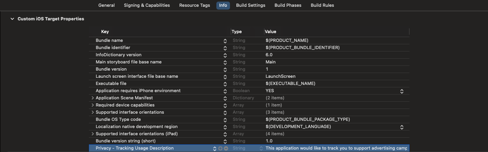
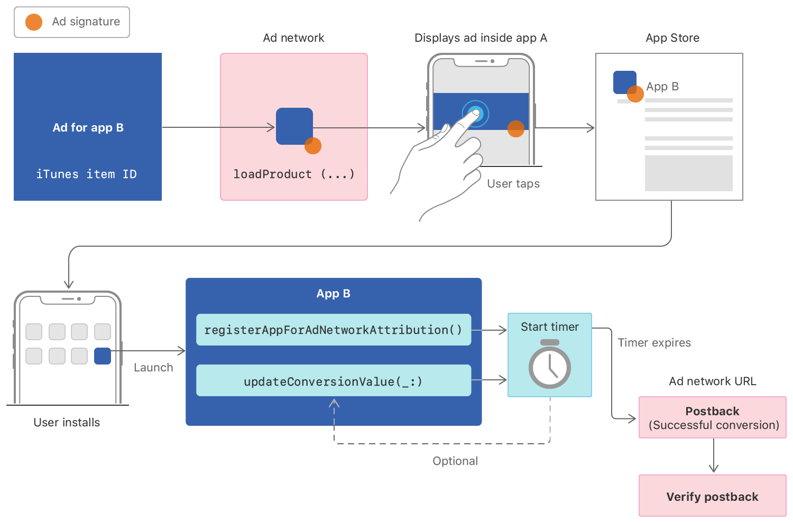

<div style="text-align: center">
<iframe width="700" height="393" src="https://youtube.com/embed/s3_EB2ABnc0" frameborder="0" allow="accelerometer; autoplay; encrypted-media; gyroscope; picture-in-picture" allowfullscreen></iframe>
</div>

Apple will be releasing OS updates for most of their mobile devices pretty soon. There is a change that has ruffled the features of a lot of people in the online advertising industry.

The issue revolves around an API that Apple has for iOS called the Advertising Identifier, or IDFA for short.

The IDFA is used by advertisers to tie advertising campaigns back to a specific device. This is very similar to how they track users with cookies on certain browsers. I say certain browsers because Apple's Safari and Brave have blocked this type of tracking. This is why when you are searching for a certain product or service on one page, and then you browse to another website you will sometimes see ads for what you were just searching. Advertisers are doing this mainly so they can tie campaigns and their success to the users viewing the ads.

For mobile app developers like Facebook, they sell advertising campaigns for other mobile apps. If a user installs a mobile app based on an ad campaign they saw on Facebook, they use the IDFA to tie the device back to the campaign to know how effective the campaign was for that app install.

# What is Apple doing?

In the upcoming release of iOS 14.5 developers are being required to get permission from the user to get their IDFA. Facebook and other companies believe that when users are prompted to allow them to track, the users will simply deny them that permission. 

If the user does not give permission to use their IDFA, the app developer will get a series of zeros when they look up this identifier. It will look something like this to the developer;

```bash
00000000-0000-0000-0000-000000000000
```

By doing this, all users that opt out will have the same IDFA, rendering it useless for the campaign.

# How do you currently get the IDFA

To retrieve the IDFA for the device now, their is a simple API call that is made to the `ASIdentifierManager` in the code. Here are some examples in Swift and Objective-C;

```swift
// Swift
import AdSupport

...

let idfa = ASIdentifierManager.shared().advertisingIdentifier
```

```objc
// Objective-C
#import <AdSupport/AdSupport.h>

...

NSUUID *IDFA = [[ASIdentifierManager sharedManager] advertisingIdentifier];
```

In iOS 14.5 and greater, if you want to get a valid identifier back, you will need to add a key to your info.plist for `NSUserTrackingUsageDescription`. You will have to make sure the description here is valid, otherwise Apple will reject your application. Here is what it looks like on the Xcode project 'info' tab;



# Solutions when the User Ops Out of App Tracking

If you were to ask most mobile phone users if they want to be tracked, I believe most would say no. This is one of the reasons why Facebook is so upset. This may not satisfy Facebook, but Apple has added an API to try to find a middle ground with advertisers while satisfying the privacy concerns of their customers. 

Apple has a framework called SKAdNetwork which allows advertisers to run campaigns without gathering the unique identifier of a users device. While this does not replace what advertising networks can do with a IDFA, it does give them feedback on the success of a campaign.


<p align="Center" style="font-size: small; color: gray;">Graphic courtesy of Apple, Inc.</p>

To use the new functionality, developers will need to [register](https://developer.apple.com/contact/request/ad-network-id/) their Ad Network with Apple. Once they have registered their network, the developer will need to configure the participating apps for the network identifier, or `SKAdNetworkIdentifier`. This can be done by adding a dictionary to the 'info.plist' for the key 'SKAdNetworkItems'. 

```xml
<array>
    <dict>
        <key>SKAdNetworkIdentifier</key>
        <string>adnetworkA</string>
    </dict>
    <dict>   
         <key>SKAdNetworkIdentifier</key>
         <string>adnetworkB</string>
    </dict>
</array>
```

The apps that are installed can update Apple about the conversion by calling the registerAppForAdNetworkAttribution() or updateConversionValue(_:) methods in SkAdNetwork. No personal information is shared with the advertiser. Apple will update the advertiser with a callback within 24 hours of the conversion.

The advertiser will have to host a service to receive the callback. This is done when registering the advertising network. Apple will provide feedback with 24 hours. If the request is unsuccessful, they will try again nine times over nine days.

## Relevant documentation

[Registering an Ad network](https://developer.apple.com/documentation/storekit/skadnetwork/registering_an_ad_network)

[Configuring the Participating Apps](https://developer.apple.com/documentation/storekit/skadnetwork/configuring_the_participating_apps)

[Receiving Ad Attributions](https://developer.apple.com/documentation/storekit/skadnetwork/receiving_ad_attributions)

# Summary

I am sure that advertisers are going to find ways to get around this limitation with the IDFA, but there are tools that we can use to track the success of a campaign.