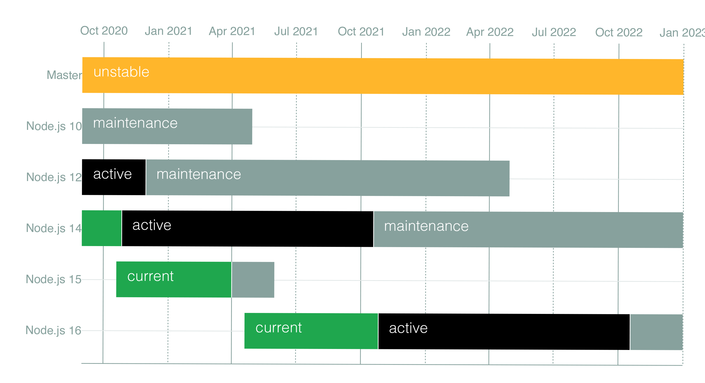

The Node.js foundation just released the first version of Node v16.0.0. The Node.js maintains multiple versions, including the current release along with a long term support (LTS) release. The current v16 release will become the LTS release sometime in October 2021. This is the normal release [schedule](https://github.com/nodejs/Release#release-schedule) for Node.



# Apple Silicon Support
Apple released a new CPU architecture last November based on ARM64. These are the Macs using the M1 chip from Apple. While Node.js did run on these newer machines, it did so through Apple's Rosetta technology. Rosetta allows x86_64 code to run in emulation on the newer chips. While this is stable, it is not ideal.


You can now download this release through the Node foundation as a `.pkg` file or through the Node Version Manager. This is the first release with Apple Silicon binaries. The `.pkg` installer will install a universal binarythat will run either on Apple Silicon processors or on Intel based Macs.

# V8 version 9.0

The version of V8, the JavaScript engine for Node.js, has been upgraded to version 9.0. Previously in Node version 15, they were using V8 8.6.

Part of this new version of V8 includes new Regular Expression capabilities for start and end indices of a captured string. This is available when you use the `/d` flag and access the `.indices` array property.

# Stable Timers Promises API

Stable Timers were previously available in Node v15 under an experimental status. They are now considered a stable feature.

```javascript
import { setTimeout } from 'timers/promises';

async function doSomething() {
  console.log('doSomething started!');
  await setTimeout(2000);
  console.log('Delayed Timers!');
}
doSomething();
```

# Experimental Web Crypto API

The Web Crypto API is the newer more well defined version of the Crypto library for JavaScript. All of the new Web Crypto methods are available on the `subtle` interface. 
Many browsers used an interface called `Crypto` without having a specific specification. The Web Crypto API adds a standard to the `Crypto` library.

```JavaScript
import { webcrypto } from 'crypto';
const { subtle } = webcrypto;

(async function() {

  const key = await subtle.generateKey({
    name: 'HMAC',
    hash: 'SHA-256',
    length: 256
  }, true, ['sign', 'verify']);

  const digest = await subtle.sign({
    name: 'HMAC'
  }, key, 'I love node.js');

  console.log(digest);
})();
```

# Node-API version 8
The Node API provides an interface for writing Native C++ add-ons as node modules. Version 8 of the Node-API adds native methods for the following methods;

* `napi_add_async_cleanup_hook`
* `napi_object_freeze`
* `napi_object_seal`
* `napi_type_tag_object`
* `napi_check_object_type_tag`
* `napi_type_tag`

# AbortController

The AbortController Web API provides a global API that can be used to cancel select promised based APIs. Event listeners should use the `{ once: true }` option  ensure that the event listener is removed. Here is an example of the AbortController being used with a event listener;

```JavaScript
const abortC = new AbortController();
abortC.signal.addEventListener('abort', () => {
    console.log('Just cancelled')
}, { once: true });
abortC.abort();
console.log(abortC.signal.aborted);
```

# Buffer atob and btoa

These methods for converting data into base64 encoded strings and back where added to support legacy web platform APIs. This is not the preferred way, and should not be used in new code.

The preferred way to convert data into a base64 encoded string is to use the `Buffer.from(data, 'base64')` method or `buf.toString('base64')` to convert the buffer into a 'base64' string.

```JavaScript
const str = 'Hello JavaScript Developer!';

const strBuf = Buffer.from(str, 'utf8');
console.log(strBuf);
// <Buffer 1d e9 65 a0 96 af 69 27 2b 8a 9b 43 7a f7 a5 a2 97 ab>

const base64Buf = Buffer.from(strBuf, 'base64');
const base64Str = base64Buf.toString('base64');
console.log(base64Str);
// SGVsbG8gSmF2YVNjcmlwdCBEZXZlbG9wZXIh

const bufFromBase64Str = Buffer.from(base64Str, 'base64');

const decodedStr = bufFromBase64Str.toString('utf-8');
console.log(decodedStr);
// Hello JavaScript Developer!
console.log(str === decodedStr);
// true
```

# Other features

* npm v7.10.0
* Source Maps v3
* process.binding() has been deprecated

# Conclusion

Node.js upgrades are usually incremental upgrades. As the V8 runtime is upgraded with new features, Node gets these features with the new version of V8. I am looking forward to the LTS release in October.

