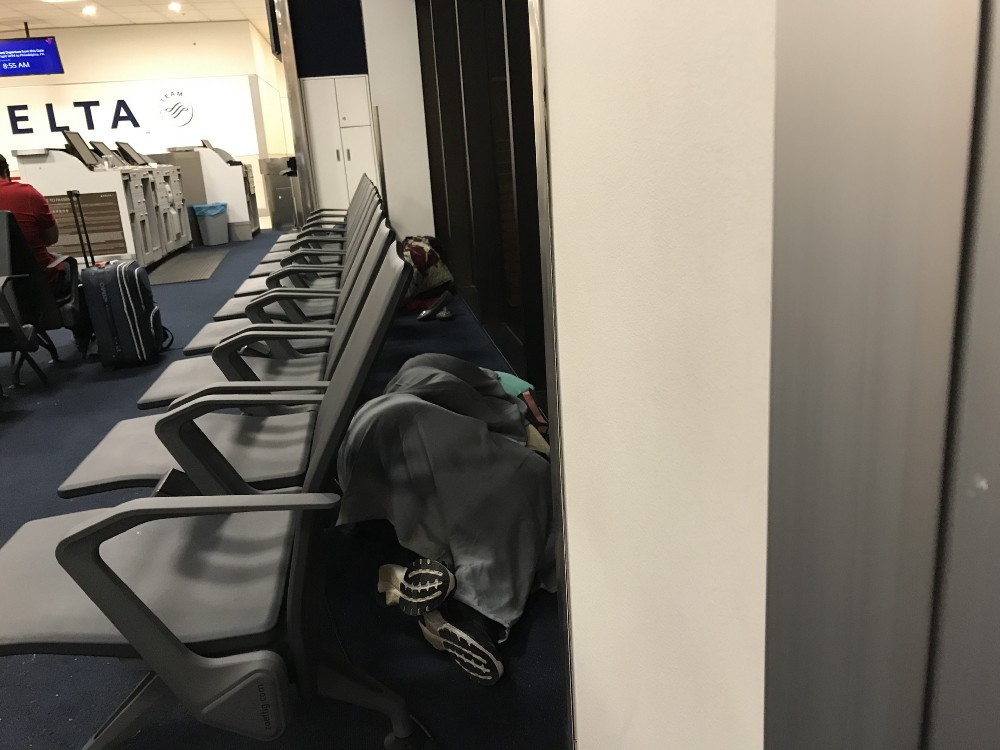

As the pandemic winds down, and more and more people start flying again, it is important to remember that the air traveling experience is not all it is cracked up to be sometimes.

A couple of years ago I made a business trip to Northern California on Delta Airlines. I am a Delta Airlines SkyMiles member, and have been for over a decade. I like thousands of other travelers got caught up in the delays and cancellations that affected Delta after a five hour hold on April 5th, 2017 at Atlanta’s Hartsfield airport. This stoppage caused over 3000 cancellations over the next 5 days.

We have an expression in the South: “If you die and goto Heaven, you have to stop in Atlanta first”. Delta’s biggest hub is in Atlanta. Even though Delta is the second largest carrier in the United States, over 60% of Delta’s flights go through ATL.

On Thursday of that week I was traveling to San Francisco airport when I got a notification from Delta on my phone that our flight was being delayed from the noon departure time to 3:30 PM. After going through security at SFO I received another notification that my flight to ATL was being bumped back until 8:00 PM.

I decided to make the best of it by reading a book I had in a quiet section of SFO. At 5:30 PM I received a text message from someone who was on the same flight that he had heard that our flight had been rescheduled to leave at 6:00 PM. I preceded to the gate and boarded. I did not receive another notification from Delta about this until 6:00 pm. If Delta had actually left at 6:00 PM, I would have missed my flight back to ATL.

Because like so many other passengers had not received a notification about the departure time, Delta did not depart until just after 7:00 PM. They waited for the 40 passengers who had checked in, but had not boarded yet. We eventually departed SFO at 7:40 PM.

By the time we had landed in ATL is was nearly 3:00 AM in the morning. When I deplaned, I expected that the terminal would be empty. Instead I found thousands of other passengers sprawled out wherever they could find a space sleeping. If they were not sleeping, they were standing in one of the many lines that seemed to go on for miles waiting to try to get rebooked on a flight the next day.

I was able to book a flight back to Jacksonville for 10:25 AM. While waiting for the next flight, I with the thousands of other passengers got to sit through an alarm that went on for what seemed like hours in Terminal A. You can listen to it below.

<iframe width="700" height="393" src="https://youtube.com/embed/l2BEsu3Aap0" frameborder="0" allow="accelerometer; autoplay; encrypted-media; gyroscope; picture-in-picture" allowfullscreen></iframe>

While I was waiting for the plane to arrive at my gate, I could not help but notice that there was another flight at my gate that had not left yet. It turns out that the flight before ours needed an additional Flight Attendant, and they would not let anyone board the aircraft until they had one for that flight.
35 minutes before my flight to JAX was supposed to depart, I and the other passengers waiting for our flight got a text message from Delta saying that our flight had been moved to another terminal. I made it with the other passengers to the new gate and proceeded to board the aircraft for JAX. This flight was only 25 minutes late, and we arrived in JAX just after noon on Friday. My colleague was not as lucky. Even though he boarded his connection to JAX an hour before my flight, they did not touch down until 2:00 PM. The reason for the delay was that aircraft they boarded was originally headed to Portland, and they had too much fuel to land at JAX. Everyone had to deplane that aircraft because they could not get a fuel truck out to empty fuel from the tanks. By the time one had arrived, it was too late. Delta had already changed the manifest.

## Why did no one hear of this Massive Delay for Delta

In what turned out to be one of the luckiest PR events in the history of the airline industry, in the same week that Delta’s system wide travel failure occurred, United Airlines forced a Doctor off one of their flights. This became the prevailing horrible airline news story from that week. United got all of the bad ink for that week, and Delta escaped any public ridicule.

Read about [Dr. David Dao](https://abcnews.go.com/US/doctor-dragged-off-united-airlines-flight-watching-viral/story?id=62250271) at ABC News.

# End Result

I am a licensed commercial pilot, but at this point I had not flown in two decades. After going through this ordeal and given the extra special treatment from the TSA one too many times, I decided to get current and start flying again.

Since then I have purchased a partnership in a Cessna Cardinal. This is not as fast or inexpensive as traveling on an airline, but I no longer have to go through the TSA, and I can set my own schedule for when I want to travel and where.

If you hate traveling with the airlines, you should seriously consider getting a pilots license.