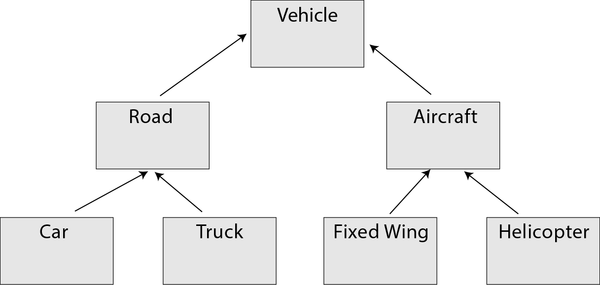
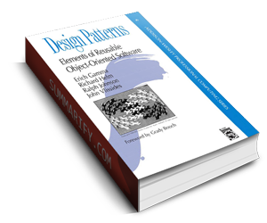

<div style="text-align: center">
<iframe width="700" height="393" src="https://youtube.com/embed/t1q9I9obHJA" frameborder="0" allow="accelerometer; autoplay; encrypted-media; gyroscope; picture-in-picture" allowfullscreen></iframe>
</div>

There are actually times when you want to use object inheritance in your applications. I have seen a lot of applications that extend a lifecycle API through object inheritance.

Inheritance was designed as a way for software developers to extend existing functionality and add properties to an existing base class or object. When modeling data as objects it is very common to create object graphs where one object may be a grandchild or great grandchild of a base object.



As an example we might have a `Person` object that is a parent object. We can create `User` object that extends the `Person` object. We may also have an `AdminUser` object that extends the `User` object. Any change I make to the `Person` object will automatically inherited by the `User` and `AdminUser` objects.

Some of the side affects of inheritance is that if we make a change to the definition of the base object, it is now tightly coupled to the entire chain of objects. This can create something known as the Fragile Base Class problem. Another problem if we are trying to add functionality to our objects using inheritance, in most general purpose languages we can only inherit from one  object. C++ is one of few languages that allows developers to do multiple inheritance. Languages such as C#, Objective-C, Java and Swift only allow for single inheritance.

# Delegation Pattern

One of the patterns I was introduced when I started learning Objective-C was the Delegation pattern that is common through a lot of Apple's APIs. This is similar to the Observer pattern mentioned in the Gang of Four Design Patterns book.



[Objective-C](https://developer.apple.com/library/archive/documentation/Cocoa/Conceptual/ProgrammingWithObjectiveC/Introduction/Introduction.html) is a language that was made popular by Next Computer, the company Steve Jobs started when he left [Apple](https://apple.com), and which he sold back to Apple in 1996. Next adopted Objective-C as their default language because it could be used to create Object-Oriented applications and frameworks, but it also allowed developers to use existing C code.

Since Objective-C only allows for single inheritance, Apple developed a lot of their APIs to make use of a delegation pattern. The idea is pretty simple. If the developer is writing a class in a program, and they need to consume a network or database server resource, they can create an instance of the API class, and make their class a delegate of that object. Making a networking call can be a blocking process if you are waiting for the response on a single thread. Apple was able to abstract away of a lot of the complexity of making networking calls by encapsulating the threading into their API. All the consumer had to do was implement certain methods on their class to consume the results from the networking API, and set their class as the `delegate` of the networking class.

Today Apple has a lot of modern APIs that use closures and blocks to handle a networking requests in a non-blocking way, but the Delegation pattern is still used in a lot of their APIs.

# Inheriting Functionality in JavaScript

Lets' say we have an object we are creating that needs to offload some work to another object, and then needs to have a function called on once the other object has completed that task. One way of doing this is to inherit that functionality from a parent object. For this example we create two objects, one called `parent`, and the other called `child`. The `child` is going offload some of its work to the `parent` object. The `parent` object will have functions called `doWorkForChild`, `setStatus` and `sayHelloToMe`.

The `child` object will inherit the methods from the `parent` object, but we are going to override the functionality of the `setStatus` function, and add functions for `start` and `print`.

```javascript
function parent() {
    return this;
}

function child() {
    return this;
}
```

Then we are going to set the prototype of the `child` to the `parent` so we can inherit the functionality of the `parent`.

```javascript
child.prototype = Object.create(parent.prototype);
```

Now we can define the functions for each of our objects. 

```javascript
//parent functions
parent.prototype.doWorkForChild = function() {
    console.log('Doing something');
    setTimeout(() => {
        const time = new Date();
        const currentTime = time.getTime();
        this.setStatus(currentTime);
    }, 5000);
}

parent.prototype.sayHelloToMe = function(name) {
    this.setStatus(`Hello ${name}`);
}

parent.prototype.setStatus = function(status) {
    console.log('setStatus called');
}

// child functions
child.prototype.start = function() {
    console.log('Starting child');
    this.sayHelloToMe('Parent');
    this.doWorkForChild();
}

child.prototype.print = function() {
    console.log('Printing child');
}

child.prototype.setStatus = function(status) {
    console.log(`Current Status: ${status}`);
}
```

As we can see from the example above we have overridden the `setStatus` function on the child object so that it prints the `status` parameter using the `console.log`.

To run this example we need to create a new instance of the `child` object and call the `start` function on the instance.

```javascript
const childInstance = new child();
childInstance.start();
// Output should look like the following
// Starting child
// Current Status: Hello Parent
// Doing something
// Current Status: 1620506525300
```

# Decoupling the objects using the Delegate Pattern

Lets' put the functionality we have in the `parent` object into a new factory function called 'worker'.

```javascript
// worker.js file
function createWorker() {
    if (new.target) 
        throw 'createWorker() must not be called with new';
    
    let delegate;

    function setDelegate(observer) {
        delegate = observer;
    }

    function doWorkForDelegate() {
        console.log('Doing something');
        setTimeout(() => {
            const time = new Date();
            const currentTime = time.getTime();
            delegate.setStatus(currentTime);
        }, 5000);
    }

    function sayHelloToMe(name) {
        delegate.setStatus(`Hello ${name}`);
    }

    return Object.freeze({
        setDelegate,
        doWorkForDelegate,
        sayHelloToMe
    });
}

export default createWorker;
```

As you can see this function creates an object with the same functions we had in the `parent` object previously. The main difference here is that we have variable called `delegate` that we use to store a reference back to a delegate object. Now we need to create an object that will observe calls made from the `worker` object.

```javascript
import createWorker from './worker.js';
const worker = createWorker();

function createDelegate() {
    
    function start() {
        console.log('Starting delegate');
        worker.sayHelloToMe('Delegate');
        worker.doWorkForDelegate();
    }

    function print() {
        console.log('Printing delegate');
    }

    function setStatus(status) {
        console.log(`Current Status: ${status}`);
    }

    const instance = Object.freeze({
        start,
        print,
        setStatus
    });

    worker.setDelegate(instance);

    return instance;
}
```

As you can see from the example above we are creating an instance variable of our delegate object. We then assign this instance of our delegate to the delegate property in the worker object. Once the worker has this reference, it can now call functions on the delegate object.

Now all we have to do is start up the delegate object to start observing responses from the worker object.

```javascript
const delegate = createDelegate();

delegate.start();
// Output:
// Starting delegate
// Current Status: Hello Delegate
// Doing something
// Current Status: 1620523716260
```

# Alternative Approaches

The wonderful thing about JavaScript is that there are multiple ways of achieving the same result. We can do the same thing we did above by using callbacks or event listeners. A lot of modern JavaScript APIs you can use `Promises` in combination with `async/await` in accomplishing the same result.

# Conclusion 

The Delegation Pattern is a great alternative to having to inherit functionality from a base object, and allows the developer to observe multiple objects at the same time. This is also a great pattern to use if you need to wire up many different lifecycle events to an API without having to use an actual event listener.

[Example Code](https://github.com/davidfekke/delegateexample)
