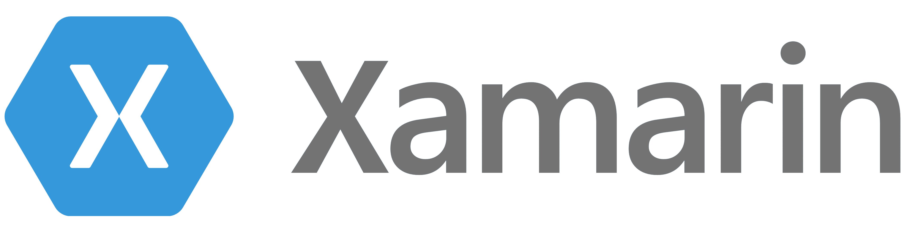
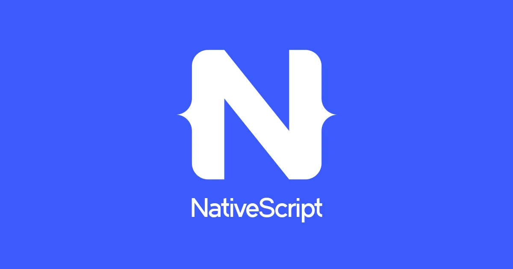
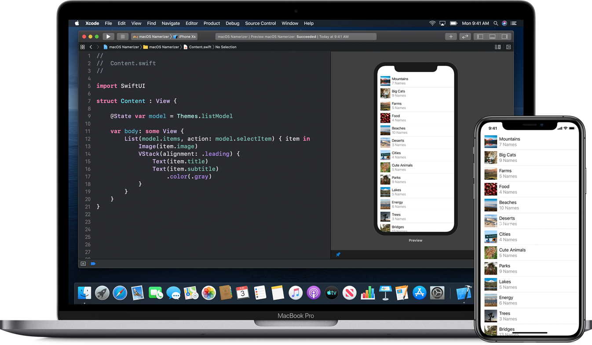

<div style="text-align: center">
<iframe width="700" height="393" src="https://youtube.com/embed/KTD3szzMfyI" frameborder="0" allow="accelerometer; autoplay; encrypted-media; gyroscope; picture-in-picture" allowfullscreen></iframe>
</div>

Building apps for the iOS/iPadOS and Android platforms may seem daunting if you are new to mobile development, but there are many different options for developing these apps that may suit your needs. In this post I will cover some of the options for developing mobile applications and the discuss the pros and cons for each of the different options.

Mobile development options can be broken into three main groups: Web based, cross-platform native and pure native development. I will try to drill down into each option that developers might want to use for building their mobile apps.

# Web Based Frameworks

There are a number of different frameworks that target web developers, and allow them to build an application that can be installed from the respective stores. These applications can be built just using HTML, CSS and JavaScript. We can also think of these types of applications as being packaged WebViews.


# Cordova

Cordova is a framework that sprang out of building applications using web technologies like HTML/CSS and JavaScript, and embedding the HTML app in a native container. This has been a huge boost to existing web front-end developers who where already knowledgable in web technologies. The native applications can be submitted to the individual app stores just like regular native applications.

If you are using Cordova, make sure to use the latest version of Cordova. Earlier versions contained references to the UIWebView from Apple. Apple will not accept new apps that contain references to the UIWebView.

#### Pros
* Easy to transition if you are a existing web developer
* Many HTML and JavaScript frameworks built for mobile applications
* Easily add Plugins to utilize native functionality like Push Notifications

#### Cons
* At the end of the day this is an Encapsulated WebView
* Because UI is built with Web Frameworks instead of native users make get a sense of uncanny valley
* Extending functionality requires knowledge of Objective-C and Java


## PhoneGap

DEPRECATED! Cordova is the open source project the sprung out of PhoneGap. PhoneGap was a commercial project that eventually was purchased by Adobe. Adobe has discontinued their investment in PhoneGap and Cordova. Cordova continues as a open source project.

Do not start any new applications using PhoneGap. If you are taking over a project built on PhoneGap, transition over to Cordova, or think about rebuilding in another framework.

## Ionic

Ionic is a framework built around Angular and Cordova. If you are familiar with the Angular ecosystem and like Cordova, this may a framework you may be interested in learning.

# Alternative WebView Development

I have some blog posts I have done on how to create your own WebViews on the specific platform native. In this [post](https://fek.io/blog/you-do-not-need-cordova/) I describe how to use the WKWebView in iOS in a native iOS application without having to use Cordova. In a follow up [post](https://fek.io/blog/using-a-web-view-on-android-still-no-need-for-cordova) I show how to do the same thing in an Android application.

# Cross Platform Options

There are a number of different options for building mobile apps that are multi-platform that share code. One of the wishes of software engineers is the ability to build applications that are WORA, or Write Once/Run Anywhere. The Java platform was originally supposed to be a language and a system for writing your application once and running anywhere.

# Flutter

Flutter is another cross platform framework from Google. Unlike Cordova, Flutter does not use a WebView, but uses a common language for developing applications called Dart. Dart originally was targeted as an alternative to JavaScript. 

#### Pros
* Build cross platform apps for not just Android and iOS, but many other operating systems
* Good tools for animation
* You can build applications with 'Widgets'
* Will be Fuscha compatible

#### Cons
* The main development language is Dart
* Some performance problems
* Not all native features available to Flutter developers
* Not many plugins for extending functionality
* Difficult to make platform specific UI
* Not a mature technology



# Xamarin

[Xamarin](https://dotnet.microsoft.com/apps/xamarin), now officially part of Microsoft and Visual Studio, this framework is based off of .NET and C#. If you are a .NET developer and unfamiliar with Java/Kotlin on Android and Swift/Objective-C on iOS, this may be the framework for you. You can build and structure your applications using Visual Studio solutions. In your solutions, you can divide your project into shared code projects, and individual projects for iOS and Android. This allows the developer to custom tailer their app to the specific UI of the platform they are targeting. It also allows the developer to share business logic for both platforms.

#### Pros
* If you have developers that are familiar with .NET, the language and tools are the same ones they are used using
* Allows the reuse of code between Android and iOS
* Uses Ahead of Time compiling to create native apps 
* Some APIs from .NET available for use with Xamarin

#### Cons
* Does require a Mac for compiling iOS apps
* No Visual Studio support for M1 Macs

## Xamarin Forms

Xamarin forms present a cross-platform tool for creating User Interfaces that work on both iOS and Android. Not all UI elements available on both platforms.


# React Native

This framework is the same framework used for React.js applications. React is a very popular JavaScript based view engine for building component based UIs. React Native has its own native views that can be composed using React. It also has its own implementation of Flexbox for laying out your UIs.

A JavaScript bridge is used to bind your business logic to your User Interface components. React Native uses JavaScript Core for the bridge. Like React.js, this project is sponsored by Facebook.

#### Pros
* Build Native Apps using JavaScript JSX while still being a native app
* Easily extend your application with React Native modules
* Can use React developers to build mobile apps
* Can also build React Native Web applications

#### Cons
* Can run into performance problems using the JavaScript bridge
* Writing custom modules requires knowledge of Objective-C on iOS and Java on Android
* Scroll performance suboptimal
* AirBNB wrote a number of posts on problems they had with React Native [here](https://medium.com/airbnb-engineering/react-native-at-airbnb-f95aa460be1c), [here](https://medium.com/airbnb-engineering/react-native-at-airbnb-the-technology-dafd0b43838), [here](https://medium.com/airbnb-engineering/building-a-cross-platform-mobile-team-3e1837b40a88), [here](https://medium.com/airbnb-engineering/sunsetting-react-native-1868ba28e30a) and [here](https://medium.com/airbnb-engineering/whats-next-for-mobile-at-airbnb-5e71618576ab)



# NativeScript

NativeScript has a similar model to that of React Native. But unlike React its framework was originally based on Angular. NativeScript also has support for Vue, Svelte and React.

NativeScript shows how Angular, Vue and React are not just web application frameworks, but can be used as just application frameworks. This project is part of the OpenJS foundation

#### Pros
* Similar framework to React
* build Native apps with JavaScript or TypeScript
* Support for multiple application frameworks including Vue, Svelte and Angular

#### Cons
* Similar performance problems that you have in React Native
* Limited set of Native APIs that accessible to the developer

# Native iOS/iPadOS

The way that Apple and Google would prefer you write applications for their respective OS's would be natively. iOS and iPadOS have their own frameworks and languages. Apple's MacOS was originally based on the NextStep operating system which used Objective-C for all of its frameworks. 
## IDE and Tools



Apple has an integrated development environment called `Xcode` that has all of the tools you need for building native applications in one tool. Xcode allows developers to write code in C, C++,Objective-C and the Swift programming languages. It includes the LLVM based Swiftc and Clang compilers.

It also comes with the frameworks that make up CocoaTouch designed by Apple for developing software for iOS/iPadOS. It was originally derived from the Objective-C Cocoa APIs from MacOS. 

### Objective-C

Objective-C was the primary language used for developing software for the NextStep and Mac OS X, and for the first seven years of iOS. Objective-C was originally designed as a way of building Object-Oriented software on top of the C programming language. Objective-C classes are usually made from two files, a header '*.h' and an implementation '*.m' file. You can also combine C++ code by adding an extra m '.mm' to the implementation file for whats called Objective-C++.


### Swift

In 2014 Apple introduced the Swift programming language. Swift like Objective-C is a general purpose language, but with many functional features. Swift has advanced Generic features, closures and error handling syntax.

```swift
let greeting = "Hello!"
print(greeting)
// Output: Hello!
```

## SwiftUI

Apple introduced SwiftUI in 2019, which allows developers to build declarative UIs in code. Views are composed from lightweight structs as opposed to classes in traditional CocoaTouch.

#### Pros
* Build apps specific for the platform
* Strong support options from Apple
* Full access to all publicly available APIs

#### Cons
* Objective-C and C may be too low level for some developers, but must development can be done now with Swift
* Steeper learning curve for Web Developers


## Native Android

The Android operating system is based on Linux and the APIs are based on Java. Since it is based on Java, developers can add existing Java libraries into their applications. 

## IDE and Tools


Android Studio is the IDE Google licensed from Jet Brains, the company that makes the IntelliJ family of IDEs. It comes with a cod editor, ADB tools and Android emulators for testing your applications.

### Java

Originally developed by Sun in the 1990s, Java is an object-oriented general purpose programming language. Java code is typically compiled into bytecode, or intermediate code instead of an executable built for one processor. Current versions of the Android Developer tools actually compile the applications using ART which does ahead of time compiling for machine code.


### Kotlin

[Kotlin](https://kotlinlang.org/) is a newer general purpose object oriented programming language developed originally out of Jet Brains, the makers of popular programmer IDEs and developer tools. It is now the default programming language for Android development and runs in the Java eco-system.

```kotlin
// Hello, World! example
fun main() {
    val scope = "World"
    println("Hello, $scope!")
}

fun main(args: Array<String>) {
    for (arg in args) {
        println(arg)
    }
}
```

### Jetpack Compose

Google currently is developing a new declarative UI framework similar to SwiftUI for Android called Compose. It is still in beta, but developers can download and start using the Canary release.

#### Pros
* Build apps specific for the Android platform
* Full access to all publicly available APIs

#### Cons
* Java and C may be too low level for some developers, but most development can be done now with Kotlin
* Steeper learning curve for Web Developers

# Game Development

There are a number of different options for building cross-platform games on mobile. I am only going to attempt to cover a few in this post. You can also develop games using native tools from each vendor, but frameworks below are higher level and considered easier for building games. 

## Unity

Unity3D is a program and engine for building apps and games on multiple platforms including iOS and Android. They have options for 3D games and 2D games. They also have options for multiple programming languages including Lua, C# and JavaScript. 

#### Pros
* Easily create games using the Unity3D engine
* Can extend those games with JavaScript, Lua, C#, C++, IronPython, Rust and Boo

#### Cons
* Unity licensing may be too expensive for some developers
* Unity may provide too much of an abstraction for developers who may need GPU access

## MonoGame

The MonoGame framework allows game developers to target multiple platforms including iOS/Android. Developers can use C# or other .NET languages to build their games. 

#### Pros
* Open Source project
* Build Games using .NET like frameworks and languages like C#

#### Cons
* No professional support options

# Conclusion

There is an expression that says that you should use the best tool for the Job. I have been developing mobile software for over 10 years and I have used the native tools for most of my development. This is mainly due to the fact that I like to have fool access to all of the APIs on the platform.

One of the things you can do is mix and match frameworks. You can build a native app for iOS that also uses pieces that are built from Cordova. It is also common for some React Native apps to have parts that are completely native with some views built using React. Pick the tool that best fits your needs.
