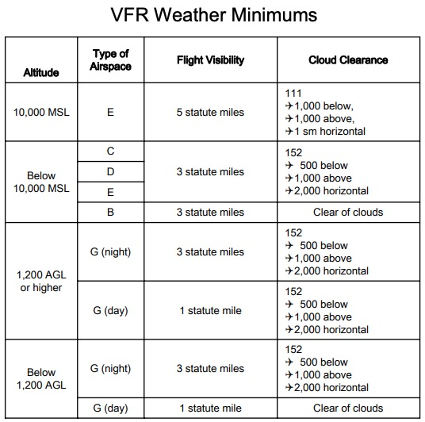

I have recently seen a bunch of different reports in the press about UAPs, or unidentified aerial phenomena. These used to be called UFOs or unidentified flying objects.

After watching several of the Navy [videos](https://www.youtube.com/watch?v=QWUcJfDQ35g) a thought occurred to me, are these vehicles aware of the FAA? Don't they know we have Federal Aviation Regulations? I have decided to make a list of the regulations they are possibly breaking. Do they even have an up to date copy of the FAR/AIM?

## Airspace

A lot of these sightings have occurred off of the US coast and in Navy practice areas. Some of these areas are known as Air Defense Identification Zones, or ADIZ for short. Any aircraft entering or leaving an ADIZ must provide identification. This is covered in [FAR part 99](https://www.ecfr.gov/cgi-bin/text-idx?rgn=div5;node=14%3A2.0.1.3.14#se14.2.99_143). 

All aircraft must also file a flight plan. Since these flights possibly began outside of our solar system this would most likely require filing an international flight plan under the ICAO format.

I have not heard about one of these things bothering to call Air Traffic Control.

## Required Equipment

Since the beginning of 2020, aircraft flying into rule airspace must have ADS-B out equipment installed in their aircraft. This is covered in FAR Part [91.225](https://www.law.cornell.edu/cfr/text/14/91.225). I have not heard of any specific Class B or Class C airspace violations yet, but this could become a problem if they were to fly into this airspace. I doubt these "Tic-Tacs" have all of the necessary equipment.

## Visual Flight Rules

Are these UAPs following proper clearances from the clouds? Are they even maintaining proper VFR weather minimums? Here is a reminder;

## Part 21

Are these UAPs even following the type certification requirements under [Part 21](https://www.ecfr.gov/cgi-bin/text-idx?SID=da23626c21aa97af26bbc2622a9f78d8&mc=true&node=pt14.1.21&rgn=div5#sp14.1.21.f)? I seriously doubt it. According to the eye witness accounts, there was no known or recognized form of propulsion. Have these engines been properly tested under Part 91.128?

## Ignorance is no excuse

I am sure people will probably say that whoever is operating these vehicles is not of this world, and are not aware of regs. I was always taught growing up when it came to the law, ignorance was no excuse. It seems to me if these UAPs have the technology to fly here from outer space, they ought to be able to hack into SpaceX's [Starlink](https://www.starlink.com/) satellites, and doa little research before they start violating our airspace.

I just hope that the FAA will take regulatory violations seriously from this point on.