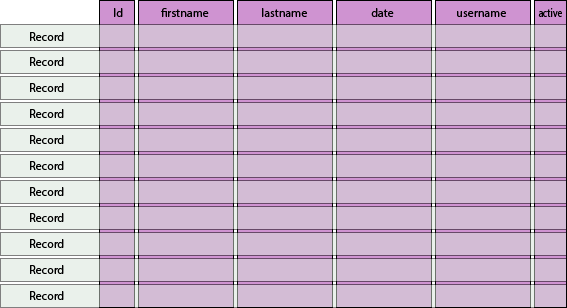

<div style="text-align: center">
<iframe width="700" height="393" src="https://youtube.com/embed/cl2Iw5iPlbA" frameborder="0" allow="accelerometer; autoplay; encrypted-media; gyroscope; picture-in-picture" allowfullscreen></iframe>
</div>

This is part two of a three part series on using Postgres DB with Node.js.

Read [part one here](/blog/using-postgres-and-timescale-db-with-node-js-series).

In the first part of this series I wrote about how to get an instance of Postgres or TimescaleDB running and communicating with Node.js. In this post we will describe how tables and indexes are used to store and query data. We will also cover DDL, DML and DQL SQL statements.

## Tables and Indexes

Relational database software is composed of specific database objects such as tables and indexes. Some systems also have objects like sequences. This will depend on the vendor.

Tables are used to store your raw data. Tables are composed of columns and rows. You will use columns to store individual fields in your table, while rows are used to store entire records.



## Defining Tables

Creating tables is fairly simple. This can be done with a `CREATE TABLE` statement. This kind of query is considered part of the *Data Definition Language* or DDL for short.

Lets' say we wanted to create a table for storing `persons`. We would probably need to have columns for the person's name, the date the record was created and some sort of record identifier or id. We could create a table like this with the following statement in Postgres;

```sql
CREATE TABLE person (
    id SERIAL PRIMARY KEY,
    firstname TEXT NOT NULL,
    lastname TEXT NOT NULL,
    createdate TIMESTAMP DEFAULT NOW() NOT NULL,
    active BOOLEAN DEFAULT TRUE NOT NULL
);
```

In the table we just created we have a column we defined as `id` which will be the primary key for our table. The primary key is the way we can uniquely identify a specific record in our table. In the example above we have given it a type of `SERIAL` which tells Postgres to autogenerate a new value every time we create a new record. Internally this value is stored as an `INTEGER`.

For the `firstname` and `lastname` we created `TEXT` columns. The `TEXT` type can represent any varying sized text data in that column. Most database systems allow the developer to limit the size of these columns using a `VARCHAR` type. So if we only want to allow the column to store a maximum of 30 characters, we can express that by defining a `VARCHAR(30)`.

Most of the columns in our table end with a `NOT NULL`. This tells Postgres that we will not allow a record to be added to our table unless it has a non-null value for that column. We could also have specified `NULL`. This will allow the column to store NULL values.

We can also specify a `DEFAULT` value. For our `createdate` column and our `active` columns, we have specified a default value. For the `createdate` column we are using the `NOW()` function to use Postgres for the date if we do not pass a value into that column. The `active` column can by true or false, so I used a default of `TRUE`.

## Indexes

Most relational databases allow for the creation of indexes. Indexes make it possible to quickly search through a table for a row or rows by maintaining a reference to a column in a table. You will want to add an index to any column that you want to reference in query for specifically related rows. 

```sql 
CREATE UNIQUE INDEX person_firstname_idx ON person (firstname);
```

## Structured Query Language (SQL)

One of the hallmarks of relational databases is the Structured Query Language, or SQL for short. SQL is actually a standard. While most database software will have their own flavor of SQL, they all should at least correspond to an [ANSI SQL standard](https://blog.ansi.org/2018/10/sql-standard-iso-iec-9075-2016-ansi-x3-135/).

The idea is if write a query for one vendor, it should work for all of the other vendors as long as you follow that standard. I have worked at a couple of companies that used the same SQL queries across multiple database systems from different vendors.

SQL has essentially four commands that you can use when you are writing queries.

- SELECT
- INSERT
- UPDATE
- DELETE

The `SELECT` command is used to query data from the table. The `INSERT` command is used to add records to a table. `UPDATE` is used to update columns in a table, and `DELETE` is used to remove records from a table.  

The INSERT, UPDATE and DELETE commands are all considered a *Data Manipulation Language* or DML. The SELECT command is usually just used for querying data from tables, and is considered a *Data Query Language*.

## SELECT 

Lets' say we have a table that stores an entity called `person`. If we want to query all of the records from that person table, we can express that with the following SQL statement.

```sql
SELECT * 
FROM person;
```

The query above will return all rows from our table. If we only need the `id`, `firstname` and `lastname` from that table, we can express that with the following query.

```sql
SELECT id, firstname, lastname
FROM person;
```

If we only want to return the records in a table that match a specific value in one of the columns, we can do that with the `WHERE` clause.

```sql
SELECT id, firstname, lastname
FROM person
WHERE username = 'admin';
```

## INSERT

If we want to add a record to our table, we can do this by specifying the columns we want to add and their respective values.

```sql
INSERT INTO person
    (firstname, lastname, active)
VALUES
    ('Phil', 'White', TRUE);
```

## UPDATE

UPDATE can change the values of individual records or multiple records at the same time. If we wanted to set the `active` column to false for one record in our table, we could express that with the following example.

```sql
UPDATE person
    SET active = TRUE
WHERE
    lastname = 'White';
```

## DELETE

If we want to delete a record or records we can do that using the `DELETE`. **Please be careful** using this command. If you make a mistake there is no edit -> undo. To see the danger, lets' look at the following statement.

```sql
-- Please don't do this!
DELETE person;
```

The statement above will delete every record from our table. The only way to retrieve your deleted data would be with a database restore, with most database systems is not an easy task. 

If you want to remove one specific record, you can do this by adding a `WHERE` clause.

```sql
DELETE person
WHERE
    id = 68978921;
```

## The Relational in a Relational Database

Whats makes SQL databases relation is the ability to query data from multiple tables at the same time, and combine the records into a single result that makes sense. SQL databases do this through `JOIN` syntax in the query. 

Lets' say we have our `person` table, and we want to add a `user_t` table. I am naming the user table with a '_t' at the end because the `user` object name is already used in Postgres. We can create this `user_t` table, there is no reason to recreate `firstname` or `lastname` columns because we can store a reference back to the `person` table. Lets' create a `user_t` table to see how we would do that in SQL.

```sql
CREATE TABLE user_t (
    id SERIAL PRIMARY KEY,
    username TEXT NOT NULL,
    passwordhash TEXT NOT NULL,
    person_id INTEGER NOT NULL REFERENCES person(id), 
    createdate TIMESTAMP DEFAULT NOW() NOT NULL,
    active BOOLEAN DEFAULT TRUE NOT NULL
);

CREATE INDEX user_t_username_idx ON user_t (username);
```

Now we can query both the `person` table and the `user_t` table at the same time. We can do this by using the `JOIN` keyword in the `FROM` clause.

```sql
SELECT 
	person.id, person.firstname, person.lastname, user_t.username
FROM
	person
		JOIN user_t
			ON person.id = user_t.person_id
WHERE person.lastname = 'White';
```

If I were to perform the query above without a matching `person_id` in my `user_t` table, the query will not return any results. But if I make the join a `LEFT JOIN`, this will return all records in the `person` table that have a matching `lastname`, and it will leave `username` NULL. The table on the left hand side of the join will have precedence.

## Adding Postgres to Node.js

Assuming we have our Postgres or TimescaleDB database running, and we want to start using it as our persistence store in Node, we can do this with the `pg` module. If you want to add the `pg` model to an existing Node.js project, you can `npm install` it in your terminal like so.

```bash
> npm i pd --save
```

This will install the module into our Node.js project and create a dependency in our 'package.json' file.

## Query Postgres data in Node.js

Now that we have the `pg` module installed, lets' create a simple app that can query our person data, and output the results on the command line. Lets' create a file in our project called 'printallpeople.js'.

After we create the file lets' import the `pg` module, and create a `Pool` from `pg` module to query the data from our Postgres database.

```javascript
// printallpeople.js

// import in the Postgres module
import PG from 'pg';

// Get Pool object from using a destructor 
const { Pool } = PG;

const pool = new Pool({
    user: 'postgres',
    host: 'localhost',
    database: 'etfdb',
    password: 'password',
    port: 5432
});

// I am defining my query in this statement variable. 
// Notice how I am using $1 for the parameter in the WHERE clause
const statement = `
    SELECT firstname, lastname, createdate 
    FROM person 
    WHERE active = $1;
`;

// This is where we make our query against Postgres, passing in any parameters into an array.
const data = await pool.query(statement, [true]);

// The records will be returned in a result object.
// The result object has a property called `rows` that has an array of objects for each record being returned.
for (let row of data.rows) {
    console.log(`firstname: ${row.firstname}, lastname: ${row.lastname}`);
}

// We close the pool once we are done.
pool.end(() => {
    console.log('closing the pool');
});
```

# Conclusion

As you can see it is very easy to connect to a Postgres database and query the data in database tables using Node.js. We are only scratching the surface here of what we can do in Postgres and TimescaleDB. 

In the next post in this series I plan on showing the additional functionality that you get from Postgres and TimescaleDB, and how we can use it in Node.js.  
