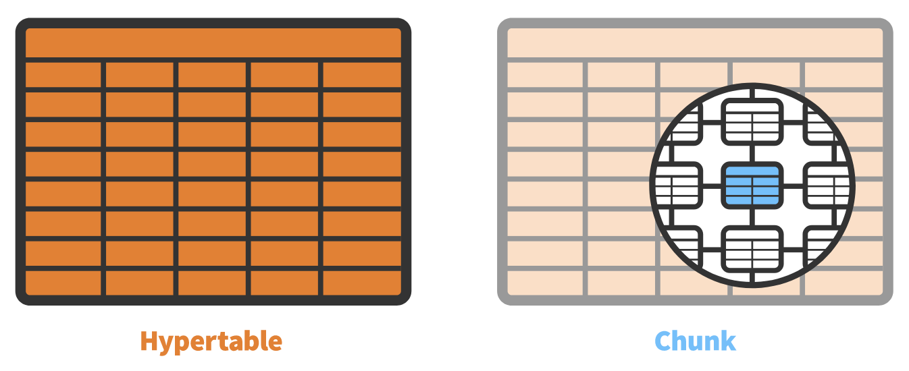

<div style="text-align: center">
<iframe width="700" height="393" src="https://youtube.com/embed/jdMa4GdbCEs" frameborder="0" allow="accelerometer; autoplay; encrypted-media; gyroscope; picture-in-picture" allowfullscreen></iframe>
</div>

This is part three of a series of posts I am doing on using Postgres and TimescaleDB with Node.js.

In the previous posts I discussed how setup a [dev instance](../using-postgres-and-timescale-db-with-node-js-series) of Postgres or TimescaleDB with Docker, and connect and [query data from Node.js](../using-postgres-and-timescale-db-with-node-js-series-part-2).

In this post we discuss TimescaleDB, and how to use it as an extension of Postgres.

## TimescaleDB

[TimescaleDB](https://timescaledb.com) extends the functionality of [Postgres](https://www.postgresql.org/) by allowing a high volume of inserts and queries across a horizontally scalable version of Postgres. It does this with a new table type called a 'Hypertable'.



Hypertables are partitioned into 'chunks'. Chunks are created by partitioning the hypertable based on values belonging to a time column. Chunks are created automatically as data is added to the hypertable. TimescaleDB automatically determines the size of the chunk based on data being inserted over time.

Hypertables can also be partitioned by an additional column. These are called 'time and space' partitions. 'Time and space' partitioning are known as distributed hypertables. In this two dimensional partitioning, hypertables are partitioned over separate nodes.

Each chunk uses a standard database table, but these tables are child tables of one parent table, which is the hypertable. Each chunk includes constraints that contain the time ranges for that chunk. Even the space chunks contain those ranges.

When data is inserted into the hypertable, it is then routed into the proper chunk by the time constraint. When you query a time range, TimescaleDB will optimize the query to make sure that only the chunks are used that fit that time range.

## In-memory

TimescaleDB places certain chunks in available memory. When querying data from a disk vs random access memory, memory is always faster. The most recent chunks will be kept in-memory. This ensures that the most recent data is stored in-memory, speeding up queries.

Not all chunks are kept in-memory. TimescaleDB uses LRU caching to decide which chunks are kept in memory and which is kept on disk pages. 

## Local Indexes

Indexes are kept in their respective chunks. This maintains that data and the indexes resides in the same memory. This ensures that inserting data is kept speedy since it is being performed in the RAM. 

TimescaleDB ensures that primary keys remain unique because they are usually a combination of a unique column and a time column. When a user creates a new index, it is passed down to every chunk in the hypertable.

## Deleting Data

Data retention in TimescaleDB is made easy because time ranges can be set on a hypertable to remove data based on a time period. Since the data is stored in chunks instead of a single table, TimescaleDB simply removes the associated file. No defragging of a table is required since the data is kept in separate chunks.

Data retention policies can be created to manage this maintenance automatically. 

## Creating a Hypertable

To a create a hypertable in TimescaleDB, we only need to do two things. Make sure the table you want to base you hypertable on has a primary key based on a timestamp column, and use the `create_hypertable` function on that table. Thats it! TimescaleDB does the rest for us automatically.

Lets' define a table for storing an account_transaction table. This table will contain a reference to a user, the time the record was inserted, and a transaction amount. We will make the primary key be a combination of the user_id and the time. After that we will use the `create_hybertable` function to create the actual hypertable.

```sql
CREATE TABLE account_transaction (
    user_id INTEGER NOT NULL,
    dt TIMESTAMP WITHOUT TIME ZONE NOT NULL,
    amount DECIMAL NOT NULL,
    source TEXT NULL,
    PRIMARY KEY(user_id, dt) 
);

SELECT create_hypertable('account_transaction', 'dt');
```

Congratulations! You just created your first hypertable. 

## Conclusion

Both TimescaleDB and Postgres solve many of the issues that prevented application developers from using relational databases in their solutions. Relational databases can scale and perform in modern scalable cloud based architectures.

There is a lot more to TimescaleDB than what I have posted here. Please take the time to review the [documentation](https://docs.timescale.com/timescaledb/latest/) on the TimescaleDB site.