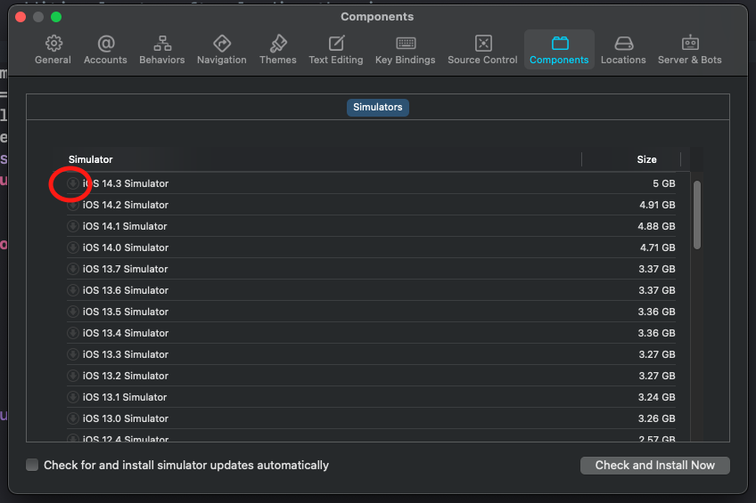

I was running into nasty crash whenever I tried to debug the WKWebView in one of my iOS apps. It is a common practice among developers to debug using Safari while running JavaScript code in their WebViews.

I noticed several months ago whenever I had Safari running on my Mac, and I was running the debugger in Xcode, I would get a crash with the following exception.

```c
WebThread (9): EXC_BAD_ACCESS (code=2, address=0x16b6c2320)

JavaScriptCore`invocation function for block in Inspector::RemoteConnectionToTarget::dispatchAsyncOnTarget(***::Function<void ()>&&):
```

It turns out there is a bug in iOS 14.5 and 14.6 that prevents developers from running a debug session in Xcode while Safari is running. You can read about it here in Apple's forum;

https://developer.apple.com/forums/thread/679015

## Workaround

In the Apple forum there were some suggestions on installing the Safari Technology Preview. I installed that version of Safari, and it did not resolve the issue for me, but it might for others.

What did wind up working for me was downloading an older version of the iOS simulator. Version 14.3 of the simulator seems to have done the trick for me with my debugging sessions.

You can install older versions of iOS in your simulator by going to Xcode preferences -> Components, and clicking on the download button on the version of the simulator you want.



Then you can run in the simulator, and debug using Safari.

## Conclusion

There are thousands of iOS/iPad OS apps that use the WKWebView and Safari for debugging. Many frameworks like Ionic and Cordova use the WKWebView, as well as native apps that require the ability to render and run web content. It is unfortunate that Apple has not addressed this yet with the current versions of iOS and Safari, but hopefully they will soon.