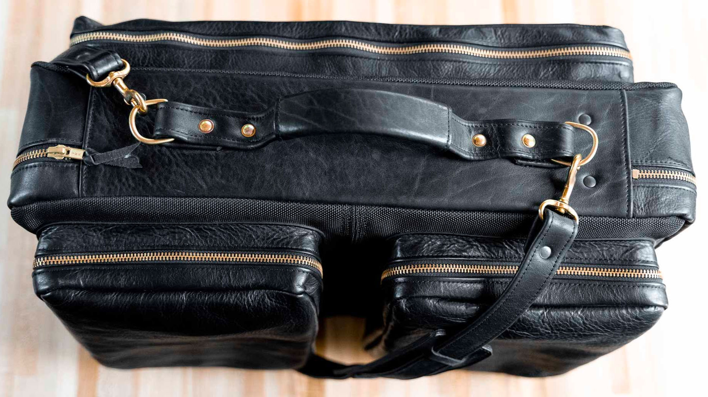
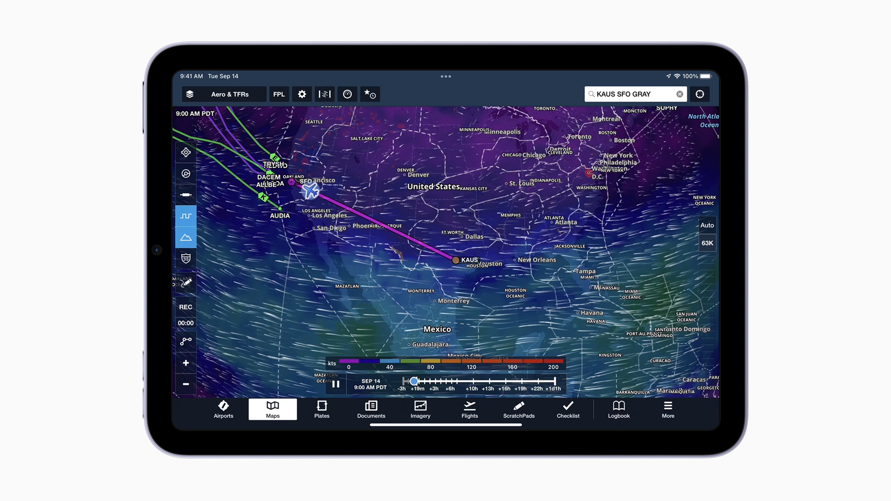
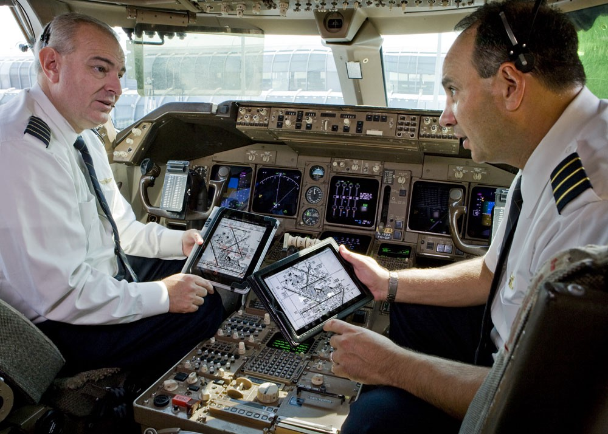
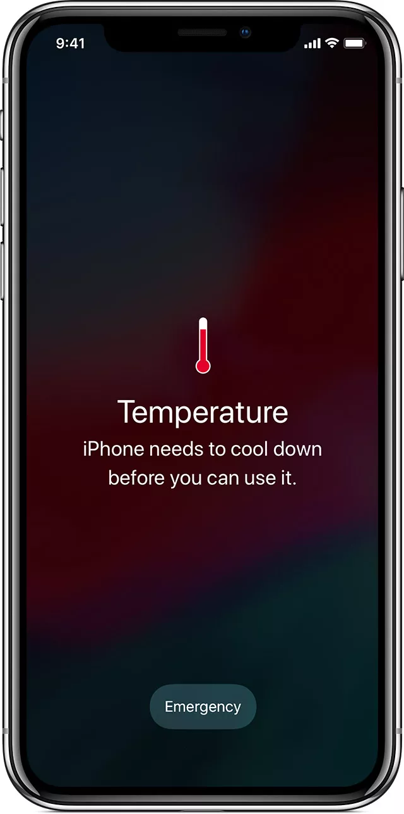

<iframe width="700" height="393" src="https://youtube.com/embed/iSCSPa6PKvI" frameborder="0" allow="accelerometer; autoplay; encrypted-media; gyroscope; picture-in-picture" allowfullscreen></iframe>

For my day job I write software for iOS and iPad devices, but while I earn my living as a software engineer, I am also a FAA licensed Commercial Pilot.
While I do not fly for an airline, those pilots have a different certification called a ATP, or Airline Transport Pilot, I do fly general aviation aircraft.

Most general aviation aircraft are old, on average about 50 years old. The airplane I typically fly was manufactured by Cessna in the 1970s. As part of regular maintenance and also in some cases in the regulations, we do upgrade the avionics in these aircraft. Avionics are the electronic instruments and radios that we use to navigate and communicate with the aerospace system and air traffic control.

One of the quiet technological revolutions that has happened in aviation has been the use of iPads in the cockpit. For those who do not remember how it used to be when you were walking through the airport and saw a pilot, they would be carrying a large suitcase like briefcase or bag, usually strapped to an overnight piece of luggage. The reason why pilots lugged this giant case around with them was because it had all of the maps and charts, as well as books of approach plates and procedures they needed while navigating our friendly skies. 

Companies like ForeFlight (now part of Boeing) and Garmin both make software that runs on iPads that contains all of the charts, approach and departure procedures that pilots used to lug around in that giant bag. The FAA refers to these type of devices and software as EFBs, or Electronic Flight Bags. One of the first things that pilots learn is the FAA has a three letter abbreviation for about everything.  

With iPads being so common now in cockpits, I was often surprised how this community of iPad users has been ignored by Apple.

## Introducing the new iPad Mini

Last month with Apple's new product announcements for the iPhone, they also introduced a new iPad mini. In their marketing, Apple now shows pilots using iPads and as in this image below an iPad actually running ForeFlight, one of the apps pilots use to help them navigate.

The iPad has become such an essential tool for pilots that many carry two in the cockpit with them, and some even have a mount in the instrument panel or yoke that can hold an iPad.

While I am happy that Apple has started recognizing pilots as an important user segment, I hope they realize that iPads should not be considered avionics. As a matter of fact, legally they are not.

Any equipment that pilots use that are a part of an aircraft, specifically instruments, avionics and radio equipment are strictly regulated by the [FAA](https://faa.gov). Companies such as [Garmin](https://garmin.com) as well as being a consumer electronics company also makes electronics for naval and aviation markets. As a matter of fact Garmin got its start manufacturing GPS navigation receivers for aircraft. Any equipment we use that is part of an aircraft has to have extremely high tolerances. Aircraft have to be able to operate in very hot environments as well as very cold environments. Sometimes well below freezing. Check out the video below on [FlightChops](https://flightchops.com/) about some of the testing that Garmin does on their equipment.

<iframe width="700" height="393" src="https://youtube.com/embed/sUSZALnHw20" frameborder="0" allow="accelerometer; autoplay; encrypted-media; gyroscope; picture-in-picture" allowfullscreen></iframe>

Since most general aviation aircraft are old, a lot of them were built without air conditioners. As a matter of fact, a lot of general aviation aircraft are not made with air conditioners today. I am based in Florida, and it can get pretty hot here during the Summers, as well as the Spring and Fall. Something that commonly occurs to my iPad while I am flying is my iPad will overheat and shutdown while I am trying to use it in the cockpit. I have to be careful to not let it sit out on top of the instrument panel or sit in direct sunlight. 

If Apple is going to market their equipment to pilots, they need to make they will operate reliably in the harsh environments that pilots operate in every day. I don't like the idea of inviting in new regulations, but maybe the FAA should look into Apple and their marketing.

## Conclusion

I love the iPad and ForeFlight. I can't imagine flying without these tools. It has made flight planning and weather briefing much easier.

If Apple is going to market to Pilots, they need to do a better job at making sure that their devices will operate in the same environments that pilots operate in the cockpit every day.