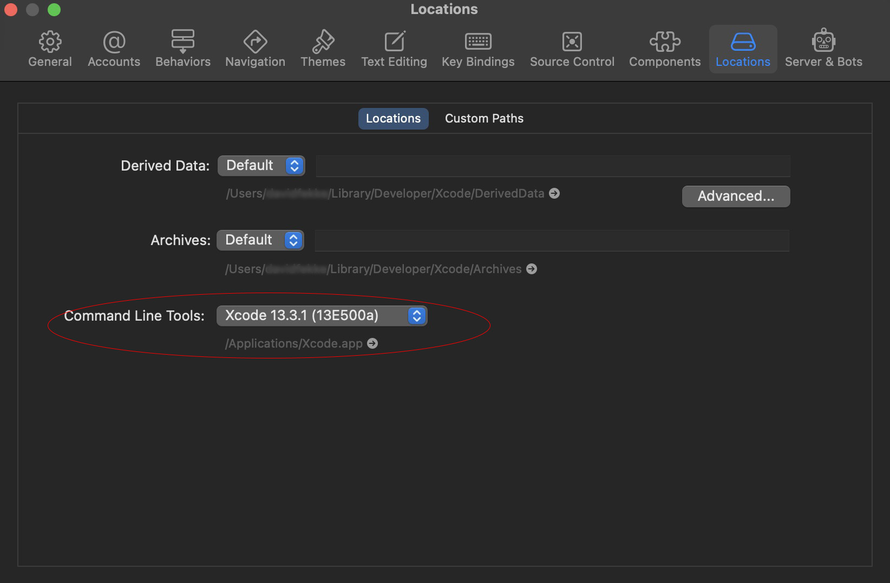

<div style="text-align: center">
<iframe width="700" height="393" src="https://youtube.com/embed/B1efUcJ8Fbk" frameborder="0" allow="accelerometer; autoplay; encrypted-media; gyroscope; picture-in-picture" allowfullscreen></iframe>
</div>

I recently purchased a M1 Mac for development. It is my first time using an M1 Mac, so I thought share my experiences.

Going through the React-Native documentation, I found a lot of it to be out of date. Here is what I had to do to get React-Native running on my new Mac.

## Make sure you have Xcode installed

Make sure to install the latest version of Xcode onto your Mac. This can be installed by going to the App Store on your Mac, and searching for Xcode, then installing.

## Make sure to install Xcode Command Line tools are installed

When you open Xcode, you should be prompted to install the Xcode command line tools. To verify that you have installed the tools, go to the preferences, choose locations, and make sure you have the current version of the tools installed. It should look something like the following;



## Install homebrew

Homebrew is like apt-get if Apple had a package manager. You can install Homebrew by running the following command in your terminal;

```bash
> /bin/bash -c "$(curl -fsSL https://raw.githubusercontent.com/Homebrew/install/HEAD/install.sh)"
```
This might take a little while to install, be patient.

## Install the current LTS version of Node.js

Next you will want to install the LTS version of [Node.js](https://nodejs.org/). I recommend using the installer from their website, but you can also install using Homebrew.

## Install watchman

Use Homebrew to install watchman. Run the following command in your terminal to install watchman;

```bash
> brew install watchman
```

## Install Cocoapods

Install Cocoapods using `homebrew`, do not use the Ruby `gem` command listed in the documentation. Cocoapods is like NPM for Node. It is used for installing dependencies for your project. You cannot use React Native on iOS with a working installing of Cocoapods.

```bash
> brew install cocoapods
```

## Lets' create a new project to make sure your installation is working properly

Once you have all of the prerequisites installed, you can run the following example from their documentation

```bash
> npx react-native init AwesomeProject
```

After installing the example project, you can run it by using the following command;

```bash
> npx react-native run-ios
```

# Conclusion

Not all of the kinks of developing on the Apple Silicon Macs have been worked out yet, but with just a few small changes you can get React-Native running on your M1 Mac.