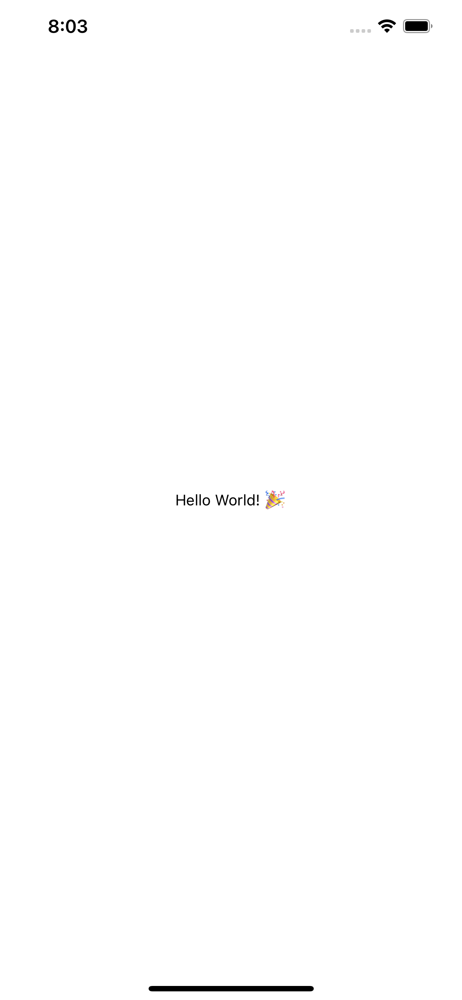

<div style="text-align: center">
<iframe width="700" height="393" src="https://youtube.com/embed/3wftC30CN2I" frameborder="0" allow="accelerometer; autoplay; encrypted-media; gyroscope; picture-in-picture" allowfullscreen></iframe>
</div>

I have been starting to use [React Native](https://reactnative.dev) in an existing iOS and Android app that I am maintaining. One of the problems I am finding in the React Native [docs](https://www.reactnative.dev/docs/integration-with-existing-apps) is the guides they give for adding to an existing iOS application are out of date.

## Cocoapods

React Native uses [Cocoapods](https://cocoapods.org/) to add iOS dependencies when you add new modules to your application. Cocoapods is a dependency manager for the Apple development ecosystem. Since Cocoapods was introduced Apple has added their own called the Swift Package Manager, but React Native was created before this existed. Cocoapods is the only way to add React Native and its' native modules to iOS projects.

Cocoapods uses a configuration file called a `Podfile` to instruct the Cocoapods dependency manager which modules to add to your Xcode project. It does this by creating a workspace file, and then adding the project and any needed modules to the workspace.

The `Podfile` given in the guides for adding React Native to an existing iOS project will not work! I repeat that. Their `Podfile` will not work in an existing iOS project. They have example for both Objective-C and Swift, and neither is up to date with the current version of React Native.

## How to add React Native as of 2022

For this post, I will assume that you already have Xcode installed. You will also need to configure your environment for the React Native CLI Quickstart in the [environment setup guide](https://www.reactnative.dev/docs/environment-setup). The setup will make sure that you have a current version of [Homebrew](https://brew.sh/), [Node.js](https://nodejs.org/en/) installed, along with `watchman` and `Cocoapods`. I have another post I created recently on how to get React Native [setup](../2022-04-13/how-to-setup-react-native-on-M1-mac-2022.md) and running on a M1 based Mac.

### Set up directory structure

Create a new folder for your project. This is where we will keep the React Native code. After creating this folder, copy your existing iOS project to a folder underneath your project folder called `ios`.

### Install Node dependencies

In the root of your project folder, create a package.json file with the following contents:

```json
{
  "name": "YourReactNativeApp",
  "version": "1.0.0",
  "private": true,
  "scripts": {
    "start": "yarn react-native start"
  }
}
```

Make sure you have the `yarn` package manager installed. If you do not have this installed, you can install it by using the following command:

```shell
> npm install yarn -g
```

To install your Node dependencies, you can use the following command:

```shell
> yarn add react-native
```

When you run this command, it will display a message in your terminal that should look like the following:

|  > react-native@0.68.1" has unmet peer dependency "react@17.0.2".

If your unmet dependency is a specific version of react, you will need to add React for the specific version specified in the message:

```shell
yarn add react@17.0.2
```

## Setting up Cocoapods for your iOS app

Now that you have React and React Native installed, cd into you `ios` subdirectory, and execute the following command:

```shell
> pod init
```

This command will create a `Podfile`, the configuration file that Cocoapods uses for adding dependencies to you iOS app. The `Podfile` should look something like this:

```ruby
# Uncomment the next line to define a global platform for your project
# platform :ios, '9.0'

target 'yourreactnativeapp' do
  # Comment the next line if you don't want to use dynamic frameworks
  use_frameworks!

  # Pods for yourreactnativeapp

end
```

Every Xcode project should have a target. The target is the target for compilation. Usually if you have multiple platforms that you would support, i.e. MacOS, tvOS and iOS, you would have a target for each platform. For this example we will only modifiy the target for our iOS app. In the example above my iOS target is called `yourreactnativeapp`.

```ruby
require_relative '../node_modules/react-native/scripts/react_native_pods'
require_relative '../node_modules/@react-native-community/cli-platform-ios/native_modules'

platform :ios, '13.0'

target 'yourreactnativeapp' do
  use_react_native!
end
```

Once you modified your Podfile to include the `use_react_native!` function for your target, you now run the following command to add your React Native dependencies:

```shell
pod install
```

After you have installed your dependencies using the pod install command, Cocoapods will have created a workspace (`yourreactnativeapp.xcworkspace`) for your project. It should have the same name as the project file. You will want to use the workspace file to open your project in Xcode from now on.

Your new workspace will have two projects in it, one with your iOS app, and one called `Pods`. The `Pods` project will contain all of the dependencies you will need to run React Native in your app.

## Adding the React View to your iOS App

Now that we have added the React Native dependencies to your iOS app, we have the dependencies we need to in order to run the React Native content in your app. Lets' go ahead and modify a ViewController to display our React Native app:

```swift
// ViewController.swift

import UIKit
import React

class ViewController: UIViewController {

    override func viewDidLoad() {
        super.viewDidLoad()
    }

    override func loadView() {
        loadReactNativeView()
    }

    func loadReactNativeView() {
        let jsCodeLocation = URL(string: "http://localhost:8081/index.bundle?platform=ios")!
        
        let rootView = RCTRootView(
            bundleURL: jsCodeLocation,
            moduleName: "YourApp",
            initialProperties: nil,
            launchOptions: nil
        )
        self.view = rootView
    }
    
}
```

Now lets' modify the `index.js` file so it looks like the following:

```javascript
import React from 'react';
import {
    AppRegistry,
    Text,
    View
  } from 'react-native';

const YourApp = () => {
  return (
    <View style={{ flex: 1, justifyContent: "center", alignItems: "center" }}>
      <Text>
        Hello World! 🎉
      </Text>
    </View>
  );
}

AppRegistry.registerComponent('YourApp', () => YourApp);
```

To test and make sure that this is set up correctly, we to start Metro first by running the following command at the root of our project:

```shell
> yarn start
```

Once we have started Metro, we can run our iOS app again and navigate to the ViewController that contains our `RCTRootView` view. This should create a screen that looks like the following:



## Conclusion

I hope this explains how you can add React Native to an existing iOS application. React Native is one of many tools that are available to iOS developers to build native applications. One of the nice things about React Native is that it is cross platform. This makes it easy to share code between both iOS and Android applications.