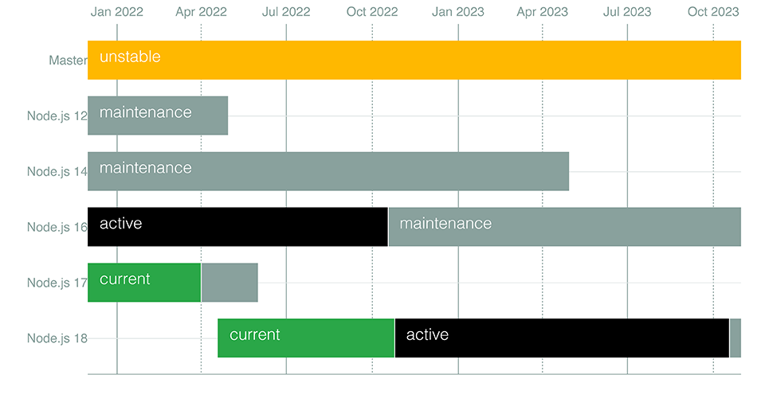

The Node.js foundation just released the first version of Node [v18.0.0](https://github.com/nodejs/node/blob/master/doc/changelogs/CHANGELOG_V18.md#18.0.0). The Node.js foundation maintains multiple versions, including the current release along with a long term support (LTS) release. The current v18 release will become the LTS release sometime in October 2022. This is the normal release schedule for Node.



## Fetch

One of the new features getting a lot of attention is the new `fetch` API. Fetch has been around for awhile in the browser, and has been module you could add into your Node.js project by running `npm install node-fetch`. There have been complaints that the two are not completely interoperable.

<blockquote class="twitter-tweet"><p lang="en" dir="ltr">fetch() has shipped in Node and now people are complaining that it does not work like node-fetch 🤦‍♂️. However, EVERYBODY said they wanted more standard-compliant APIs from Node.js.</p>&mdash; Matteo Collina (@matteocollina) <a href="https://twitter.com/matteocollina/status/1517617719838973953?ref_src=twsrc%5Etfw">April 22, 2022</a></blockquote> <script async src="https://platform.twitter.com/widgets.js" charset="utf-8"></script>

The Fetch API provides a simple promise based API for making client based HTTP requests. Previously you had to use the `XMLHttpRequest` API to make HTTP requests which required multiple lines of code to be written to make a request. Now with the Fetch API a HTTP request can be made as simply as the following example:

```javascript
const response = await fetch('https://swapi.dev/api/people/1');
const data = await response.json();
console.log(data);
```

## HTTP Timeouts

The `http.server` timeouts have changed in Node.js v18. The `headersTimeout` is set to 60000 milliseconds (60 seconds), and `requestTimeout` is set to 300000 milliseconds (5 minutes) by default. The `headersTimeout` is the time that is allowed for a http request header to be parsed. The `requestTimeout` is the timeout used for a http request.

## Test Runner module

While there have been many popular options for unit testing your code in Node.js, Node has never had a built in test runner. Node v18 now includes a `node:test` module. The example below shows how to set up test and assertions.

```javascript
import test from 'node:test';

test('Math tests', async (t) => {
  await t.test('test equality 1', (t) => {
    assert.strictEqual(1, 1);
  });

  await t.test('test equality 2', (t) => {
    assert.strictEqual(2, 2);
  });
});
```

You can read more about the new test running in the docs here [https://nodejs.org/dist/latest-v18.x/docs/api/test.html](https://nodejs.org/dist/latest-v18.x/docs/api/test.html).

## Web Streams API

The new Web Streams API is now exposed globally in the global scope. While streams have been a part of the Node.js API from the very beginning, this API is shared between both the browser and Node.js, though this is considered an experimental feature in Node.

Web Streams support both ReadableStream and WriteableStream readers, writers and controllers. These can be used in combination with the new `fetch` API.

The following API objects are now globally available in Node v18:

* ReadableStream
* ReadableStreamDefaultReader 
* ReadableStreamBYOBReader
* ReadableStreamBYOBRequest 
* ReadableByteStreamController
* ReadableStreamDefaultController 
* TransformStream
* TransformStreamDefaultController 
* WritableStream
* WritableStreamDefaultWriter 
* WritableStreamDefaultController 
* ByteLengthQueuingStrategy
* CountQueuingStrategy
* TextEncoderStream
* TextDecoderStream 
* CompressionStream 
* DecompressionStream

## V8 10.1

There are three notable changes to V8 10.1. One of those additions are new array methods for finding the last element and index of an array:

```javascript
// 
const arr = [{v:1}, {v:2}, {v:3}, {v:4}, {v:5}];
const lastElement = arr.findLast(l => l.v % 2 === 0);
// lastElement {v:4}
const lastIndex = arr.findLastIndex(l => l.v % 2 === 0);
// lastIndex 3
```

Another improvement in V8 has been internationalization support. With the addition of the `Intl.Locale` and the `Intl.supportedValuesOf` functions you can now retrieve calendar, currency, numbering as well as timeZone data about a location as seen in this example:

```javascript
const arabicEgyptLocale = new Intl.Locale('ar-EG')
// ar-EG
arabicEgyptLocale.calendars
// ['gregory', 'coptic', 'islamic', 'islamic-civil', 'islamic-tbla']
arabicEgyptLocale.collations
// ['compat', 'emoji', 'eor']
arabicEgyptLocale.hourCycles
// ['h12']
arabicEgyptLocale.numberingSystems
// ['arab']
arabicEgyptLocale.timeZones
// ['Africa/Cairo']
```

The V8 engine has also made strides in improving the performance of class fields and private class methods.
The data format of the `v8.serialize` function has changed, and it will not be backwards compatible with earlier versions of Node.js.

## Toolchain and Compiler

Linux versions of Node are now built on Red Hat Enterprise Linux and are compatible with glibc 2.28 or later. Prebuilt binaries for macOS will not require macOS 10.15 (Catalina) or later. The minimum supported architecture for AIX is now Power 8.

Prebuilt binaries for 32-bit Windows are not available at this time because of a V8 update, but may be restored if 32-bit support is added back to V8.

## Conclusion

Version 18 of Node.js is packed with some neat features, and more should be coming prior to the LTS release. As the V8 runtime is upgraded with new features, Node gets these features with the new version of V8. I am looking forward to the LTS release in October as I am sure other Node developers will be.