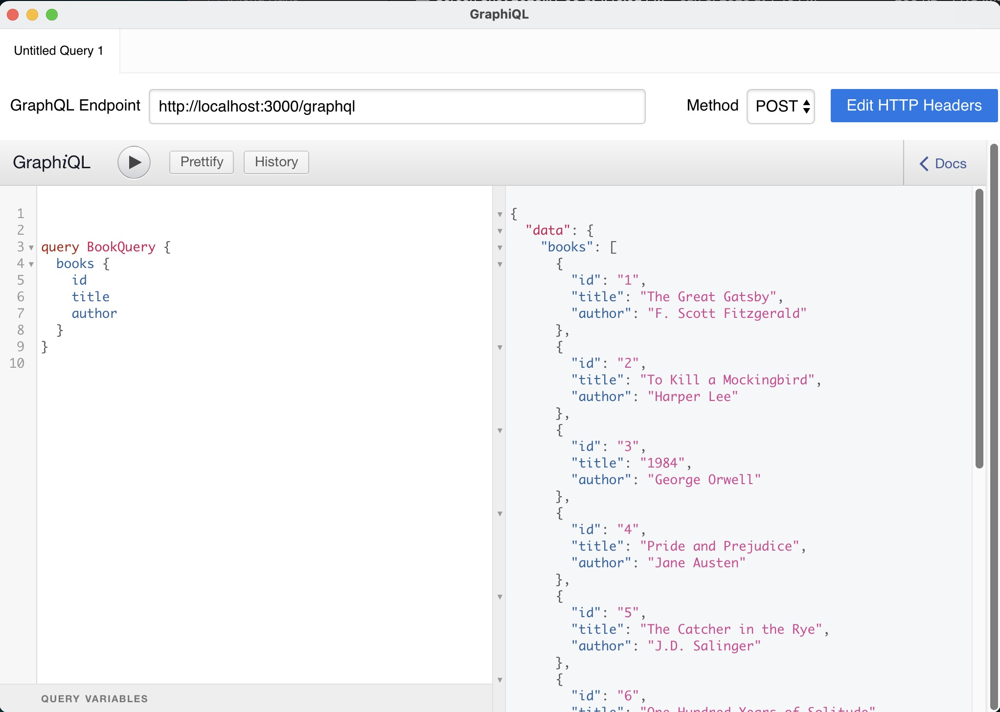

<div style="text-align: center">
<iframe width="700" height="393" src="https://youtube.com/embed/TGalBR4j2Uo" frameborder="0" allow="accelerometer; autoplay; encrypted-media; gyroscope; picture-in-picture" allowfullscreen></iframe>
</div>

I recently needed to add a GraphQL endpoint to an existing [Fastify](https://www.fastify.io/) service. I have worked with Apollo before which has a way of hosting on top of an Express service. 
There may be a way of hosting Apollo on top of Fastify service, but I have not found a way to do this with the existing version of Fastify.

There is a Fastify plugin for apollo, but it works with older versions of Fastify. In fact if you follow the link to the plugin, it takes you to a [404 page](https://github.com/apollographql/apollo-server/tree/main/packages/apollo-server-fastify).

It turns out that Fastify has a pretty good solution for hosting a GraphQL service through a tool called [Mercurius](https://mercurius.dev/#/).

In this post I will show how you can take an existing Fastify service, and add a GraphQL endpoint.

## Example Fastify Rest Endpoint

Let us take a look at existing Fastify server.

```javascript
// Require the framework and instantiate it
import Fastify from 'fastify';

const fastify = Fastify({ logger: true });

// Declare a route
fastify.get('/books', (req, reply) => {
    reply.send([
      { id: 1, title: 'The Great Gatsby', author: 'F. Scott Fitzgerald' },
      { id: 2, title: 'To Kill a Mockingbird', author: 'Harper Lee' },
      { id: 3, title: '1984', author: 'George Orwell' },
      { id: 4, title: 'Pride and Prejudice', author: 'Jane Austen' },
      { id: 5, title: 'The Catcher in the Rye', author: 'J.D. Salinger' },
      { id: 6, title: 'One Hundred Years of Solitude', author: 'Gabriel Garcia Marquez' },
      { id: 7, title: 'Moby-Dick', author: 'Herman Melville' },
      { id: 8, title: 'War and Peace', author: 'Leo Tolstoy' },
      { id: 9, title: 'The Odyssey', author: 'Homer' },
      { id: 10, title: 'The Divine Comedy', author: 'Dante Alighieri' },
    ])
  })

// Run the server!
const start = async () => {
  try {
    await fastify.listen({ port: 3000 })
  } catch (err) {
    fastify.log.error(err)
    process.exit(1)
  }
};
start();
```

# Adding Mercurius to Fastify

The next step is to use NPM or Yarn to add Mercurius.

```bash
> npm i mercurius
```

Now add the following code to your Fastify server.

```javascript
import Fastify from 'fastify';
import mercurius from 'mercurius';

```

## The Schema

GraphQL servers require two configurations, Type definitions and resolvers. The Type definition or schema uses a GraphQL based type definition to define the data being output as well as any parameters.
For out book service, it will look like the following:

```graphql
type Book {
  id: ID!
  title: String!
  author: String!
}

type Query {
  books: [Book!]!
}
```

If we look at the following definition we can see it has a type for the `Book`, as well as the `Query`. The `Book` has thee properties for the `id`, `title` and `author`. In the `Query` type, we have a query for `books` that expects an array of `[Book]`.

## Resolvers

The other configuration will be the resolver. For every query in our definition, we need to have logic to return the data expected by the query. With Fastify, we can simply inject our route with the data needed by the resolver like the following:

```javascript
const resolvers = {
  Query: {
    books: async () => {
      const res = await fastify.inject({
        method: 'GET',
        url: '/books'
      })
      return res.json()
    }
  }
};
```

Instead of doing that, a better way would be to refactor the data returned from `book` into its own function or variable.

```javascript
function getBooks() {
  return [
    { id: 1, title: 'The Great Gatsby', author: 'F. Scott Fitzgerald' },
    { id: 2, title: 'To Kill a Mockingbird', author: 'Harper Lee' },
    { id: 3, title: '1984', author: 'George Orwell' },
    { id: 4, title: 'Pride and Prejudice', author: 'Jane Austen' },
    { id: 5, title: 'The Catcher in the Rye', author: 'J.D. Salinger' },
    { id: 6, title: 'One Hundred Years of Solitude', author: 'Gabriel Garcia Marquez' },
    { id: 7, title: 'Moby-Dick', author: 'Herman Melville' },
    { id: 8, title: 'War and Peace', author: 'Leo Tolstoy' },
    { id: 9, title: 'The Odyssey', author: 'Homer' },
    { id: 10, title: 'The Divine Comedy', author: 'Dante Alighieri' },
  ];
}

```

Now we can share that method with both the get route for books as well as the resolver.

```javascript
const resolvers = {
  Query: {
    books: async () => {
      return getBooks()
    }
  }
};
```

## Register your GraphQL in Fastify

Now that you have your definition and resolver, lets put this all together in Fastify.

```javascript
const typeDef = `
  type Book {
    id: ID!
    title: String!
    author: String!
  }

  type Query {
    books: [Book!]!
  }
`;

fastify.register(mercurius, {
  schema: typeDef,
  resolvers: resolvers
});
```

The final refactored Fastify service should look like the following:

```javascript
import Fastify from 'fastify';
import mercurius from 'mercurius';

const fastify = Fastify({ logger: true });

function getBooks() {
  return [
    { id: 1, title: 'The Great Gatsby', author: 'F. Scott Fitzgerald' },
    { id: 2, title: 'To Kill a Mockingbird', author: 'Harper Lee' },
    { id: 3, title: '1984', author: 'George Orwell' },
    { id: 4, title: 'Pride and Prejudice', author: 'Jane Austen' },
    { id: 5, title: 'The Catcher in the Rye', author: 'J.D. Salinger' },
    { id: 6, title: 'One Hundred Years of Solitude', author: 'Gabriel Garcia Marquez' },
    { id: 7, title: 'Moby-Dick', author: 'Herman Melville' },
    { id: 8, title: 'War and Peace', author: 'Leo Tolstoy' },
    { id: 9, title: 'The Odyssey', author: 'Homer' },
    { id: 10, title: 'The Divine Comedy', author: 'Dante Alighieri' },
  ];
}

const typeDef = `
  type Book {
    id: ID!
    title: String!
    author: String!
  }

  type Query {
    books: [Book!]!
  }
`;

const resolvers = {
  Query: {
    books: async () => {
      return getBooks()
    }
  }
};

// Declare a route
fastify.get('/books', (req, reply) => {
  reply.send(getBooks());
});

fastify.register(mercurius, {
  schema: typeDef,
  resolvers: resolvers
});

// Run the server!
const start = async () => {
  try {
    await fastify.listen({ port: 3000 })
  } catch (err) {
    fastify.log.error(err)
    process.exit(1)
  }
};
start();
```

## Verify it working

You can use a tool like GraphiQL to verify that your service is working. This tool can be downloaded locally. To test your endpoint, you will just need to use `graphql` after the domain name of your server. 



## Conclusion

GraphQL is becoming an increasing popular way to query and transform data from multiple different endpoints. If you have an existing Fastify service, it is not necessary to have to host a separate service. This can be done to your existing Fastify service.

That being said, it is quite common and sometimes better to use a separate service for hosting you GraphQL. One of the things organizations are doing now is hosting GraphQL as a federated service, and this might be a better option.
