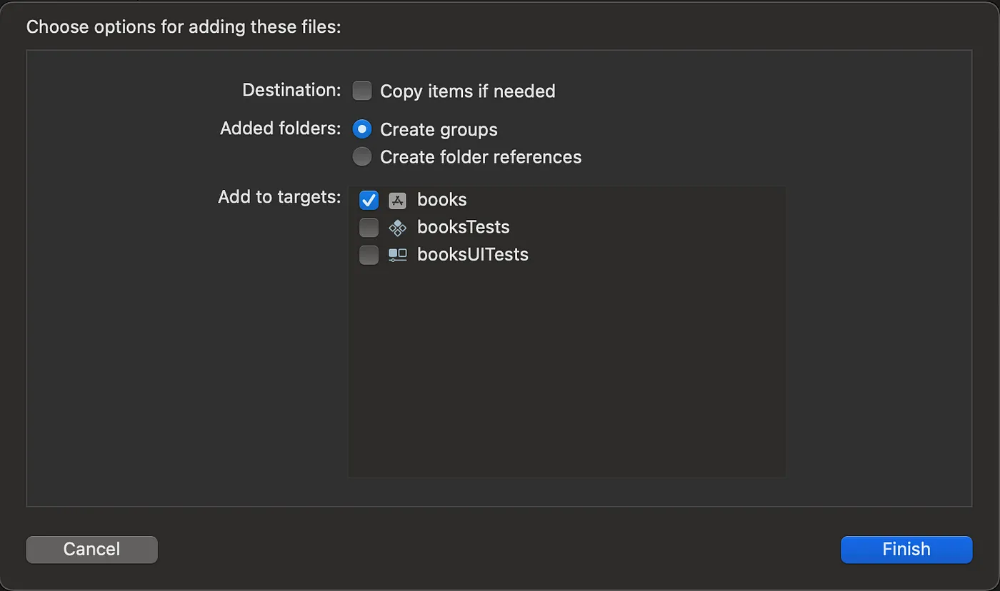

## Make sure to add the following to this post

I have been researching using [Mercurius](https://mercurius.dev/#/) and [Fastify](https://www.fastify.io/) for a [GraphQL](https://graphql.org/) backend for iOS. I think a lot of iOS developers are already familiar with using [Apollo](https://www.apollographql.com/) as a GraphQL backend, but I have a couple of Fastify services that I was already hosting as REST endpoints. In a [previous post](http://localhost:8000/blog/how-to-add-graph-ql-to-your-fastify-service/) I wrote about adding a GraphQL endpoint to Fastify. In this post I wanted to write about how you can add iOS code generation to your existing iOS apps using Mercurius and Fastify as the backend.

## Consuming GraphQL in iOS

The easiest way to consume GrapghQL on iOS is use the [Apollo Client for iOS](https://www.apollographql.com/docs/ios/). This client library comes with a bunch of tools including code generation, and can be installed using CocoaPods, Swift Package Manager to your Xcode project or SPM with your Package.swift. For this post I am just going to use SPM with the Xcode project.

One of the problems I cam across in getting this working is that the Apollo docs do not show everything you need to get this working for your application. I hope to show how you can install and use these tools to make GraphQL queries.

## Installing the Apollo-ios-cli

In the Apollo documentation, they suggest installing the command line tool using the right mouse click menu in the project explorer. As of Xcode 14.3, this option [no longer works](https://github.com/apollographql/apollo-ios/issues/2919). I had to install the executable for the apollo-ios-cli directly in a path that my terminal could access. I installed the `apollo-ios-cli` directly in my '/usr/local/bin' directory on my Mac. You can download the executable from the `releases` link on the GitHub [page](https://github.com/apollographql/apollo-ios) for Apollo-ios.
Download the release of `apollo-ios-cli.tar.qz` for the version you plan on using of the library. At the time of writing this post, that was version 1.1.1. The library and cli have to be the same version.

You can confirm that the tool is installed and working by using the following command in the terminal:

```bash
$ apollo-ios-cli --version
```

## Generating code for iOS using the Apollo-ios-cli tool

Once you have the cli tool installed and working on your machine, Apollo needs a couple of things in order to generate code. It will need configuration file called `apollo-codegen-configuration.json`, GraphQL files with the queries you want to use in files with the `.grapghql` extension and the schema for your GraphQL endpoint. Once you have all three, you will be able to generate code.

One of the challenges I came across with using Mercurius for hosting my GraphQL endpoint was there was not an easy way getting the schema definition or the SDL from the endpoint. You can always use an Introspection query to return the schema in a JSON format, but I wanted to be able to use the SDL since that is the example usually given in the Apollo documentation. To accomplish this I had to add a new route to my Fastify service to return the SDL. Here is how I added the route:

```javascript
// Define a route to retrieve the SDL
fastify.post('/schema', (req, reply) => {
    reply.type('text/plain').send(schema);
});

fastify.get('/schema', (req, reply) => {
    reply.type('text/plain').send(schema);
});
```
Now that you have this routes, you can download the SDL using `/schema` for the route.

## Setting up your Xcode project structure

In the root directory where you keep your swift code, create a new directory called `/graphql`. This directory will contain your GraphQL queries and your schema, as well as your generated code. This folder will need to be added to your Xcode project as well as a `folder group`. When adding to your Xcode project navigator, make sure to choose the create groups` next to the `added folders` option.



## Generate apollo configuration

I used the following command in the root of my code folder to create the `apollo-codegen-configuration.json` file:

```bash
$ apollo-ios-cli init --schema-name <What_YouWill_Call_Your_Schema> --module-type embeddedInTarget --target-name <Your_Target_Name>
```

Once you have created the `apollo-codegen-configuration.json` file, we will need to modify it to point to the `/grapghql` folder. Look for the `output` section, and change it so that it points to the correct directory path:

```json
  "output" : {
    "testMocks" : {
      "none" : {
      }
    },
    "schemaTypes" : {
      "path" : "./graphql",
      "moduleType" : {
        "embeddedInTarget" : {
          "name" : "YourTargetName"
        }
      }
    },
    "operations" : {
      "inSchemaModule" : {
      }
    }
  },
```

## Add the SDL to your grapghql folder 

Apollo needs the definition as one of the inputs to generate code. Now that we have our schema endpoint setup in Fastify, we can add it to our graphql folder by running the following command.

```bash
$ curl http://localhost:3000/schema > graphql/schema.graphqls
```

Any file that contains the definition or SDL for our GraphQL endpoint should end with a `.grapghqls` extension. The extra `s` at the end signifies that it is the schema.

## Create a file with our GraphQL query

I have a query that will work with our book query from my previous post.

```graphql
query BookQuery {
    books {
        id
        title
        author
    }
}
```

Save this into the `/graphql` directory as `bookquery.graphql`.

## Generate your swift files

Now that you have the config file, the SDL and a graphql query file, we can generate our swift code. Run the following command in your terminal under your root directory:

```bash
$ apollo-ios-cli generate
```

## Using your generated code to display query in a SwiftUI View

We will create a new class and call it `BooksQueryViewModel`.

Once you have created the class, we will add an init constructor. We will also add a property for our Apollo client. It should look like the following:

```swift
import Foundation
import Apollo

class BooksQueryViewModel: ObservableObject {
    
    var apollo = {
        guard let url = URL(string: "http://localhost:3000/graphql") else {
            fatalError("Could not create URL for GraphQL endpoint.")
        }
        return ApolloClient(url: url)
    }()
    
    typealias Book = Bookschema.BookQuery.Data.Book
    @Published var books: [Book] = []
    
    init() {
        apollo.fetch(query: Bookschema.BookQuery()) { [weak self] result in
            switch result {
            case .success(let graphResult):
                self?.books = graphResult.data?.books ?? []
            case .failure(let error):
                print("\(error.localizedDescription)")
            }
        }
    }
}
```

As you can see from the code above, we create a `typealias` to make an easier to use `Book` type based off of the generated type of `Bookschema.BookQuery.Data.Book`. Then in the `fetch` method, we use a resultType, which can take either a success or a failure from the fetch result. If it is successful we set the `books` property to the result, which is an array of Books.

Now we will modify our SwiftUI view to use this view model and display the results in a list using a `ForEach` function.

```swift
import SwiftUI

struct ContentView: View {
    
    @ObservedObject var viewModel = BooksQueryViewModel()
    
    var body: some View {
        VStack {
            List {
                ForEach(viewModel.books, id: \.id) { book in
                    Text("\(book.title) by \(book.author)")
                }
            }
        }
        .padding()
    }
}
```

Now when we run the app with this view, we will see a list of our books and authors.

## Conclusion

It takes a lot of set up to get the Apollo working with a Mercurius/Fastify backend. Once you have all of these pieces in place, it does make it a lot easier to develop and use GraphQL with your iOS code.

You can set up your Xcode project to automatically generate code every time you build or run your app. I do not think that is a best practice. It is better to generate when you know new types have been added to your schema. Some environments make frequent changes to their GraphQL backend, so you may need to add a script to run this each time you build your app.
