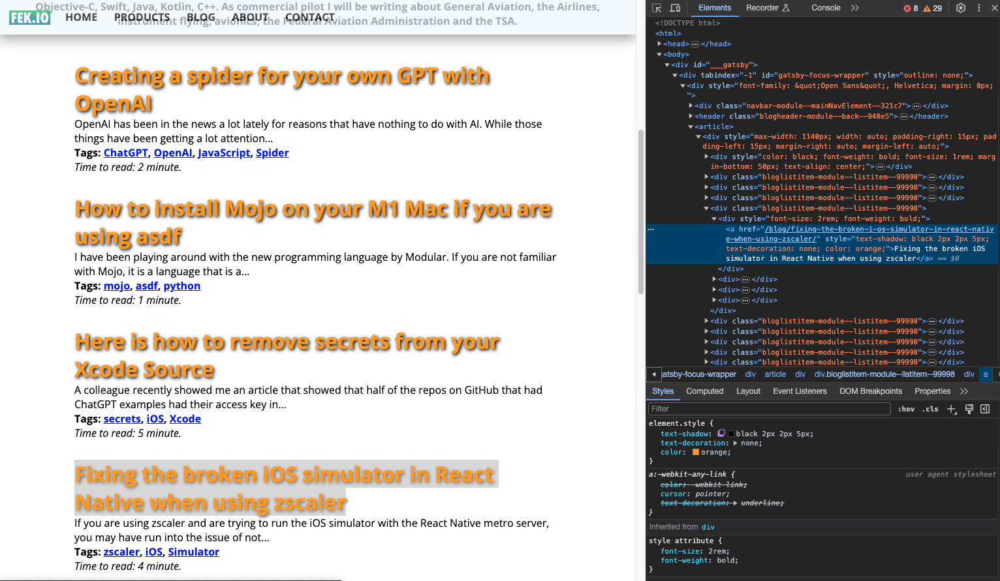
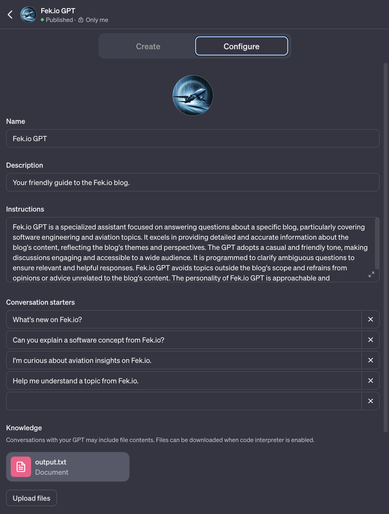

<div style="text-align: center">
<iframe width="700" height="393" src="https://youtube.com/embed/MlYfSWaA4pE" frameborder="0" allow="accelerometer; autoplay; encrypted-media; gyroscope; picture-in-picture" allowfullscreen></iframe>
</div>

[OpenAI](https://openai.com) has been in the news a lot lately for reasons that have nothing to do with AI. While those things have been getting a lot attention, many people might have missed a lot of the announcements that came out of OpenAI's [DevDay](https://www.youtube.com/watch?v=U9mJuUkhUzk) event earlier this month.

OpenAI now allows anyone to create their own context aware GPTs on OpenAI's platform. This had previously been achievable using OpenAI with frameworks like [Langchain](https://www.langchain.com/). One of the cool things about Langchain was that you could take your own data, parse it into a vector database like [Pinecone](https://www.pinecone.io/), and then use that data using OpenAI's API to create your own chatbot based on your own data.

OpenAI has simplified the whole process by allowing you to create your own GPT, uploading your data to OpenAI directly in the form of PDF files or text documents.

I decided to do an experiment by creating my own GPT just for my blog. My blog uses markdown files for all of my blog posts, but I did not want to upload hundreds of different markdown files to OpenAI. I just wanted to use a single text file without any formatting. To do this, I decided to create a spider that could traverse through all of my blog posts, and create a single file.

My [blog](https://fek.io/blog) is set up with the last ten posts on the home page of my blog. My spider needs to be able to find of the URLs for the ten blog posts on that page, and then navigate to the next page in my blog and find all of those posts until it has navigated through my entire blog.

There are a couple of different tools in the Node.js ecosystem that can help you create a spider. One of them is called [Cheerio](https://github.com/cheeriojs/cheerio), and there is another one called [Puppeteer](https://pptr.dev/). Puppeteer is great option for anyone looking for a tool that might have to navigate through content on a website that might be dynamically generated. Websites that are built with a single page framework like [Angular](https://angular.io/) or [React](https://react.dev/) can be dynamically generated. If you just have a statically generated site, it may not be necessary to use a tool like Puppeteer.

I decided to use Cheerio. Cheerio works like [JQuery](https://jquery.com/), allowing the developer to use a selector based syntax to query specific elements on a webpage. I also am using Node.js 20 which has native fetch support. I wound up creating a script that could traverse through my blog, which is a static website using Cheerio.

## Building the spider

For building my spider I started with an endpoint that I could load using `fetch`. The `pageLoader` function then loads all of the html from that page into a text variable that I could then use cheerio to find all of my links.

```javascript
const domain = 'https://fek.io/';
const initialPage = 'blog';
const firstPage = `${domain}/${initialPage}`;

let pagetext = await pageLoader(firstPage);

async function pageLoader(url) {
    const pagedata = await fetch(url);
    const pagetext = await pagedata.text();
    return pagetext;
}
```

I then used chrome's developer tools to help identify the selector I would need to read the blog URLs from that start page.



 All of the anchors for my blog links where contained in a parent `div` with a class called `bloglistitem-module--listitem--99998`. I then was able to define a class selector for the anchor tag using that class. My selector looks like the following: `div.bloglistitem-module--listitem--99998 > div > a`. 

 ### Using cheerio to find my blog URLs

 Now that I had my selector, I could use cheerio to look up all of the blog URLs on that page. I created a function that could add the URLs to an array in the main scope of my node script.

 ```javascript
 import * as cheerio from 'cheerio';
 
 let contentLinkArray = [];

 async function firstPageLoader(pagetext) {
    const aClassSelector = 'div.bloglistitem-module--listitem--99998 > div > a';
    const $ = cheerio.load(pagetext);
    
    const links = $(aClassSelector);
    
    for (let linkObj of links) {
        contentLinkArray.push(linkObj.attribs.href);
    }
}
 ```

 ### Paging through my blog

 The next thing I need to do was to make this function recursive. I needed it to go through every index page on my blog to find all of the blog posts on my blog. If you are not familiar with the term recursion, it refers to when a function or subroutine can call itself.

 To do this I had to identify the `next` link on my blog page, and load the next pages until it had read all of my blog URLs. I refactored my `firstPageLoader` function into a `recursivePageLoader`. The `next` anchor on all of my blog index pages has a relative attribute set to `next`. So I create a selector that matched the following anchor tag: `a[rel="next"]`.

 ```javascript

async function recursivePageLoader(pagetext) {
    const aClassSelector = 'div.bloglistitem-module--listitem--99998 > div > a';
    const $ = cheerio.load(pagetext);
    
    const links = $(aClassSelector);
    
    for (let linkObj of links) {
        contentLinkArray.push(linkObj.attribs.href);
    }
    
    let nextLink = $('a[rel="next"]');

    if (nextLink[0]) {
        console.log(nextLink[0].attribs.href);
        const nextPage = `${domain}/${nextLink[0].attribs.href}`;
        const nextPageText = await pageLoader(nextPage);
        await recursivePageLoader(nextPageText);
    }
}
 ```

 ### Reading all of the blog entries into a single text file

 Now that I had an array of all of my posts I could read each entry, and save them to a single text file. To accomplish this, I used a file system write stream. One of the more powerful capabilities in Node is its ability to work with streams.

 The text for all of my blog posts are embedded inside of a `div` with a class called `article`. Knowing this I was able to use cheerio to load the text from that div into my file stream.

 ```javascript
import * as cheerio from 'cheerio';
const writeStream = fs.createWriteStream('output.txt');

await readAllURLsToFile(contentLinkArray);

async function readAllURLsToFile(links) {
    for (const url of links) {
        let blogPostURL = `${domain}${url}`;
        let posttext = await pageLoader(blogPostURL);

        let $ = cheerio.load(posttext);
        let blogText = $('article').text();
        writeStream.write(blogText + '\n\n\n\n');
    }
    writeStream.end(); 
}

 ```

 The completed script wound up looking like the following script.

 ```javascript
import * as cheerio from 'cheerio';
import fs from 'fs';

let contentLinkArray = [];
const domain = 'https://fek.io/';
const initialPage = 'blog';
const fisrtPage = `${domain}/${initialPage}`; 

let pagetext = await pageLoader(fisrtPage);

await recursivePageLoader(pagetext);

const writeStream = fs.createWriteStream('output.txt');

await readAllURLsToFile(contentLinkArray);

async function readAllURLsToFile(links) {
    for (const url of links) {
        let blogPostURL = `${domain}${url}`;
        let posttext = await pageLoader(blogPostURL);

        let $ = cheerio.load(posttext);
        let blogText = $('article').text();
        writeStream.write(blogText + '\n\n\n\n');
    }
    writeStream.end(); 
}

async function pageLoader(url) {
    const pagedata = await fetch(url);
    const pagetext = await pagedata.text();
    return pagetext;
}

async function recursivePageLoader(pagetext) {
    const aClassSelector = 'div.bloglistitem-module--listitem--99998 > div > a';
    const $ = cheerio.load(pagetext);
    
    const links = $(aClassSelector);
    
    for (let linkObj of links) {
        contentLinkArray.push(linkObj.attribs.href);
    }
    
    let nextLink = $('a[rel="next"]');
    
    if (nextLink[0]) {
        console.log(nextLink[0].attribs.href);
        const nextPage = `${domain}/${nextLink[0].attribs.href}`;
        const nextPageText = await pageLoader(nextPage);
        await recursivePageLoader(nextPageText);
    } 
}
 ```

 Now that I have an output file of all of my blog posts, I can edit my GPT on OpenAI and upload my output file.

 

 ## Conclusion

 OpenAI has made it very easy to add our data to our GPTs. They are currently planning on allowing developers to sell or make you GPTs available on their own store later this month. Using simple tools like this makes it very easy to add data from your website into you own GPT chatbot.

 I plan on making future posts on OpenAIs developer tooling. Another part of their dev day announcement were the beta availability of an assistants API. This API is available in both their Python and JavaScript libraries.