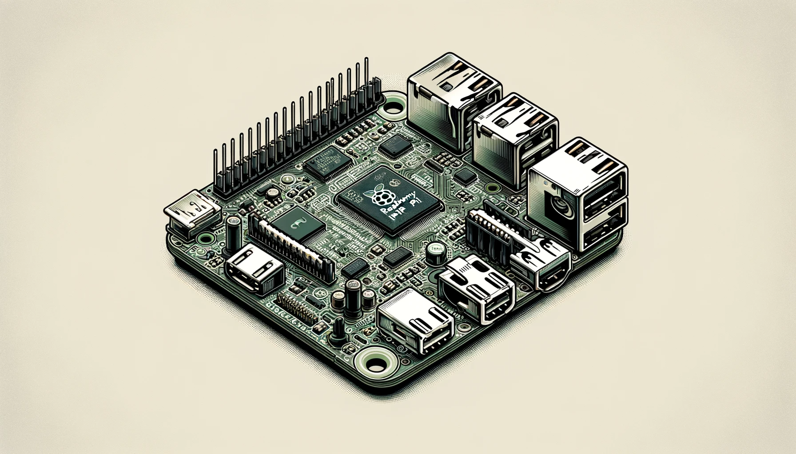

The Raspberry Pi is a credit card sized computer that runs Linux or Windows. It is a great way for playing around with IoT projects, making robots or even running a simple web server in your house.



One of the things I like using the Raspberry Pi for is running agents or bots. There is no reason I can find to pay for an external server when you can run simple software like this on a Raspberry Pi locally in your own home.

Now that I have a Raspberry Pi, and I am running software on it, I was looking for a way to create a pipeline and automatically deploy software to my Pi. The solution I came up with was running a Github Actions runner directly on my Pi. Once you have a runner on your Pi, it will deploy any code from your github repository that are configured to use Github actions.

## Adding a runner to your Pi
To add a runner to your Pi, go to your Github page, and click on the `Setting` button. When you see the menu on the left hand side of the page, select `Actions` and then the submenu for `runners`. Select the `New runner` button, and then the option for a `New self-hosted runner`.

On the `New self-hosted runner` page, you should see three options for MacOS, Linux and Windows. Select Linux. There is a architecture option below the OS options that lets you choose between `x64`, `ARM` and `ARM64`. Depending on the Raspberry Pi model it could be ARM or ARM64. You will have to check the model to find out for sure. Plus you will need to make sure the version of the Raspberry Pi OS is 32 bit or 64 bit. If the OS is 64 bit, you will need `ARM64`.

There will be a set of scripts to run on your Pi to install the Github Action runner, one for downloading, and one for configuring. 

Once you have the runner installed, you will need to set it up as a service. Github recommends the following commands:

```shell
> sudo ./svc.sh install
```

Once the service is installed, you can start it up with the following command:

```shell
> sudo ./svc.sh start
```

## Installing PM2 for you Node application

You can run the following command to install PM2 on your Pi.

```shell
> npm i  pm2 -g
```

This will install PM2 globally. PM2 is a great application runner and manager.

To install PM2 so that it runs at startup, run the following command in the terminal:

```shell
pm2 startup
```

You then might get an instruction on how to install the PM2 service like the following example using systemd:

```shell
sudo env PATH=$PATH:/usr/bin /usr/lib/node_modules/pm2/bin/pm2 startup systemd -u user --hp /home/user
```

# Add Github action to your App to deploy to your Pi

Create a Github action by creating a YAML file in the following location in your repo:

* /.github/workflows/myactionfile.yml

Your action will need to have the following steps:

```yaml
name: Node.js CI

on:
  push:
    branches: [ main ]

jobs:
  build:

    runs-on: self-hosted

    strategy:
      matrix:
        node-version: [20.x]
        # See supported Node.js release schedule

    steps:
    - uses: actions/checkout@v2
    - run: npm ci
```

If you look at the tenth line on that YAML file you will see the following command for the jobs: `runs-on: self-hosted`. This line will run the action on the Pi you have installed the Github runner on.
When you check in this action, you will see the action deployed to a path on your Pi that might look like the following:

* ~/actions-runner/_work/yourreponame/yourreponame

## Running your app on the Pi

Now that your Github action has downloaded your app to your Pi, you can use PM2 to run your app. If you Pi looses power or has to restart, we can use PM2 to automatically restart your app. PM2 will essentially let you run your app as a service. We can use the following shell commands to copy our app, and start running it with PM2:

```shell
mkdir ~/apps/
mkdir ~/apps/yourapp
cp -r ~/actions-runner/_work/yourreponame/yourreponame/* ~/apps/yourapp
cd ~/apps/yourapp
pm2 start index.js --name yourappname
pm2 save
```

You may also want to create a shell script that you can use to reset your app in PM2 every time you push a change through Github. You could write a script that shuts down the service, and reinstalls it like the following example:

```shell
# resetservice.sh
#!/bin/bash
pm2 stop yourappname
pm2 delete yourappname
pm2 save
rm -rf ~/apps/yourapp
mkdir ~/apps/yourapp
cp -r ~/actions-runner/_work/yourreponame/yourreponame/* ~/apps/yourapp
cd ~/apps/yourapp
pm2 start index.js --name yourappname
pm2 save
```

Now that you have a script that can stop, delete and restart the service, you can add it to your Github action:

```yaml
name: Node.js CI

on:
  push:
    branches: [ main ]

jobs:
  build:

    runs-on: self-hosted

    strategy:
      matrix:
        node-version: [20.x]
        # See supported Node.js release schedule

    steps:
    - uses: actions/checkout@v2
    - run: npm ci
    - shell: bash
      run: chmod +x resetservice.sh
    - shell: bash
      run: ./resetservice.sh
```

## Conclusion

With very little effort, you can add an Github Action runner that can deploy your own code to your Raspberry Pi. This makes it very easy to iterate through changes in your code, and have it deploy to your Pi.

The Raspberry Pi and Ubuntu also make it fairly easy to set up a Kubernetes cluster, so you can simulate deploying your apps in a similar way that many cloud based services do. Have fun tinkering!