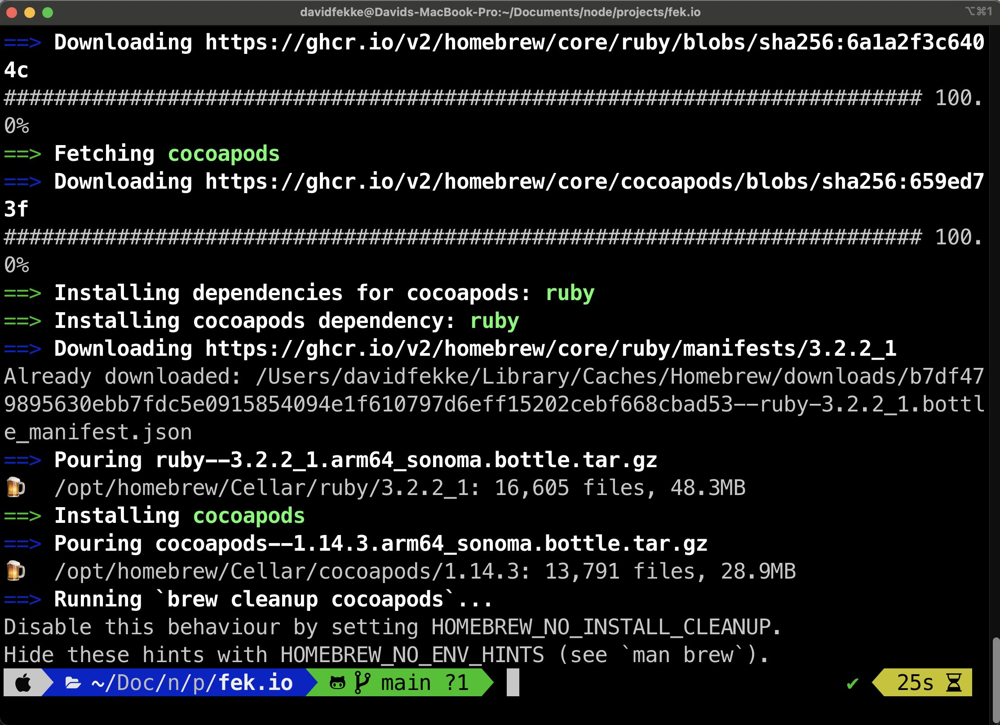

<div style="text-align: center">
<iframe width="700" height="393" src="https://youtube.com/embed/fMHOgnuOo80" frameborder="0" allow="accelerometer; autoplay; encrypted-media; gyroscope; picture-in-picture" allowfullscreen></iframe>
</div>

I just purchased a new MacBook laptop from Apple. One of the things I intend on using it for is Software Development. I use a lot of different tools and frameworks including Node.js, Xcode, Android Studio and VSCode. I decided to live stream the process of setting up my new MacBook.

The first thing I do is set up the finder and Dock the way I prefer. I like to see invisible files in the Finder. This can be achieved by running the following shell commands:

```shell
> defaults write com.apple.finder AppleShowAllFiles true
> killall Finder
```

## Xcode

The process of installing Xcode is pretty simple. Many of the other tools I use depend on Xcode being installed in order to use clang and compilers. This is pretty simple. All you have to do is go to the App Store app on your Mac and search for `Xcode`. Click on the button that says `install`.

## Visual Studio Code

I use [VSCode](https://code.visualstudio.com/) for most of my web development and Node.js coding. Setting up VSCode probably requires its own blog post, but I am going to keep it short. When you go to [https://code.visualstudio.com/](https://code.visualstudio.com/), there is a button to Download the Mac Universal installer. Once you have it installed, you can use the `command-shift-P` to open up the command pallete, and type `>Shell Command: Install 'code' command in PATH`. This will let you launch VSCode from the terminal.

## iTerm 2

I like to use [iTerm 2](https://iterm2.com/) over the bundled `Terminal` application that comes with the Mac. You can download [here](https://iterm2.com/). Once I have iTerm installed, I like to install the `oh-my-zsh` tool. There are instructions on how to install `oh-my-zsh` at this [web page](https://ohmyz.sh/#install). Once I have that installed, I change the theme to use `agnoster`. This [gist](https://gist.github.com/rupeshtiwari/e83d15baee60fa26f38bfd2fcd81ea70) explains how to set it up.



## Docker

[Docker](https://docs.docker.com/desktop/install/mac-install/) is one of the ways I test and use containers locally on my Mac. It is a great tool because you can spin up a server container without having to spin up a whole Virtual Machine. If I am working with database server like [Postgres](https://www.postgresql.org/), I generally run that in a container rather installing on my machine.

## Homebrew

Now that I have my terminal set up, I install [Homebrew](https://brew.sh/). Homebrew is like a package manager, similar to apt-get on Linux or Choclately on Windows. Installing Homebrew is pretty easy. Just run the following command:

```shell
> /bin/bash -c "$(curl -fsSL https://raw.githubusercontent.com/Homebrew/install/HEAD/install.sh)"
```

You can now use Homebrew to install different programs and packages on your Mac. Here is an example of how to install Cocoapods:

```shell
> brew install cocoapods
```

## ASDF

I like to use [ASDF](https://asdf-vm.com/guide/getting-started.html) as a universal version manager for different runtimes on my Mac. I use to manage Node.js, Python and Ruby. You can install ASDF with the following command:

```shell
> git clone https://aur.archlinux.org/asdf-vm.git && cd asdf-vm && makepkg -si
```

Once ASDF is installed, follow the directions on how to add plugins for you runtime of choice. Here is the command for installing the Node.js plugin as an example:

```shell
> asdf plugin add nodejs https://github.com/asdf-vm/asdf-nodejs.git
```

## Rust

I have started using Rust for some software projects. Rust and Cargo can both be install with the following command:

```shell
curl https://sh.rustup.rs -sSf | sh
```

## Github

Setting up Github access can be tricky, but it can be simpliefied by using one of the applications provided by Github. Github has a desktop application that you can download, but they also have an awesome CLI which can be installed using Homebrew.

```shell
> brew install gh
```

Onec you have `gh` installed, you can authenticate you Mac using the following command:

```shell
> gh auth login
```

This will prompt you login into Github with a web page. Once you are logged in, you will be able to push and pull from your repos.

## Android Studio

[Android Studio](developer.android.com) is the standard IDE for Android development. This can be be done by downloading the Android Studio image from the following [web page](https://developer.android.com/studio).

## Conclusion

It took me a little over an hour today to install all of my apps on this MacBook. If you watch the video, I did run into some complications, but for the most part it was not hard.