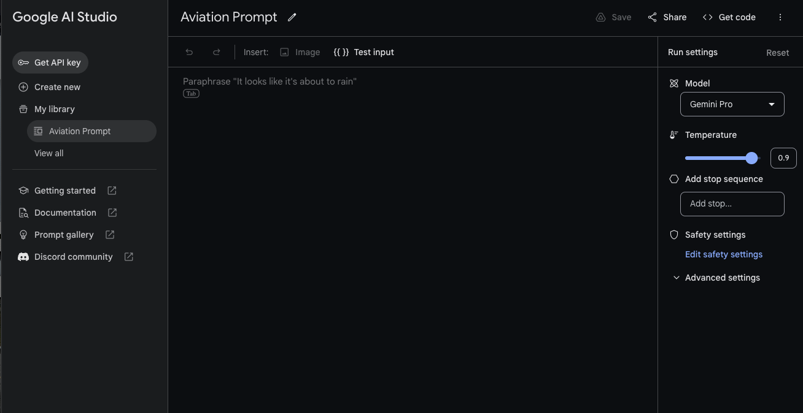

<div style="text-align: center">
    <div class="responsive-iframe-container">
        <iframe src="https://youtube.com/embed/uQiqNPyoMps" frameborder="0" allow="accelerometer; autoplay; encrypted-media; gyroscope; picture-in-picture" allowfullscreen></iframe>
    </div>
</div>

It seems the only thing anyone has been talking about in tech over the last year has been generative AI. When OpenAI launched ChatGPT last year it sent the world into an AI frenzy. One of OpenAI's chief competitors is Google. Google has been hard at work adding their own generative AI features, and they recently launched `Gemini`.

Today Google launched their [API](https://blog.google/technology/ai/gemini-api-developers-cloud/)'s for Gemini developers. This comes with a number of libraries and frameworks that developers can use to incorporate into their applications. In order to use these tools, you will need to generate an API key, which you can do with Google's [AI Studio](https://makersuite.google.com/app/prompts).



Once you have a key created, you can test your prompts in AI Studio, but there is `code` button that will show how to execute that prompt with your language of choice. The options today are as follows:

* JavaScript
* Python
* Android (Kotlin)
* Swift

They even show examples just using the cURL command line tool.

## Node.js example

To execute a prompt using Node.js, you will need to install the following NPM package into your Node project:

```shell
> npm i @google/generative-ai
```

Once you have the package installed, you can initiate a prompt and response with the following sample code.

```javascript

import { GoogleGenerativeAI, HarmCategory, HarmBlockThreshold } from "@google/generative-ai";
  
const MODEL_NAME = "gemini-pro";
const API_KEY = process.env.GEMINI_API_KEY;
  
async function run() {
    const genAI = new GoogleGenerativeAI(API_KEY);
    const model = genAI.getGenerativeModel({ model: MODEL_NAME });

    const generationConfig = {
        temperature: 0.9,
        topK: 1,
        topP: 1,
        maxOutputTokens: 2048,
    };

    const safetySettings = [
        {
            category: HarmCategory.HARM_CATEGORY_HARASSMENT,
            threshold: HarmBlockThreshold.BLOCK_MEDIUM_AND_ABOVE,
        },
        {
            category: HarmCategory.HARM_CATEGORY_HATE_SPEECH,
            threshold: HarmBlockThreshold.BLOCK_MEDIUM_AND_ABOVE,
        },
        {
            category: HarmCategory.HARM_CATEGORY_SEXUALLY_EXPLICIT,
            threshold: HarmBlockThreshold.BLOCK_MEDIUM_AND_ABOVE,
        },
        {
            category: HarmCategory.HARM_CATEGORY_DANGEROUS_CONTENT,
            threshold: HarmBlockThreshold.BLOCK_MEDIUM_AND_ABOVE,
        },
    ];

    const parts = [
        {text: "What are some of the differences between cats and dogs?"},
    ];

    const result = await model.generateContent({
        contents: [{ role: "user", parts }],
        generationConfig,
        safetySettings,
    });

    const response = result.response;
    console.log(response.text());
}

run();
```

I received the following result from the prompt `What are some of the differences between cats and dogs?`.


1. **Social Behavior:**
   - Cats: Cats are typically more independent and solitary animals, content with spending time alone. They don't inherently possess the pack-like bonding instinct seen in dogs.
   - Dogs: Dogs, on the other hand, are pack animals that thrive on social interaction, including with humans. They often exhibit a stronger attachment to their owners and tend to be more sociable with other dogs.

2. **Activity Level:**
   - Cats: Cats have a more flexible and self-regulating sleep-wake cycle compared to dogs. Their activity patterns often center around bursts of play and exploration followed by periods of rest.
   - Dogs: Dogs tend to have a more consistent and predictable activity level. They have higher energy requirements and often require regular exercise, whether it's playing fetch, going for walks, or engaging in other physical activities.

3. **Grooming Habits:**
   - Cats: Cats are meticulous groomers. They spend a significant amount of time licking and cleaning themselves, which helps maintain their fur and skin.
   - Dogs: Dogs have less frequent grooming habits compared to cats. Although they still groom themselves, they may require additional grooming assistance from their owners, such as brushing or bathing.

4. **Diet:**
   - Cats: Cats are obligate carnivores, meaning their bodies are biologically designed to digest and utilize animal-based nutrients. They have a higher protein requirement compared to dogs.
   - Dogs: Dogs are omnivores, capable of consuming both plant-based and animal-based foods. While they have a higher tolerance for carbohydrates, their diet should still be primarily meat-based.

5. **Communication:**
   - Cats: Cats communicate through a variety of vocalizations, such as meows, purrs, chirps, and hisses, as well as body language and facial expressions.
   - Dogs: Dogs primarily communicate through barking, growling, whining, and howling. They also use body language, including tail wagging, ear positioning, and facial expressions, to convey their emotions and intentions.

6. **Trainability:**
   - Cats: Cats are often perceived as less trainable compared to dogs. While they can be taught basic commands and tricks, they tend to be less responsive to consistent training methods.
   - Dogs: Dogs are generally more receptive to training due to their innate pack mentality and desire to please their owners. They can be trained to perform various tasks and commands, such as retrieving items, sitting, staying, and heeling.
 *  Terminal will be reused by tasks, press any key to close it. 

## Output

The Output comes back as an array called `candidates`. Each candidate contains

 ## Safety

 One of the neat features of Gemini is the ability to establish certain safety guardrails when making requests. Here is the `enum` that defines harm categories that you can throttle back with a specific `HarmCategory`.

 ```typescript
 export declare enum HarmCategory {
    HARM_CATEGORY_UNSPECIFIED = "HARM_CATEGORY_UNSPECIFIED",
    HARM_CATEGORY_HATE_SPEECH = "HARM_CATEGORY_HATE_SPEECH",
    HARM_CATEGORY_SEXUALLY_EXPLICIT = "HARM_CATEGORY_SEXUALLY_EXPLICIT",
    HARM_CATEGORY_HARASSMENT = "HARM_CATEGORY_HARASSMENT",
    HARM_CATEGORY_DANGEROUS_CONTENT = "HARM_CATEGORY_DANGEROUS_CONTENT"
}
 ```

These get passed into the request with a `HarmThreshold`.

```typescript
export declare enum HarmBlockThreshold {
    HARM_BLOCK_THRESHOLD_UNSPECIFIED = "HARM_BLOCK_THRESHOLD_UNSPECIFIED",
    BLOCK_LOW_AND_ABOVE = "BLOCK_LOW_AND_ABOVE",
    BLOCK_MEDIUM_AND_ABOVE = "BLOCK_MEDIUM_AND_ABOVE",
    BLOCK_ONLY_HIGH = "BLOCK_ONLY_HIGH",
    BLOCK_NONE = "BLOCK_NONE"
}
```

Looking at the Node.js example above you can see that these get passed as an array in the following form:

```javascript
const safetySettings = [
    {
        category: HarmCategory.HARM_CATEGORY_HARASSMENT,
        threshold: HarmBlockThreshold.BLOCK_MEDIUM_AND_ABOVE,
    },
    {
        category: HarmCategory.HARM_CATEGORY_HATE_SPEECH,
        threshold: HarmBlockThreshold.BLOCK_MEDIUM_AND_ABOVE,
    },
    {
        category: HarmCategory.HARM_CATEGORY_SEXUALLY_EXPLICIT,
        threshold: HarmBlockThreshold.BLOCK_MEDIUM_AND_ABOVE,
    },
    {
        category: HarmCategory.HARM_CATEGORY_DANGEROUS_CONTENT,
        threshold: HarmBlockThreshold.BLOCK_MEDIUM_AND_ABOVE,
    },
];
```

It is nice to see that Google has given developers such granular control of safety in their generative model.

## Conclusion

It has been exciting to see all of the new tools that have been made available to developers for building AI applications on top of existing models. It should be interesting to watch how these continue to improve over the next couple of years as we make our way towards AGI.
