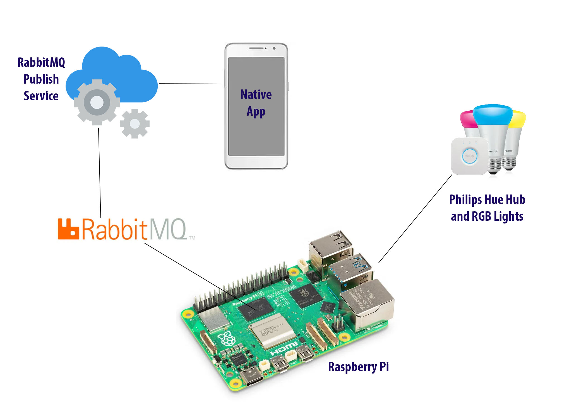

For this holiday season I decided to upgrade my lighting for the exterior of my home. I purchased some Philips Hue lights for my home. One of the nice things about the Philips Hue lights is that you can control your lights and their mood and color from a hub. The Philips Hue hub connects to a ethernet port in your home. Once it is installed, you can register new lights to that hub, and control them from an app. But the really cool thing about the hub is that it has a REST based web service you can call from your local network to check on and control your bulbs.

Philips has good [instructions](https://developers.meethue.com/develop/get-started-2/) on how to get a user key to call the hub. Once you have that {user} key, you can turn lights off and on as well as change the color and brightness of the bulb.

```
Address	https://<bridge ip address>/api/1028d66426293e821ecfd9ef1a0731df/lights/1/state
Body	{"on":false}
Method	PUT
```

The following `PUT` tells the first light on the hub to turn off.

For my home project I decided that I wanted to be able to control the lights from a program I was running on a [Raspberry Pi](https://www.raspberrypi.org/). If you are not familiar with the Pi, it is a credit card sized computer that can connect to Wi-Fi, bluetooth and ethernet.

I also decided that I wanted to be able to remote control my lights from a smart phone. Since the program I was using on my Raspberry Pi only connected to my local network, I had no way to access from outside of my home network. To get around this problem, I decided to use a simple queue service that I could send messages to and receive those messages on my Raspberry Pi. To do this I decoded to use RabbitMQ. I found a RabbitMQ service that was running on the internet with a free tier. I then created a REST service that I could call from my mobile app to send messages to the queue.



On my Raspberry Pi I created a program to consume messages from the queue. I used this program to control a service I was running using PM2 on my Pi to run another program on my Pi to alternate the bulbs between green and red on the front of my home.

## Programming the lights

The program that runs on my Pi runs as a service using PM2. If you are not familiar with PM2, it is a process manager that can manage services run in Node.js or other programs. It will also persist those services so if the Pi is restarted, it will return the service to the previous state it was running before the Pi was restarted.

My program for alternating the lights can be seen below:

```javascript
import process from 'node:process';

const ip_address = process.env.IP_ADDRESS;
const user = process.env.USERTOKEN;

let toggle = true;

async function setLightStatus(bulb, state) {
    const endpoint = `http://${ip_address}/api/${user}/lights/${bulb}/state`;
    const options = {
        method: "PUT",
        body: JSON.stringify(state)
    };
    await fetch(endpoint, options);
}

async function setLightStatus2() {
    let state = {
        "on":true,
        "sat":254,
        "bri":254,
        "hue": toggle ? 25600 : 0
    };
    await setLightStatus(2, state);
}

async function setLightStatus3() {
    let state = {
        "on":true,
        "sat":254,
        "bri":254,
        "hue": toggle ? 0 : 25600
    };
    await setLightStatus(3, state);
}

async function masterSwitch() {
    await setLightStatus2();
    await setLightStatus3();
    toggle = !toggle;
}

let timer = setInterval(await masterSwitch, 15000);

process.on('exit', (code) => {
    clearTimeout(timer);
    console.log(`Program exited with code: ${code}`);
});
```

As you can see from the code above, it uses a `toggle` variable to switch between red and green colors on the lights. So when one bulb is green the other one will be red, and vice versa.

## Writing events to the RabbitMQ service

In order to send messages to my Pi, I used the following REST based service to write messages to RabbitMQ.

```javascript
import Fastify from 'fastify';
import fastifyCors from '@fastify/cors';
import amqp from 'amqplib';

let connection;
let channel;
const queue = "pi_messages";
const rabbitmqURL = process.env.RABBITMQ_URL;

const fastify = Fastify({ logger: true });

const port = process.env.PORT || '3000';

fastify.register(fastifyCors, {
    // put your options here
});

fastify.post('/', async (request, reply) => {
    const jsonMessage = request.body;

    const response = {
        status: 'success',
        message: 'Message sent to AMQP',
        data: jsonMessage // Optionally include the user data or some identifier
    };

    await produceMessage(jsonMessage);

    reply
        .code(200)
        .header('Content-Type', 'application/json; charset=utf-8')
        .send(response);
})

const start = async () => {
    try {
        console.log(`URL: ${rabbitmqURL}`);
        connection = await amqp.connect(rabbitmqURL);
        channel = await connection.createChannel();
        await channel.assertQueue(queue, { durable: false });

        process.once("SIGINT", async () => {
            await channel.close();
            await connection.close();
        });

        await fastify.listen({ port, host: '0.0.0.0' });
    } catch(err) {
        fastify.log.error(err);
        process.exit(1);
    }
}

start();

async function produceMessage(msgObject) {
    try {
        channel.sendToQueue(queue, Buffer.from(JSON.stringify(msgObject)));
        console.log(" [x] Sent '%s'", msgObject);
    } catch (err) {
        console.error(err);
    }
}
```

As you can see above, this service is written [Fastify](https://fastify.dev/), and simply takes a JSON message and sends it to a queue called `pi_messages`. For turning my lights on with my `xmas` program, I made my message look like the following JSON:

```json
{
    "type": "🎄Lights",
    "on": true
}
```

Yes, I sent a Christmas tree (🎄) emoji in my JSON message.

## Consuming the RabbitMQ Queue

To consume the RabbitMQ queue, I created another service that I ran on my Raspberry Pi to listen for new messages sent from my phone. The consumer looks like the following example below.

```javascript
import amqp from 'amqplib';
import { stopService, startService } from './pm2service.js';
import { setLightStatusOff } from './lightservice.js';

const queue = "pi_messages";
const rabbitmqURL = process.env.RABBITMQ_URL;

const messagHandler = (message) => {
  if (message) {
    console.log(
      " [x] Received '%s'",
      JSON.parse(message.content.toString())
    );
    const messageObj = JSON.parse(message.content.toString());
      if (messageObj.type === "🎄Lights" && messageObj.on) {
        startLights();
      } else if (messageObj.type === "off" && !messageObj.on) {
        stopLights();
      }
  }
};

try {
  const connection = await amqp.connect(rabbitmqURL);
  const channel = await connection.createChannel();

  process.once("SIGINT", async () => {
    await channel.close();
    await connection.close();
  });

  await channel.assertQueue(queue, { durable: false });
  await channel.consume(queue, messagHandler, { noAck: true });

  console.log(" [*] Waiting for messages. To exit press CTRL+C");
} catch (err) {
  console.warn(err);
}

async function stopLights() {
  await stopService('xmaslights');
  await setLightStatusOff();
}

async function startLights() {
  await startService('xmaslights');
}
```

As you can see from the consumer above, I listen to the `pi_messages` queue for any messages. From this consumer I can turn my lights on or off by either sending a REST request directly to my hub, or turning on the other service from PM2.

To turn the lights off, I use the following module to `setLightStatusOff`.

```javascript
const ip_address = process.env.IP_ADDRESS;
const user = process.env.USERTOKEN;

async function setLightStatus(bulb, state) {
    const endpoint = `http://${ip_address}/api/${user}/lights/${bulb}/state`;
    const options = {
        method: "PUT",
        body: JSON.stringify(state)
    };
    await fetch(endpoint, options);
}

export async function setLightStatusOff() {
    let state = {
        "on":false,
    };
    await setLightStatus(2, state);
    await setLightStatus(3, state);
}
```

For turning the Xmas lights program on, I turn that on by programmatically using PM2 to turn the `xmaslights` service back to a started state.

```javascript
import pm2 from 'pm2';

export async function stopService(serviceName) {
  try {
    // Connect to PM2
    await new Promise((resolve, reject) => {
      pm2.connect(err => {
        if (err) reject(err);
        else resolve();
      });
    });

    // Stop the specified service
    await new Promise((resolve, reject) => {
      pm2.stop(serviceName, (err, proc) => {
        if (err) reject(err);
        else resolve(proc);
      });
    });

    console.log('Service stopped successfully');
  } catch (err) {
    console.error('Error stopping service:', err);
  } finally {
    // Disconnect from PM2
    pm2.disconnect();
  }
}

export async function startService(serviceName) {
    try {
        // Connect to PM2
        await new Promise((resolve, reject) => {
            pm2.connect(err => {
                if (err) reject(err);
                else resolve();
            });
        });

        // Stop the specified service
        await new Promise((resolve, reject) => {
            pm2.start(serviceName, (err, proc) => {
                if (err) reject(err);
                else resolve(proc);
            });
        });

        console.log('Service started successfully');
    } catch (err) {
        console.error('Error starting service:', err);
    } finally {
        // Disconnect from PM2
        pm2.disconnect();
    }
}
```

If everything is running properly, I can run a `pm2 ls` from my terminal and I should see the following in my terminal:

```shell
┌────┬──────────────────┬─────────────┬─────────┬─────────┬──────────┬────────┬──────┬───────────┬──────────┬──────────┬──────────┬──────────┐
│ id │ name             │ namespace   │ version │ mode    │ pid      │ uptime │ ↺    │ status    │ cpu      │ mem      │ user     │ watching │
├────┼──────────────────┼─────────────┼─────────┼─────────┼──────────┼────────┼──────┼───────────┼──────────┼──────────┼──────────┼──────────┤
│ 1  │ rabbitconsume    │ default     │ 1.0.0   │ fork    │ 62428    │ 63m    │ 0    │ online    │ 0%       │ 49.6mb   │ dav… │ disabled │
│ 0  │ xmaslights       │ default     │ 1.0.0   │ fork    │ 62514    │ 63m    │ 1    │ online    │ 0%       │ 58.7mb   │ dav… │ disabled │
└────┴──────────────────┴─────────────┴─────────┴─────────┴──────────┴────────┴──────┴───────────┴──────────┴──────────┴──────────┴──────────┘
```

## Installing and deploying services on my Raspberry Pi

To install these two services on my Pi, I used shell scripts to run every-time I deployed a new version of the services on PM2. Here is the shell script I used for installing the main `xmaslights` service.

```shell
#!/bin/bash
pm2 stop xmaslights
pm2 delete xmaslights
pm2 save
rm -rf ~/apps/xmaslights
mkdir ~/apps/xmaslights
cp -r ~/path/to/projects/xmaslightsservice/* ~/apps/xmaslights
cp ~/.env ~/apps/xmaslights/
cd ~/apps/xmaslights
pm2 start ecosystem.config.cjs
pm2 save
```

I then used the following `ecosystem.config` file to configure PM2 to start the service with an environment variable file called `.env`.

```javascript
module.exports = {
    apps: [{
      name: 'xmaslights',
      script: 'xmasservice.js', // or whatever your main file is
      node_args: '--env-file .env'
    }]
};
```

## Conclusion

This was a fun project, and is a good example of some of the neat things you can do with Hue lights and a Raspberry Pi. It is another example of using the Pi for an IoT type of project. I hope you can use this as an inspiration for a project you want to run on your Pi. Merry Christmas!