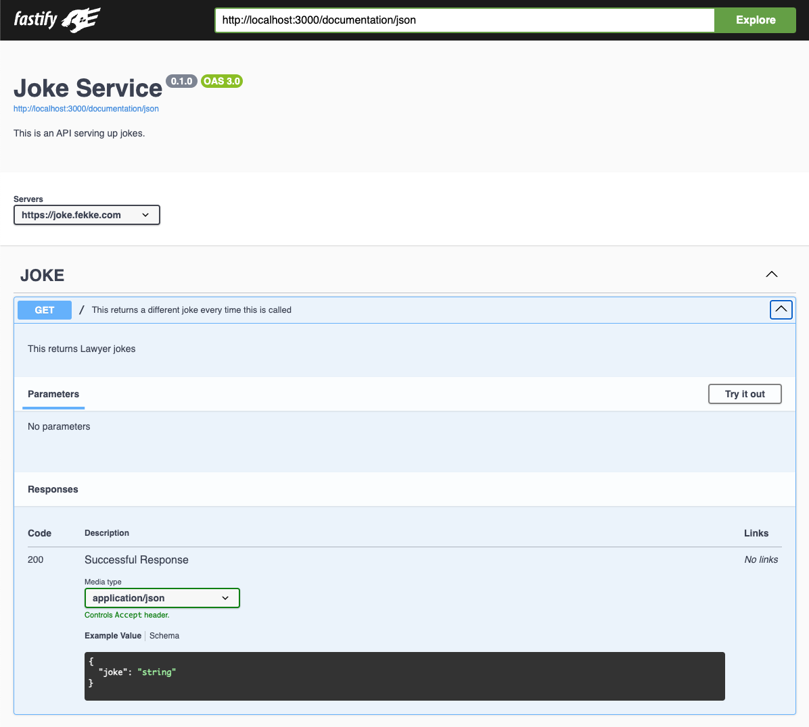

<div style="text-align: center">
    <div class="responsive-iframe-container">
        <iframe src="https://youtube.com/embed/iJEQGpS3jog" frameborder="0" allow="accelerometer; autoplay; encrypted-media; gyroscope; picture-in-picture" allowfullscreen></iframe>
    </div>
</div>

[OpenAI](https://openai.com/) plans to launch a GPT Store this week. Back in November, OpenAI announced that they would allow anyone to create their own GPT. The way this works is that an OpenAI user can define their own GPT, upload their own information and make that GPT available to other users. The really cool thing about this feature is that you can define your own GPT without any programming.

One of the other cool things is if you do know how to program or have access to external HTTP services, you can add custom actions to your GPT. In order for OpenAI to be able to use an action, it has to conform to the [openapi](https://www.openapis.org/) standard. Openapi allows developers to create a yaml or json file that defines the methods and endpoints that can be consumed by other applications. This is very similar to the old WSDL files that were used to define SOAP based web services.

## How to create a openapi definition using Swagger and Fastify

Lately I have been using [Fastify](https://fastify.dev/) to create REST based services. In the Node.js ecosystem Fastify has become a popular framework for creating REST based services.

I used Swagger to generate the openapi definition for my joke service. There are many frameworks for different languages that support adding Swagger to their services. 

I have created a GPT for telling jokes, but I will have it run an action to get new jokes. Here is a simple Fastify service that will serve up new jokes:

```javascript
import Fastify from 'fastify';
import fs from 'fs';

const port = process.env.PORT || 3000;
const data = await fs.promises.readFile('jokes.json', 'utf8');
const jokesObj = JSON.parse(data);

const schemaConfig = {
    schema: {
        description: 'This returns jokes',
        tags: ['JOKE'],
        summary: 'This returns a different joke every time this is called',
        response: {
            200: {
                description: 'Successful Response',
                type: 'object',
                properties: {
                    joke: { type: 'string' }
                }
            }
        }
    }
};

const fastify = Fastify({
    logger: true
});

fastify.get('/', schemaConfig, async (req, reply) => {
    const randomInteger = Math.floor(Math.random() * 20);
    const joke = jokesObj.jokes[randomInteger];
    reply
        .code(200)
        .header('Content-Type', 'application/json; charset=utf-8')
        .send({ joke: joke });
});

const start = async () => {
    try {
        await fastify.listen({
            port: port,
            host: '0.0.0.0'
        });
    } catch (error) {
        fastify.log.error(error);
        process.exit(1);
    }
}
start();

```

If we examine this service, it has one route that returns a joke from a JSON file with about 20 jokes.

```javascript
fastify.get('/', schemaConfig, async (req, reply) => {
    const randomInteger = Math.floor(Math.random() * 20);
    const joke = jokesObj.jokes[randomInteger];
    reply
        .code(200)
        .header('Content-Type', 'application/json; charset=utf-8')
        .send({ joke: joke });
});
```

The second parameter in the `get` method takes a schema object, which is how Fastify allows developers to define input and response types in our routes. This is used as a kind of meta information that can then be reused by tools like Swagger.

## Adding Swagger to Fastify

To add Swagger to our joke service, we will need to import Swagger and Swagger-UI using a package manager like npm or Bun.

```bash
> npm i @fastify/swagger @fastify/swagger-ui
```

Once we have added swagger to our project, we will need to add imports to our Fastify app.

```javascript
import Swagger from '@fastify/swagger';
import SwaggerUI from '@fastify/swagger-ui';
```

Before we can register Swagger to our fastify app, we will need to create a configuration. I am going to do that in another file, and import it into our main fastify file.

```javascript
const swaggerConfig = {
    openapi: {
        info: {
          title: 'Joke Service',
          description: 'This is an API serving up jokes.',
          version: '0.1.0'
        },
        servers: [{
          url: 'https://joke.mydomain.com'
        }]
    },
    hideUntagged: true,
    exposeRoute: true
};

export default swaggerConfig;

```
Then we can import this config into our fastify file.

```javascript
import swaggerConfig from './swaggerConfig.js'
```

Now that we have imported these two modules and added a configuration, we will need to register them as plugins using our fastify object before starting the service.

```javascript
const fastify = Fastify({
    logger: true
});

await fastify.register(Swagger, swaggerConfig);
await fastify.register(SwaggerUI);
```

That is all we need to do to add Swagger to our Fastify app, but I am going to make one more change to the schema for my route to add an `operationId`. OpenAI's actions need that property in order to use it as an action in your GPT.

```javascript
const schemaConfig = {
    schema: {
        description: 'This returns jokes',
        tags: ['JOKE'],
        summary: 'This returns a different joke every time this is called',
        operationId: 'get-joke',
        response: {
            200: {
                description: 'Successful Response',
                type: 'object',
                properties: {
                    joke: { type: 'string' }
                }
            }
        }
    }
};
```

If we look at the schema definition above, we can see that I added an `operationId` called `get-joke`. If we run this app, and call the root route using a curl command like the following:

```shell
> curl http://localhost:3000
"What is a sea monster’s favorite snack? Ships and dip."
```

Swagger adds a new route to view the documentation for the service. By default the route to view the documentation is `/documentation`.



Under the `@fastify/swagger` title, there is a url that should be `http://localhost:3000/documentation/json`. That endpoint is the openapi definition that we will need to add to our GPT.

To add the action to a GPT, either create or edit an existing action. Once you have the GPT editor open, the form on the left hand side has two tabs at the top: `Create` and `Configure`. Select the `Configure` tab, and click on the `Create new action` button. This will open a new form called `Add new actions`. You can either paste the definition in the `schema` text field or click on the `Import from URL`. 

## Testing the actions

Once you have successfully added the action to your GPT, OpenAI's GPT editor will give you the option to test the actions. Go ahead and verify that your actions are working.

## Conclusion

It is important to add really good summaries and descriptions to your Fastify schema. This makes it easier for OpenAI's LLM to correctly process your actions. It is essentially `prompt engineering` to give the schema the best description possible.

The real power of GPTs will come from organization and domain specific information. You will essentially be training OpenAI how to consume and repurpose this information, so it is important to get the description correct so OpenAI can have the proper context. 

Have fun creating you own GPTs!