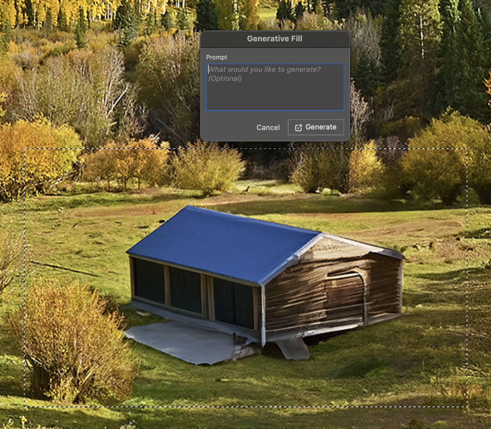

I will be giving a presentation on Software Development and AI at the Jax Software and AI meetup group on [this Wednesday](https://www.meetup.com/jax-ai/events/298769022/). This presentation will go over the current trends in AI as it concerns software development in 2024, and what developers and software engineers will be expected to know.

AI, and more specifically generative AI has been getting a lot of attention over the last year or so. We are already starting to see software changing and using some of the new technologies that have evolved in just the last year. Some examples we have seen so far:

* GPT styled ChatBots
* Generative fills in web and desktop applications
* Prompts added to our UIs
* Image generation
* Voice generation and voice copying

## Are we all going to lose our jobs?

One of the concerns, especially for white collar workers, is the prospect we are all going to be losing our jobs. Even in Software Engineering there has been the concern that jobs will be eliminated. 

If you look throughout history, as automation has been added, some jobs are lost, but many more are gained because of increased productivity. The first effect we are seeing is increased worker productivity.

## Developer tools

Many developers have already been using [Github Copilot](https://github.com/features/copilot) for the last couple of years. Copilot uses code completion features to try to automate and complete code in most programming languages. Github recently added a chatbot and prompt that can be used in Visual Studio Code. There are other tools for developers such as Amazon's [codewhisperer](https://aws.amazon.com/codewhisperer/) and [Tabnine](https://www.tabnine.com/).

## Processors

When writing software for computers, the primary target has been the CPU, or central processing unit. More recently other processors and cores have been showing up in our computers and devices. GPUs (Graphic Processing Units), NPUs (Neural Processing Units) and TPUs (Tensor Processing Units) have all been seen entering computers and servers over the last few years. Much of the AI software being developed today is written to take advantage of the features of these cores and chips. The algorithms for many of today's AI and machine learning models use linear algebra to provide inference for these models.

GPUs, NPUs and TPUs all handle linear algebra much quicker and more efficiently than traditional CPUs. Expect to see more specialized hardware designed specifically for this type of processing.

## Programming Languages for AI

The default language for much of machine learning, math and data science is [Python](https://www.python.org/). There are other languages that are also popular for ML and AI tasks, but most of the development for creating and working directly with the models is done in Python.

Many of the tools and libraries for working with machine learning and AI are written in Python as well. Some of these tools include [SciKit](https://scikit-learn.org/stable/), [TensorFlow](https://www.tensorflow.org/), [Keras](https://keras.io/), [Pandas](https://pandas.pydata.org/) and [PyTorch](https://pytorch.org/). The two most popular frameworks are TensorFlow and PyTorch. Both work with tensors, the basic object type for working with machine learning. 

### Mojo

[Mojo](https://www.modular.com/max/mojo) is a new language developed by a startup called [Modular](https://www.modular.com). Modular was started by Chris Lattner, the same engineer behind LLVM, Clang, Objective-C 2.0 and Swift.

Mojo is a superset of Python. Think of TypeScript and JavaScript. Just like TypeScript, Mojo adds a type system to the language, but unlike TypeScript, Mojo has a compiler than converts Python/Mojo code into executables that will run as fast as C++ or Rust programs.

Modular has a couple of products that seek to address some of the scaling issues that ML and AI companies have been facing with their Python code. Check out this interview with Chris on the Lex Fridman podcast:

<div style="text-align: center">
    <div class="responsive-iframe-container">
        <iframe src="https://youtube.com/embed/pdJQ8iVTwj8" frameborder="0" allow="accelerometer; autoplay; encrypted-media; gyroscope; picture-in-picture" allowfullscreen></iframe>
    </div>
</div>

## Generative AI

The real breakthrough in AI over the last year or so has been Generative AI. Generative AI focuses mostly on the transformation and generating of content based on a prompts or other inputs. Some examples of Generative AI are as follows:

* Text -> Text
* Text -> Images
* Text -> Video
* Image -> Text
* Text -> Audio

Many companies including OpenAI, Microsoft, Google, Anthropic and Meta have created services, APIs, SDKs and frameworks we can use to use generative AI. Some of these services cost money, and some can be run on fast hardware running open source software.

## APIs

[OpenAI](https://openai.com) has made many of their APIs available to the general public. These API are pretty easy to use. They can be authenticated with a simple key, and use the OpenAI python or Node.js modules. They can also be accessed with a REST API. Here is a example of how their API works:

```python
from openai import OpenAI
client = OpenAI()

response = client.images.generate(
  model="dall-e-3",
  prompt="a white siamese cat",
  size="1024x1024",
  quality="standard",
  n=1,
)

image_url = response.data[0].url
```

In the above example, the Dall-E API is used to generate an image of a siamese cat. Here is the resulting image.


## Prompts

One of the terms you may have heard recently is called Prompt Engineering. There is a whole new set of jobs that have been created in designing prompts that can be used in conjunction with AI models. 

Think of prompts as being the input for your AI function or application. If you look at ChatGPT, when you ask ChatGPT a question, it is a type of prompt.

Prompts can also be designed for the entire system and user prompts can be decorated with additional meta information that can help the AI be more precise in its outputs.

## Large Language Models

[ChatGPT](https://chat.openai.com) and GPT 3.5 and 4 are all examples of large language models. OpenAI is not the only vendor of LLMs. Google provides access to LLMs through Bard and Gemini. Gemini is the latest version of Google's multi-model AI that will work with images, text, audio and video. 

[Anthropic](https://www.anthropic.com/) is a company that was started by former OpenAI engineers that have an LLM called Claude. Other vendors include [Cohere](https://cohere.com/) and [Fal.ai](https://www.fal.ai/).

One of the more interesting entrants in this space is the open source LLM. Meta, the parent company of Facebook, released their open source LLM called Llama 2. This gives developers the ability to run this LLM on their own hardware. 

## Custom GPTs

OpenAI now allows users to create their own GPTs. The user can design custom prompts for their GPT, and add data and functions that can be used by the GPT. These custom GPTs can also be placed on the GPT store.

## Langchain

One of the frameworks that has become popular over the last year has been [Langchain](https://www.langchain.com/). Langchain allows developers to build context aware AI applications with either Python or JavaScript. 
Langchain also allows you to `chain` prompts, data and functions together with LLMs. 

One of the more powerful features of Langchain is the ability to take unstructured data and break it up in a way that it can be stored either in a database or memory, and then retrieved for building intelligent applications and agents. 

### Vector Databases

Being able to store and retrieve text data easily is important if you want to be able to use the data with an AI model. There are now multiple vendors that provide vector databases or vector extensions for existing databases like Postgres SQL.

The way vector databases work is that they can store data along with a vector. Think of a vector as a array of numbers. OpenAI as an example has an embedding service that will convert text into an embedding. Embeddings are nothing more than an array of floating point numbers. 

These embeddings can be stored in a vector database, and can be used when fetching an answer from the LLM. Vectors can also be retrieved from the database using a cosine search algorithm. 

### RAG Apps

RAG stands for Retrieval Augmented Generation. RAG apps are a way of passing your data and functions to an AI application when prompting the application for output that you want to be tailored to your data. 
Langchain is a framework that makes this relatively easy to do. Lanchain has functions that can be used to break up unstructured data into vectors, and then those vectors cab be used with prompts for more precise output from the LLM.

A good example of a RAG application built with Langchain is one where PDF or word processing documents are converted into vectors and stored for retrieval, and then these vectors can be recalled when a user is asking questions around that data.

## Examples of AI in use of apps today

I mentioned the coding assistants earlier, but there are many other examples of AI showing up in applications we use everyday. If you use gmail or iMessage, you may have noticed that these applications are using autocomplete to correct spelling and even grammar. 

Linkedin and Meetup both have AI generated fills when filling out forms in their web applications. Even [Adobe Photoshop](https://www.adobe.com/products/photoshop.html) has added a prompt and object detection for selecting objects and extending backgrounds.



## Conclusion

There are really unlimited possibilities of some of the software we can build using these existing Generative AI models. We are already starting to see many examples in commercial and open source software. I can't wait to see how developers will use this technology in the future. 

And please do not forget to join us at the Jax Software and AI meetup group on [this Wednesday](https://www.meetup.com/jax-ai/events/298769022/).