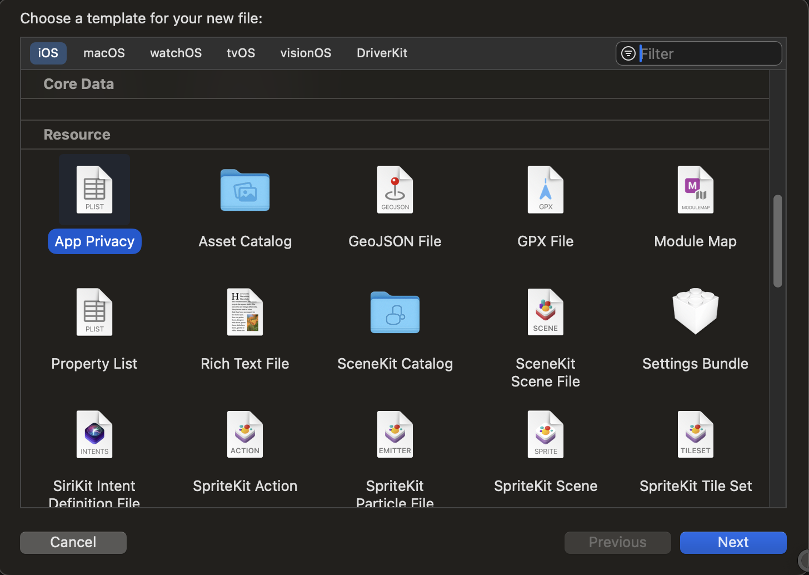
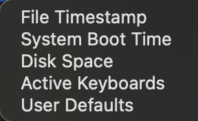
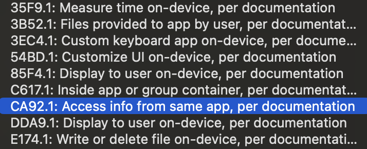
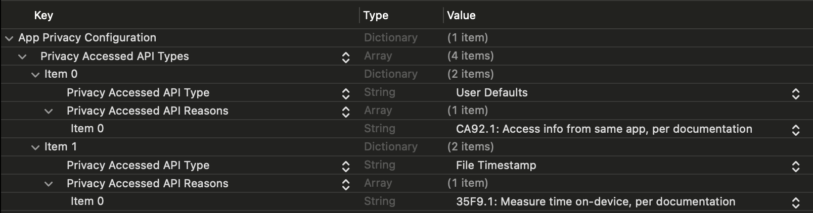

    

        <iframe src="https://youtube.com/embed/XstYjtRNMeU" frameborder="0" allow="accelerometer; autoplay; encrypted-media; gyroscope; picture-in-picture" allowfullscreen></iframe>
    

If you publish iOS apps to the Apple App Store, you might have gotten a message back saying your app was submitted successfully, but you have issues related to your upload.

This is due to Apple's continuing focus on user privacy and security. If you have code that accesses an API or framework that handles the file system, dates or user defaults, these can raise an alert with Apple's app submission process.

The message you receive from Apple might look like the following:

>Although submission for App Store review was successful, you may want to correct the following issues in your next submission for App Store review. Once you've corrected the issues, upload a new binary to App Store Connect.

>ITMS-91053: Missing API declaration - Your app’s code in the “<Your App's Name>” file references one or more APIs that require reasons, including the following API categories: NSPrivacyAccessedAPICategoryFileTimestamp. While no action is required at this time, starting May 1, 2024, when you upload a new app or app update, you must include a NSPrivacyAccessedAPITypes array in your app’s privacy manifest to provide approved reasons for these APIs used by your app’s code. For more details about this policy, including a list of required reason APIs and approved reasons for usage, visit: https://developer.apple.com/documentation/bundleresources/privacy_manifest_files/describing_use_of_required_reason_api. 

>ITMS-91053: Missing API declaration - Your app’s code in the “<Your App's Name>” file references one or more APIs that require reasons, including the following API categories: NSPrivacyAccessedAPICategoryUserDefaults. While no action is required at this time, starting May 1, 2024, when you upload a new app or app update, you must include a NSPrivacyAccessedAPITypes array in your app’s privacy manifest to provide approved reasons for these APIs used by your app’s code. For more details about this policy, including a list of required reason APIs and approved reasons for usage, visit: https://developer.apple.com/documentation/bundleresources/privacy_manifest_files/describing_use_of_required_reason_api.

To get rid of these messages and prepare your app for the May 1st deadline, you will need to add a privacy manifest to your app's Xcode project.

You can find documentation for the manifest at the [Privacy Manifest webpage](https://developer.apple.com/documentation/bundleresources/privacy_manifest_files/describing_use_of_required_reason_api?language=objc).

The first thing you will need to do is create a privacy manifest file by selecting the menu `File > New  > File...`, and selecting the `App Privacy` resource, then selecting `next`. Save the file into your applications directory. This will create a file called `PrivacyInfo.xcprivacy`.

Once you have saved the privacy manifest, you can start adding to the `App Privacy Configuration`. This first key is a dictionary. We will start by creating a `Privacy Accessed API Types` array underneath the `App Privacy Configuration`. Under the `Privacy Accessed API Types` array, we can create new items for each of the API declarations. The item will be another dictionary. Each dictionary in this array will contain two keys: `Privacy Accessed API Type` and `Privacy Accessed API Reasons`.

The `Privacy Accessed API Type` key will have a value of a string, and the editor should give you the following options:

The `Privacy Accessed API Reasons` key will have a value of an array of strings, with the following options available in the editor:

In the example above we had two alerts from Apple concerning a File Timestamp and one for UserDefaults. So we will add both of these under the `Privacy Accessed API Types` array so that it looks like the following:

The last step you will need to do is make sure that your privacy manifest gets copied into the bundle resources. Go to your `Build Phases` and add the `PrivacyInfo.xcprivacy` file to the `Copy Bundle Resources` step.

## Conclusion

Now that we have added the following API Types and reasons to our privacy manifest, our application should no longer get these warning from Apple on submission, and we should be safe for the May 1st deadline.