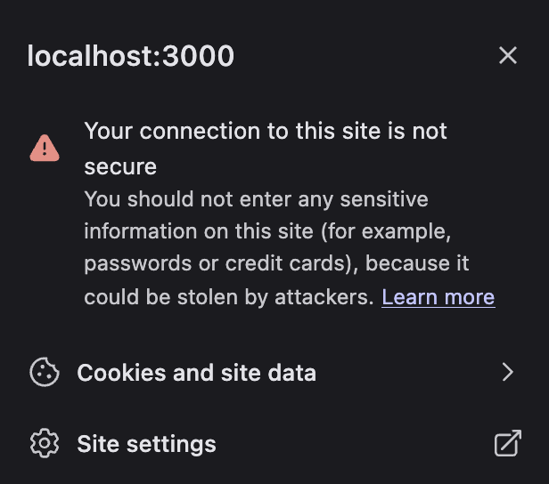
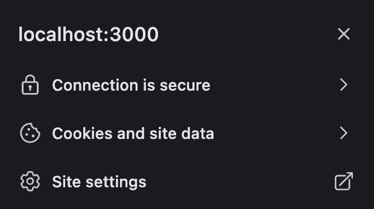

In my current role, one of the issues I have come across in developing web services and web front-ends is the need to run the server locally under [HTTPS](https://www.cloudflare.com/learning/ssl/what-is-https/) or [TLS](https://learn.microsoft.com/en-us/windows-server/security/tls/transport-layer-security-protocol). 
This is commonly referred to as [SSL](https://www.cloudflare.com/learning/ssl/what-is-ssl/), but that is not the current term, it is actually TLS.

When the first web browsers were released there was a concern about a secure trust between the browser and the web server. Netscape Navigator introduced the first secure way of transmitting information
between the browser and the server using SSL, or Secure Socket Layer in 1995. This created a way of encrypting the communication between the browser and the web server so users would not have to worry 
about a computer in the middle consuming their private data. Since the Internet is a multilevel network with many network nodes between the user and the server, it is important to encrypt the communication going over those public nodes.

SSL is actually old now and has been replaced with TLS, or Transport Layer Security. TLS like SSL before it requires a [x509 certificate](https://learn.microsoft.com/en-us/azure/iot-hub/reference-x509-certificates) to be created for the domain so that the browser can do a 
handshake with the server to create a secure connection. It is actually trivial now to create a certificate for a web server hosted in a cloud environment like AWS or Azure. 
Services like Cloudflare also make it pretty easy to create a certificate for your domain. Though you can still buy a certificate if you require a Domain Validation, Organization Validation or Extended Validation. 

Most of the search engines like Google, Bing and DuckDuckGo give a higher ranking to websites that use HTTPS versus sites that still use HTTP.

# Running and testing HTTPS locally

When developing web services and web servers locally, some frameworks may even require a HTTPS protocol to be used. [DotNet](https://dot.net), or .NET, will create and install a local certificate you can use 
for running a kestrel webserver or web service locally. This can be tricky to set up and run with most Node.js web frameworks. Fortunately the folks at Vercel have made it pretty easy to run Next.js over HTTPS. To set this up, it is pretty easy.

# Creating and Running a Next.js over HTTPS

If you have not created a Next.js app, you can do this with the following command if you have Node.js installed:

```sh
$ npx create-next-app
```

Now `cd` into your directory for the app you just created, and open it in the editor of your choice. Lets make sure that the Next app will run normally by itself using the following command:

```sh
$ npm run dev
```

If you on the icon in the browser in front of the address bar, it should tell you if you are running the dev server under HTTP. Mine at this point looks like the following:



If you look at the Next.js docs on the Next CLI, it has [instructions](https://nextjs.org/docs/app/api-reference/cli/next#using-https-during-development) on how to run the dev server under HTTPS.

```sh
$ next dev --experimental-https
```

By adding the `next dev --experimental-https` flag, we can force Next to use a local certificate. Next will actually create and install this certificate if it is not already installed. 
Before we do this, lets add a new script to the `scripts` section of our `package.json` file for our Next app.

```json
"scripts": {
    "dev": "next dev --turbopack",
    "dev:tls": "next dev --turbopack --experimental-https",
    "build": "next build",
    "start": "next start",
    "lint": "next lint"
  },
```

Now I can run the dev server under HTTPS using the `npm run dev:tls` command which will run the `next dev --experimental-https` flag for our local Next app. When we do run this the first time, we should get prompted to give a root password or another way to elevate our permissions to install the local certificate. Here is how it looked on my Mac when I went to run this server:

```sh
testhttps@0.1.0 dev:tls
> next dev --turbopack --experimental-https

 ⚠ Self-signed certificates are currently an experimental feature, use with caution.
   Downloading mkcert package...
   Download response was successful, writing to disk
   Attempting to generate self signed certificate. This may prompt for your password
Sudo password:
   CA Root certificate created in /Users/davidfekke/Library/Application Support/mkcert
   Certificates created in /Users/davidfekke/Documents/node/projects/testhttps/certificates
   Adding certificates to .gitignore
   ▲ Next.js 15.2.3 (Turbopack)
   - Local:        https://localhost:3000
   - Network:      https://10.0.0.238:3000

 ✓ Starting...
 ✓ Ready in 663ms
 ○ Compiling / ...
 ✓ Compiled / in 852ms
 GET / 200 in 997ms
 ✓ Compiled /favicon.ico in 174ms
 GET /favicon.ico?favicon.45db1c09.ico 200 in 205ms
```

After refreshing the browser to use `https://localhost:3000`, I am now getting a secure connection to my Node.js webserver. Now when I click on the icon on the left hand side of my address bar field, it looks like the following:



## Looking underneath the hood on how Next implemented this feature

Next.js is using `mkcert` in the Next CLI to manage and install the certificate. [mkcert](https://github.com/FiloSottile/mkcert) is an open source project written in GO. As Microsoft is doing with TypeScript now, 
they are using GO to create a cross platform tool that will run on just about any OS or processor architecture.

## Why using HTTPS is important when using HTTP/2

Not only is TLS important for encrypting information over the wire, it is also necessary if you are planning on using HTTP/2. HTTP/2 does not officially require that you use TLS, 
but all of the major browsers require TLS if you want to use HTTP/2.

HTTP/2 is a newer version of the HTTP protocol. It has features such as multiplexing, server push and data compression of HTTP headers. Many online services such as Youtube already are using this protocol. And there is already a HTTP/3 protocol that was added to the browsers about six years ago.

## Conclusion

Whether you are using Next.js or another framework for hosting your web services, it is now fairly trivial to install a certificate for hosting the HTTPS protocol locally. 
You can do this in Next by adding the `--experimental-https` flag or simply by using mkcert to your existing framework.
