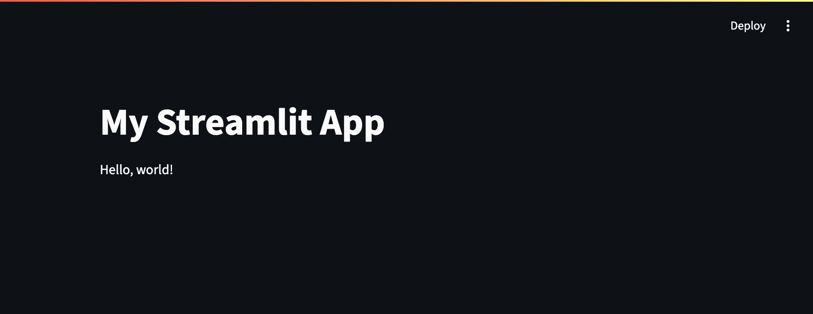
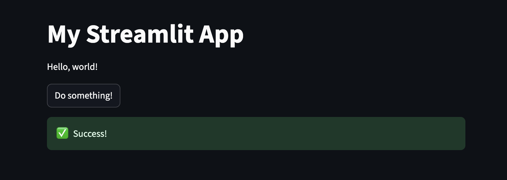
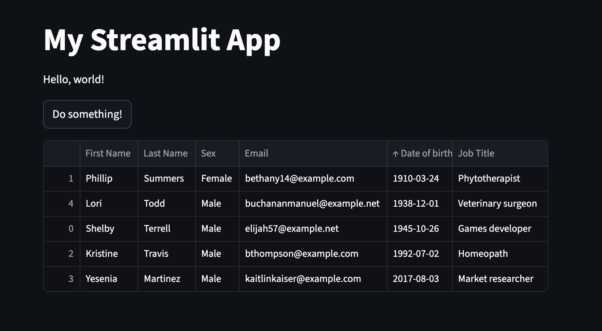

<div style="text-align: center">
    <div class="relative overflow-hidden aspect-video">
        <iframe src="https://youtube.com/embed/i4AXNz4-r7c" frameborder="0" allow="accelerometer; autoplay; encrypted-media; gyroscope; picture-in-picture" class="absolute inset-0 w-full h-full border-0" allowfullscreen></iframe>
    </div>
</div>

I recently gave a presentation to the [PyJax](https://www.meetup.com/py-jax/) user group in Jacksonville, Fl on [Streamlit](https://streamlit.io/). If you are not familiar with Streamlit, it is a [Python](https://www.python.org/) based framework for building web apps.

I am not an active Python language user, but I have been attending PyJax meetings because I have an interest in data science, machine learning and artificial intelligence. 

One of the things I like about the Python community is the it has a diverse user base or users who are not necessarily computer scientists. 
Python users range from students trying to learn programming to mathematicians and data scientists. Python has also become the lingua franca of machine learning and artificial intelligence.

The typical user of Python is probably not interested in all of the details of CSS, HTML and JavaScript frameworks. 
They also are probably not interested in learning all of the nuances of the tooling, bundling and transpilers used in building modern web apps with frameworks like [Angular](https://angular.dev) and [React](https://react.dev). 
It actually takes most users a while to get up to speed on all of the tooling and ceremony when it comes to building a modern web application.

# Introducing Streamlit

There is a youtube channel I have been following for years called Part Time Larry. On this channel the host uses Python to build most of his examples. Watching his videos is how I became aware of Streamlit.

Streamlit makes it very easy to spin up a web application quickly with knowing any HTML, CSS or JavaScript. With Streamlit you can make interactive apps easily just using Python.

Lets actually build a Hello World app using Streamlit to illustrate how easy and quick it is to build a web app in Streamlit. The first think you will need to do is install Streamlit. I recommend using Conda to spin up a new environment or at least create a virtual environment.

```sh
$ pip install streamlit
```

Now that you have Streamlit installed, create a Python file and add the following lines to your file:

```python
# helloworld.py
import streamlit as st

st.headline("My First Streamlit App")

st.write("Hello World!")
```

Once you have saved the file, you can run it using the following command in your terminal:

```sh
$ streamlit run helloworld.py
```

When you run this, it should create a web page that looks like the following.



## Streamlit components

Streamlit has dozens of builtin components you can use for displaying data, charts, tables as well as input components for buttons, inputs, toggles and sliders. If we want to add a button and some interactivity to our Hello World app, we can do that by adding the following lines:

```python
if st.button("Do something!"):
    success_placeholder = st.empty()
    success_placeholder.success("Success!", icon="✅")
    time.sleep(5)
    success_placeholder.empty()
```

When you save the file, it will show you a `rerun` button in the top right corner of the page next to the Deploy button. By rerunning the app we will now see a button at the bottom of the page that says `Do Something!`. 
Now when we push the button it will add a success message to our app. The message will have checkmark icon and should disappear in five seconds.



## The Magic Function

There are multiple methods in Streamlit for writing data and text to the page, but the `st.write()` function is considered a `magic` function. The reason why is that write will write just about any kind of data. It can not only write text, but can write out numerical, arrays and tables of data. It also will work with the Pandas library. Pandas is a very popular library in Python for working with tables or data frames of data.

As an example we can load the following table into our web app using pandas:

```csv
First Name,Last Name,Sex,Email,Date of birth,Job Title
Shelby,Terrell,Male,elijah57@example.net,1945-10-26,Games developer
Phillip,Summers,Female,bethany14@example.com,1910-03-24,Phytotherapist
Kristine,Travis,Male,bthompson@example.com,1992-07-02,Homeopath
Yesenia,Martinez,Male,kaitlinkaiser@example.com,2017-08-03,Market researcher
Lori,Todd,Male,buchananmanuel@example.net,1938-12-01,Veterinary surgeon
```

We will call this csv `people_data.csv`. We can now import this into our web app by using Pandas to import the csv, and then display the table as in the following example:

```python
import pandas as pd

# open a dataframe to my people_data.csv
df = pd.read_csv("people_data.csv")

# display the dataframe
st.write(df)
```



This will create a table that can by resorted or searched just by writing the data frame.

The source code for this example can be found at [https://github.com/davidfekke/streamlitdemo.git](https://github.com/davidfekke/streamlitdemo.git)

## Conclusion

Streamlit makes it very easy to build simple web apps just using Python. It is excellent at making data apps and dashboards. If you need theming and custom styling you should probably look at using a full web framework using something like Flash or Next.js. Overall this is a great option for those who are trying to build and deploy a web app quickly.