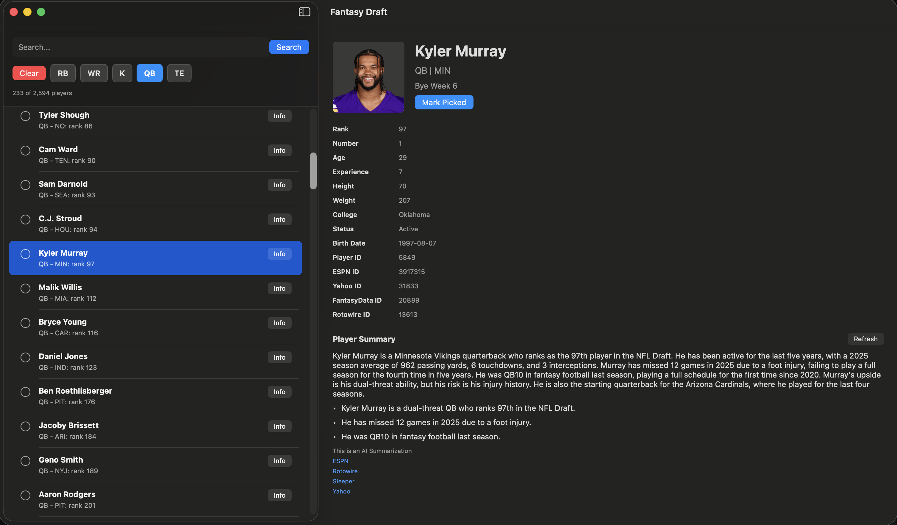

Every year I participate in a NFL Fantasy football draft with my extended family. It has always been stressful trying to keep track of which players have already been drafted before I make my selection.

I decided that I should create an AI Agent that I could use to help research NFL players for the draft, and run this on device as opposed to using an external LLM like [ChatGPT](https://chatgpt.com) or [Claude](https://claude.ai).

In past years I have kept a paper list with the names of all of the players that are sorted by their ranking. Last year I actually created a [React app in Next.js](https://github.com/davidfekke/fantasydraft) as a way to keep track of which players that had already been drafted. This worked fairly well, but I decided to try to up my game so to speak with some new tools.

I bring my little Mac laptop with me to the draft, so I decided to port my React app to a Mac app written in SwiftUI. If you are not familiar with React or SwiftUI, they both provide a way of building a frontend apps with a component first methodology.



This year I cheated by using Xcode 27's Codex plugin to convert the React app to SwiftUI. I used to be a iOS developer who used SwiftUI for mobile apps, but I was able to speed up the development process by using codex to create the draft version of my Fantasy app.

## Apple Intelligence

Apple gets chastised for trailing in the AI race against frontier labs like [OpenAI](https://openai.com) and [Anthropic](https://anthropic.com), but they actually have some excellent tools for putting AI into your apps. Something they introduced last year was a set models called the [Foundation models](https://machinelearning.apple.com/research/introducing-third-generation-of-apple-foundation-models). These models allow Apple users to use generative AI on their devices without have to go out to a server. This was the approach I decided to use to add an agent to my draft app.

If you are going to use the Foundation models in your app, the first thing you need to do is add a Macro to make sure the user has access to the Foundation models. Here is how I did it in my app:

```swift
#if canImport(FoundationModels)
import FoundationModels
#endif
```

## Creating the Agent

For creating the AI Agent, I created a function that would grab player information from certain web pages. I was fortunate because the player data I had contained URLs to certain sports web sites like ESPN, Sleeper and Yahoo. I created a summary function that would summarize the player data from several web pages stored for a particular player.

To summarize the player data I do a couple of different steps with the Player URLs. The first thing is I fetch the data from each URL, and then I  strip the HTML so I would just have plain text for that player.

```swift
func streamingSummary(
    for player: FantasyPlayer,
    refresh: Bool = false,
    onPartialSummary: @Sendable @escaping (PlayerInformationSummary) async -> Void
) async throws -> PlayerInformationSummary {
    if !refresh, let cached = cache[player.id] {
        return cached
    }

    let urls = player.profileURLs
    guard !urls.isEmpty else {
        throw PlayerInformationError.noSources
    }

    let excerpts = await fetchExcerpts(from: urls, playerName: player.fullName)
    guard !excerpts.isEmpty else {
        throw PlayerInformationError.noReadableSourceText
    }

    let sourceURLs = excerpts.map(\.profileURL)
    let prompt = Self.makePrompt(player: player, excerpts: excerpts)
    let modelSummary = await streamSummaryWithFoundationModel(prompt: prompt) { partialText in
        let partialSummary = PlayerInformationSummary(
            text: partialText,
            sourceURLs: sourceURLs,
            usedFoundationModel: true
        )
        await onPartialSummary(partialSummary)
    }
    let summary = PlayerInformationSummary(
        text: modelSummary ?? Self.makeExtractiveSummary(player: player, excerpts: excerpts),
        sourceURLs: sourceURLs,
        usedFoundationModel: modelSummary != nil
    )

    cache[player.id] = summary
    return summary
}

private func fetchExcerpts(from urls: [PlayerProfileURL], playerName: String) async -> [PlayerSourceExcerpt] {
    await withTaskGroup(of: PlayerSourceExcerpt?.self) { group in
        for profileURL in urls {
            group.addTask { [session] in
                await Self.fetchExcerpt(profileURL: profileURL, playerName: playerName, session: session)
            }
        }

        var excerpts: [PlayerSourceExcerpt] = []
        for await excerpt in group {
            if let excerpt {
                excerpts.append(excerpt)
            }
        }

        return excerpts.sorted { $0.profileURL.source < $1.profileURL.source }
    }
}

private static func fetchExcerpt(profileURL: PlayerProfileURL, playerName: String, session: URLSession) async -> PlayerSourceExcerpt? {
    var request = URLRequest(url: profileURL.url)
    request.timeoutInterval = 12
    request.setValue("Mozilla/5.0 Fantasy Draft macOS app", forHTTPHeaderField: "User-Agent")

    do {
        let (data, response) = try await session.data(for: request)
        guard let httpResponse = response as? HTTPURLResponse,
                (200..<300).contains(httpResponse.statusCode),
                let html = String(data: data, encoding: .utf8) ?? String(data: data, encoding: .isoLatin1) else {
            return nil
        }

        let text = readableText(from: html, playerName: playerName)
        guard text.count > 80 else { return nil }
        return PlayerSourceExcerpt(profileURL: profileURL, text: text)
    } catch {
        return nil
    }
}
```

After fetching the player data, I need to take that data and strip any HTML out of the player information. I did that by creating a function to create readable text from the HTML.

```swift
private static func readableText(from html: String, playerName: String) -> String {
    let withoutScripts = html
        .replacingOccurrences(of: "(?is)<script[^>]*>.*?</script>", with: " ", options: .regularExpression)
        .replacingOccurrences(of: "(?is)<style[^>]*>.*?</style>", with: " ", options: .regularExpression)
        .replacingOccurrences(of: "(?is)<noscript[^>]*>.*?</noscript>", with: " ", options: .regularExpression)
    let plainText = withoutScripts
        .replacingOccurrences(of: "(?s)<[^>]+>", with: " ", options: .regularExpression)
        .decodingBasicHTMLEntities
        .replacingOccurrences(of: "\\s+", with: " ", options: .regularExpression)
        .trimmingCharacters(in: .whitespacesAndNewlines)

    let sentences = plainText
        .components(separatedBy: CharacterSet(charactersIn: ".!?"))
        .map { $0.trimmingCharacters(in: .whitespacesAndNewlines) }
        .filter { sentence in
            sentence.count > 35 && sentence.localizedCaseInsensitiveContains(playerName)
        }

    let selectedText = sentences.isEmpty ? plainText : sentences.joined(separator: ". ")
    return String(selectedText.prefix(2_800))
}
```

## Prompt Engineering

Once I had the player information, I decided to make a prompt I could use to tell the Foundation model how to summarize the player information. I used the following function to create the prompt:

```swift
private static func makePrompt(player: FantasyPlayer, excerpts: [PlayerSourceExcerpt]) -> String {
    let sourceText = excerpts.map { excerpt in
        "Source: \(excerpt.profileURL.source)\nURL: \(excerpt.profileURL.url.absoluteString)\nExcerpt: \(excerpt.text)"
    }.joined(separator: "\n\n")

    return """
    Player: \(player.fullName)
    Position: \(player.position ?? "Unknown")
    Team: \(player.displayTeam ?? "Unknown")
    Rank: \(player.searchRank.map(String.init) ?? "Unknown")

    Summarize this NFL player information for a fantasy draft manager. Use only the source excerpts below. 
    Focus on role, team context, injury/status notes, upside/risk, and draft relevance. Keep it concise.

    \(sourceText)
    """
}
```

In this prompt I am telling the model how I want it to summarize the player for display. I also have a system prompt I used on how I wanted the player data to be formatted when any prompt is passed to the foundation model.

```swift
private static let instructions = """
    You summarize NFL fantasy football player research. Use only the supplied excerpts.
    Write one short paragraph followed by three concise bullets. Mention uncertainty when the source text is thin or stale.
"""
```

## Foundation Model Performance

Depending on how old your Apple device is will determine how quickly the foundation model can return the player summary. If the user is on a M5 Mac or the latest iPhone, the performance is fairly quick as far as the number of tokens per second returned by the model. The Foundation models support Macs as old as the M1, which will take more time to infer a result from the model.

While you can wait for the entire response to be returned from the model before displaying to the user, a better experience is to do what a lot of web based AI chat applications do, and that is to stream the response. If the user can see that the model is returning a response even though the model is not finished running inference on the prompt, this creates a much better experience for the user.

```swift
#if canImport(FoundationModels)
@available(macOS 26.0, iOS 26.0, *)
private enum FoundationModelPlayerSummaryGenerator {
    private static let instructions = """
    You summarize NFL fantasy football player research. Use only the supplied excerpts.
    Write one short paragraph followed by three concise bullets. Mention uncertainty when the source text is thin or stale.
    """

    static func streamSummary(
        prompt: String,
        onPartialSummary: @Sendable @escaping (String) async -> Void
    ) async -> String? {
        guard SystemLanguageModel.default.isAvailable else { return nil }

        do {
            let session = LanguageModelSession(instructions: instructions)
            let stream = session.streamResponse(to: prompt)
            var finalSummary = ""

            for try await snapshot in stream {
                let summary = snapshot.content.trimmingCharacters(in: .whitespacesAndNewlines)
                guard !summary.isEmpty else { continue }

                finalSummary = summary
                await onPartialSummary(summary)
            }

            return finalSummary.isEmpty ? nil : finalSummary
        } catch {
            return nil
        }
    }
}
#endif
```

You can look at all of the source code for this app on my [GitHub repo](https://github.com/davidfekke/FantasyDraftMac) for the app. Please note that this app is for demo purposes only. I do not attend on profiting in any way from the NFL, and the data is the data that Sleeper.com makes available through their API.

## Conclusion

In a previous [blog post](../david-fekkes-law-of-inference/) I discussed my law of inference, which is as follows: "If an AI model can be run locally, it will be eventually run locally."

The foundation models provide a nice simple implementation of a small LLM or SLM that can be run on a device. Any AI that can be run locally will reduce your token cost.

The Foundation models do not have the same capability as ChatGPT, Claude or Gemini, but they do have most of the features we need to run a lot of agent tasks on the device. Check out Apple's [docs](https://developer.apple.com/documentation/foundationmodels) on the Foundation Models.